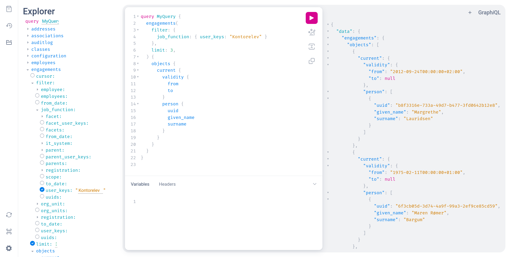

# OS2mo

MO is an IT system for organisational and identity management.

It enables your organisation to maintain information about the organisation and
its employees, volunteers, external consultants, robot users, and so on, from a
single user interface.

You get a complete overview of all departments, employees' (multiple)
employments, their IT access, their affiliations, and roles throughout the
organisation. You also get a complete picture of management hierarchies, and
you can see your union representative organisation, your payroll organisation,
your safety organisation, your line organisation, etc.

The vision for MO is that it should be _the_ source system for the entire
organisation and its employees: this is where organisational changes are made,
this is where employees are created and removed, and this information will
automatically - and immediately - be sent to other systems. The information can
also come from other systems - or be enriched from them - but it is MO that
contains the complete picture of the organisation.

Because MO contains all the information about the organisation, and it is always
up-to-date and correct, it is important to connect MO to other systems that
need the information - be it LDAP (e.g. Active Directory), an IdM system,
FK-Organisation, an org chart, an HR system, etc.

When MO is connected to many systems, workflows are automated and consistent
and high data quality is realised in the connected systems.

The primary documentation for OS2mo is available at
<https://rammearkitektur.docs.magenta.dk/os2mo/index.html> (in Danish).
Technical documentation in English is available at
<https://rammearkitektur.docs.magenta.dk/os2mo/tech-docs/architecture.html>.

## GraphQL

The primary API for OS2mo is GraphQL. The interface is versioned to handle
future breaking changes, without actually breaking any integration code. New
versions are added as needed and old versions are removed as they become
obsolete.

New integrations should always use the newest version of the interface
available, and old integrations should continuously be updated to the newer
versions as they are introduced, by following the [Migration
Guide](https://rammearkitektur.docs.magenta.dk/os2mo/tech-docs/graphql/migration.html).

The `/graphql` endpoint redirects the browser to the GraphiQL interface for the
newest version, e.g. for local development: <http://localhost:5000/graphql>.
GraphiQL has a built-in documentation explorer which can be accessed by
ctrl-clicking most fields.



There is no way to use the newest version of the GraphQL interface
programmatically, e.g. from integrations. This is by design to avoid
integrations being broken automatically once a new version is introduced, as
such, all integrations should be hardcoding the GraphQL version that they are
utilising and should update this hardcoded URL as they upgrade to a newer
version following the migration guide.

The GraphQL schema for each version is available at
`/graphql/vXX/schema.graphql` in regular GraphQL Schema Definition Language
(SDL).

More thorough documentation for the GraphQL API is available at
<https://rammearkitektur.docs.magenta.dk/os2mo/tech-docs/graphql/intro.html>.

## Getting Started

To get a local OS2mo stack running on a sane operating system:

```shell
git clone https://github.com/OS2mo/os2mo.git
cd os2mo/
docker compose up -d --build
```

The OS2mo frontend should now be available at <http://localhost:5000>, and the
GraphiQL explorer at <http://localhost:5000/graphql>. The default admin
username/password is `alvida`/`alvida`.

To stop the stack, run

```shell
docker compose down
```

To stop the stack _and delete all data volumes_, run

```shell
docker compose down -v
```

A more detailed walk-through is available at
<https://rammearkitektur.docs.magenta.dk/os2mo/tech-docs/development.html>.

## Versioning

This project uses [Semantic Versioning](https://semver.org/) with the following
strategy:

- MAJOR: Incompatible API changes.
- MINOR: Backwards-compatible updates and functionality.
- PATCH: Backwards-compatible bug fixes.

The changelog is available at
<https://rammearkitektur.docs.magenta.dk/os2mo/changelog.html>.

## Authors

Magenta ApS <https://magenta.dk>

## License

[MPL-2.0](LICENSES/MPL-2.0.txt). This project uses
[REUSE](https://reuse.software) for licensing. All licenses can be found in the
[LICENSES folder](LICENSES/) of the project.
