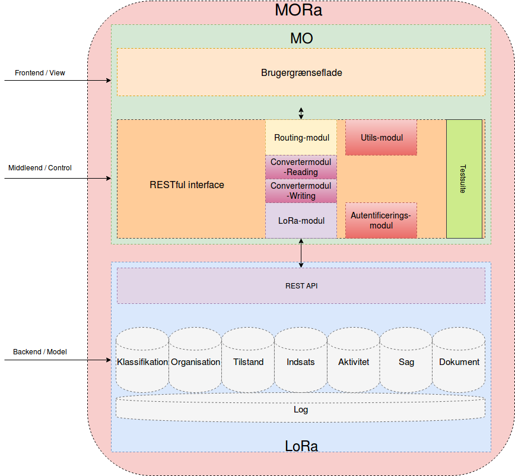

MORa — MedarbejderOrganisation + LoRa
=====================================

Om MORa
-------
MORa er en webapplikation til håndtering af et medarbejder- og
organisationshierarki. Systemet sætter brugerne i stand til at navigere rundt i
eksempelvis organisationshierarkiet, indhente relevante informationer om de
forskellige organisationsenheder samt at redigere de data, der er tilknyttet
de forskellige enheder.

Navnet MORa er en sammentrækning af MO og LoRa og
refererer til hhv. `OS2MO <https://os2.eu/projekt/os2mo>`_ og den
`Lokale Rammearkitektur <https://digitaliser.dk/group/3101080/members>`_.
Nedenstående figur viser et typisk eksempel på en side i systemet brugerflade:

.. image:: doc/mo.png
   :width: 800

Opbygningen af MORa
-------------------
Den modulære opbygning af MORa ses på nedenstående figur.

MORa består af frontend og en middleend og sidstnævnte kommunikerer med en LoRa
backend. De enkelte moduler kan opfattes som elementer i
`MVC-modellen <https://en.wikipedia.org/wiki/
Model%E2%80%93view%E2%80%93controller>`_:

MO (Frontend / View)
~~~~~~~~~~~~~
MOs frontend er skrevet i Javascript frameworket
`AngularJS <https://angularjs.org/>`_. Frontenden kan opfattes som *View* i
MVC-modellen, og brugerne interagerer med applikationen via denne. Frontenden
kommunikerer indirekte med Lora via MOs middleend.

MO (Middleend / Control)
~~~~~~~~~~~~~~
MOs middleend fungerer som en bro mellem frontenden og backenden, og den har
til opgave at oversætte de data, der sendes mellem frontenden og backenden til
passende JSON formater, når der udføres læse- og skriveoperationer fra og
til LoRa (se flere detaljer nedenfor).

Når der læses fra LoRa, leverer denne data i et JSON-format, som
frontenden ikke umiddelbart kan tolke, hvorfor middleenden oversætter disse
til det JSON-format, som frontenden forventer. Tilsvarende sender frontenden
ved skriveoperationer JSON i et format, som skal oversættes af middleenden til
det JSON-format, som kræves af LoRa's REST API. Middlend kan opfattes som *Control* i MVC-modellen.

LoRa (Backend / Model)
~~~~~~~~~~~~~~
En `LoRa <https://github.com/magenta-aps/mox>`_ backend, som gemmer alle data
i en PostgreSQL-database. Disse data udstilles og manipuleres via en
RESTful service skrevet i Python. LoRa kan opfattes som *Model* i MVC-modellen.

Detaljeret beskrivelse af MOs middleend
----------------------------------------
MOs middleend er underopdelt i en række moduler - se evt. illustrationen i
ovenstående afsnit. Formålet med denne modulære opbygning er at gøre koden
struktureret (opdelt i en række klare ansvarsområder) og analysérbar samt
at facilitere bedre muligheder for at teste kodebasen. MORa-koden består af
følgende moduler, som er skrevet i Python:

- **RESTful interface** udviklet i frameworket Flask1 som består af flg.:

  - **LoRa-modul**: håndterer HTTP kommunikationen med LoRas REST API.

  - **Authentication-modul**: Håndterer autentificering.

  - **Routing-modul**: Modtager HTTP kald fra frontenden og kalder logik i
    de øvrige moduler for at håndtere de indkomne forespørgsler.

  - **Converter-moduler**

    - **Reading-modul**: Konverterer de data, der hentes fra LoRa, til det
      format, som frontenden forventer.

    - **Writing-modul**: Konverterer data fra frontenden til det format,
      som LoRa forventer, når der gemmes nye data eller ændres data i LoRa.

    - **Utils-modul**: En samling af nyttig funktioner, som afdækker diverse
      mindre ansvarsområder (parse datoer, håndtering af URN’er mv.).
      
  - **Testsuite-modul**

Bemærk, at ovenstående liste ikke nødvendigvis udtømmende, idet der løbende kan blive
tilføjet flere moduler i takt med, at kodebasen vokser. Det vil således under
videreudviklingsprocessen af og til være nødvendigt at

1. Tilføje nye moduler
2. Splitte eksisterende moduler op i mindre dele for at undgå “responsibility
   erosion” (dette kunne fx blive relevant for utils-modulet og
   routing-modulet).

Opsætning af udviklingsmiljø
----------------------------
I princippet er det muligt at fortage videreudvikling af MORa uden at have
en kørende instans af LoRa (idet man blot skriver tests til den udviklede
kode), men i praksis vil det være mest praktisk med en kørende LoRa, som man
kan udvikle op imod. Det anbefales derfor at installere LoRa i eksempelvis en
Linux container som `LXC <https://linuxcontainers.org/>`_ eller lignende, som
kører på udviklingsmaskinen. Nærmere instruktioner vedr. selve installationen
af LoRa kan findes på LoRas GitHub-side, som er linket til ovenfor.

For at installere de nødvendige afhængigheder på en Ubuntu-maskine, køres
følgende kommandoer::

  $ sudo apt install python3 python3-venv nodejs-legacy npm

Efterfølgende klones MORa-projektet fra GitHub::

  $ mkdir /path/to/folder
  $ cd /path/to/folder
  $ git clone https://github.com/magenta-aps/mora

Man kan nu på sædvanligvis manuelt installere det virtuelle miljø, som Python
skal køre i og de nødvendige Python-moduler (med "pip install -r requirements.txt"), 
men det nemmeste er blot at anvende scriptet
**manage.py**::

  $ cd /path/to/folder/mora
  $ ./manage.py run

Dette vil automatisk oprette et vituelt Python-miljø, installere de
nødvendige Python-afhængigheder og starte applikationen (lyttende på
port 5000). Applikationen kan således tilgås på *http://localhost:5000* med et
brugernavn og password, som er hhv. *admin* og *secret*. Bemærk dog,
at der først skal uploades data til LoRa - til dette formål kan man med
fordel hente inspiration i scriptene, som er placeret i **sandbox**-mappen.

Testsuiten
-----------
Der arbejdes i proktet med tre typer af tests:

1. Unit tests
2. Integration tests
3. End-to-end tests (Selenium tests)

Der kræves ikke nogen yderligere opsætning for at køre unit testene (samt nogle af
integrationstestene), idet disse blot kan køres med kommandoen fra rodmappen
af projektet::

  $ ./manage test

En del af integrationstestene er sat op til at køre på en sådan måde, at der
startes en LoRa-instans før de enkelte test cases kører. Hver test case
køres derefter op imod LoRa-instansen, idet der ryddes op i LoRa mellem hver
test case, så testene effektivt set køres isoleret. For at anvende denne test
feature kræves det, at man installerer *minimox*::

  $ mkdir /path/to/folder/minimox
  $ git clone https://github.com/magenta-aps/mox /path/to/folder/minimox
  $ cd /path/to/folder/mox
  $ git checkout -b minimox origin/minimox

Det er nu muligt at køre alle integrationstestene vha. den netop
installerede minimox::

  $ ./manage.py test --minimox=/path/to/folder/minimox

Ønsker man at se test coverage køres kommandoen::

  $ ./coverage.py test --minimox=/path/to/folder/minimox

som giver et output à la::

    Name                          Stmts   Miss Branch BrPart  Cover
    ---------------------------------------------------------------
    mora/__init__.py                  0      0      0      0   100%
    mora/app.py                     143     22     30      7    81%
    mora/converters/__init__.py       0      0      0      0   100%
    mora/converters/addr.py          27      1     10      2    92%
    mora/converters/reading.py       58      0     15      0   100%
    mora/converters/writing.py      114      0     45      0   100%
    mora/exceptions.py                2      0      0      0   100%
    mora/lora.py                    103      8     27      2    89%
    mora/util.py                     61      7     41      4    87%
    ---------------------------------------------------------------
    TOTAL                           508     38    168     15    91%

Ønsker man at køre en enkelt testklasse eller blot en enkelt test case, kan det
gøres på følgende måde::

  $ ./manage.py test --minimox=/path/to/folder/minimox tests.test_integration.IntegrationTests
  $ ./manage.py test --minimox=/path/to/folder/minimox tests.test_integration.IntegrationTests.test_should_add_one_new_contact_channel_correctly

Installing MORa on a server
---------------------------
To install MORa, do::

  # first, clone MORa
  sudo install -d -o $UID -g $GID /srv/mora
  git clone https://github.com/magenta-aps/mora /srv/mora

  # install dependencies
  sudo apt install python3-venv nodejs-legacy npm

  # build the application, creating the virtualenv in the progress
  /srv/mora/manage.py build
  # install gunicorn
  /srv/mora/venv-linux-cpython-3.5/bin/pip install gunicorn gevent

  # create the user and required infrastructure
  sudo adduser --system \
    --home /srv/mora \
    --shell /usr/sbin/nologin \
    --disabled-password --disabled-login \
    --ingroup www-data mora
  sudo install -d -o mora -g www-data /var/log/mora /run/mora
  sudo install -m 644 /srv/mora/config/mora.service /etc/systemd/system
  sudo install -m 644 /srv/mora/config/mora.socket /etc/systemd/system
  sudo install -m 644 /srv/mora/config/mora.conf /etc/tmpfiles.d

  sudo systemctl daemon-reload
  sudo systemctl enable mora.socket mora.service
  sudo systemctl start mora.service

You now have a working MORa installation listening on a local socket.
To expose to the outside, you'll need to configure Apache or nginx to
forward requests to it. We're using Apache for now, and the following::

  SSLProxyEngine on

  <Location /mo/>
      ProxyPass unix:/run/mora/socket|http://localhost/
      ProxyPassReverse http://localhost/
  </Location>

Then enable the ``proxy_http`` module, and restart Apache::

  sudo a2enmod proxy_http
  sudo apache2ctl graceful

You also need to copy ``config-example.json`` to ``config.json`` and
adjust ``LORA_URL`` to point to your server::

  {
    "LORA_URL": "https://lora.example.com/"
  }

Please note that using an HTTPS URL requires a trusted certificate on
the server, and that MORa doesn't support SAML authentication at this time.
