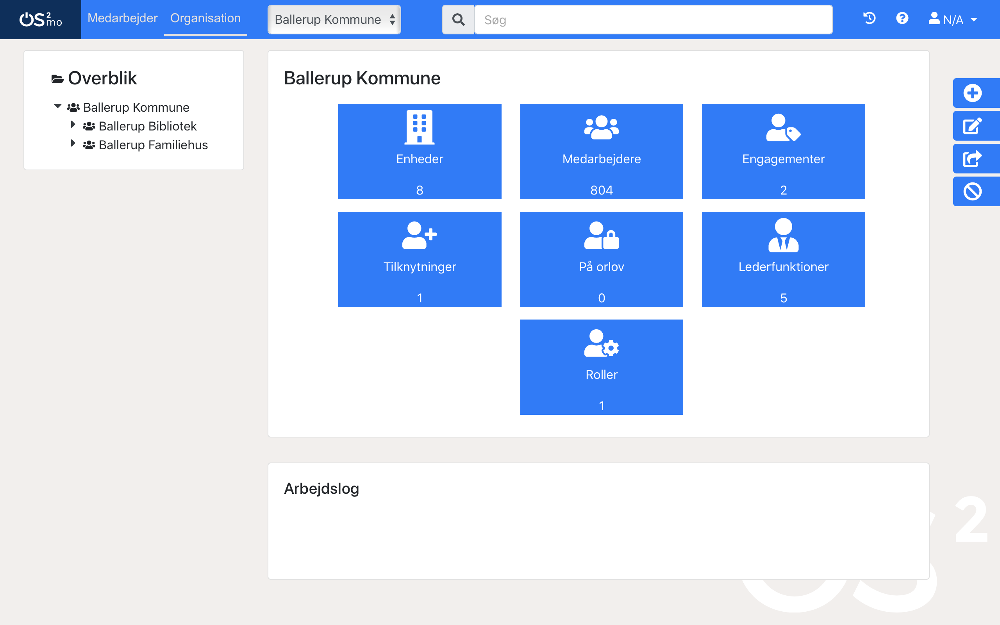

============
Om OS2MO 2.0
============

.. contents:: `Indhold`
   :depth: 2

.. image:: https://lorajenkins.magenta.dk/buildStatus/icon?job=mora/development
   :alt: Build Status
   :target: https://lorajenkins.magenta.dk/job/mora/job/development/

Introduktion
============

MORa er en webapplikation til håndtering af et medarbejder- og
organisationshierarki. Systemet sætter brugerne i stand til at navigere rundt i
eksempelvis organisationshierarkiet, indhente relevante informationer om de
forskellige organisationsenheder samt at redigere de data, der er tilknyttet
de forskellige enheder.

Navnet MORa er en sammentrækning af MO og LoRa og
refererer til hhv. `OS2MO <https://os2.eu/projekt/os2mo>`_ og den
`Lokale Rammearkitektur <https://digitaliser.dk/group/3101080/members>`_.
Nedenstående figur viser et typisk eksempel på en side i systemet brugerflade:

Opbygning
=========

Den modulære opbygning af MORa ses på nedenstående figur.

.. image:: docs/graphics/MOmoduler.png
   :width: 100%

MORa består af frontend og en middleend og sidstnævnte kommunikerer med en LoRa
backend. De enkelte moduler kan opfattes som elementer i
`MVC-modellen <https://en.wikipedia.org/wiki/
Model%E2%80%93view%E2%80%93controller>`_:

--------------------
MO (Frontend / View)
--------------------
MOs frontend er skrevet i Javascript frameworket
`Vue.js`_. Frontenden kan opfattes som *View* i
MVC-modellen, og brugerne interagerer med applikationen via denne. Frontenden
kommunikerer indirekte med Lora via MOs middleend.

----------------------
LoRa (Backend / Model)
----------------------
En `LoRa <https://github.com/magenta-aps/mox>`_ backend, som gemmer alle data
i en PostgreSQL-database. Disse data udstilles og manipuleres via en
RESTful service skrevet i Python. LoRa kan opfattes som *Model* i MVC-modellen.
LoRa anvender OIO-standarderne for sag, dokument, organisation og klassifikation

MO betjener sig af udvidelser af datamodellen i LoRa. Før Lora kan anvendes sammen
med MO skal disse tilretninger afspejles i databasen.

--------------------------------------
MO-tilretninger af datamodellen i LoRa
--------------------------------------

For at få datamodellen i LoRa til at afspejle datamodellen i MO skal
LoRAs konfiguration justeres så den anvender en anden
databaseopsætning::

  DB_STRUCTURE_EXTENSIONS=/path/to/os2mo/backend/mora/db_extensions.json

Dette skal sættes som en del af konfigurationen af LoRA inden
databasen oprettes og ``initdb.sh`` afvikles. Derudover skal det være
sat under kørslen.

Uden denne indstilling vil eksempelvis kaldenavn og primære
engagementer ikke kunne lagres.

------------------------
MO (Middleend / Control)
------------------------
MOs middleend fungerer som en bro mellem frontenden og backenden, og den har
til opgave at oversætte de data, der sendes mellem frontenden og backenden til
passende JSON formater, når der udføres læse- og skriveoperationer fra og
til LoRa (se flere detaljer nedenfor).

Når der læses fra LoRa, leverer denne data i et JSON-format, som
frontenden ikke umiddelbart kan tolke, hvorfor middleenden oversætter disse
til det JSON-format, som frontenden forventer. Tilsvarende sender frontenden
ved skriveoperationer JSON i et format, som skal oversættes af middleenden til
det JSON-format, som kræves af LoRa's REST API. Middlend kan opfattes som *Control* i MVC-modellen.

Opsætning af udviklingsmiljø
============================

.. tip::

   TL;DR: for at få et udviklingsmiljø, kør:

   .. code-block:: bash

      git clone https://github.com/OS2mo/os2mo.git
      cd os2mo
      docker-compose up mox-cp
      docker-compose up -d --build mo

------
Docker
------

Repositoriet inderholder en :file:`Dockerfile`. Det er den anbefalede måde at
installere OS2MO i produktion og som udvikler.

Alle releases bliver sendt til  Docker Hub på `magentaaps/os2mo
<https://hub.docker.com/r/magentaaps/os2mo>`_ under tagget ``latest``. Tagget
``dev-latest`` indeholder det seneste byg af ``development`` branchen.

For at køre OS2MO i docker, skal du have en kørende docker instans. For
installationen af denne, referere vi til `den officielle dokumentation
<https://docs.docker.com/install/>`_.

Containeren kræver en forbindelse til en `LoRa instans
<https://github.com/magenta-aps/mox>`_. Den kan sættes via miljøvairablen
``OS2MO_LORA_URL``. Desuden kræves enten en forbindelse til Serviceplatformen
som sættes via miljøvariablerne ``OS2MO_SP_*``. Alternativt kan OS2MO lave en
attrap af Serviceplatformen. Det gøres ved at sætte miljøvariablen
``OS2MO_DUMMY_MODE=True``.

For at starte en OS2MO container med en attrap af Serviceplatform, køres
følgende:

.. code-block:: bash

    docker run -p 5000:5000 -e OS2MO_LORA_URL=http://<LoRa-IP>:8080/ -e OS2MO_DUMMY_MODE=True magentaaps/os2mo:latest

Den henter docker imaget fra Docker Hub og starter en container i forgrunden.
``-p 5000:5000`` `binds port
<https://docs.docker.com/engine/reference/commandline/run/#publish-or-expose-port--p---expose>`_
``5000`` på host maskinen til port ``5000`` i containeren. ``-e`` `sætter den
efterfølgende miljøvariabel
<https://docs.docker.com/engine/reference/commandline/run/#set-environment-variables--e---env---env-file>`_
i containeren.

Hvis serveren starter rigtigt op skulle du kunne tilgå den på fra din host
maskine på ``http://localhost:5000``.

Brugerrettigheder
-----------------

:file:`Dockerfile` laver en ``mora`` brugerkonto der kører applikationen.
Brugerkonto ejer alle filer lavet af applikationen. Brugerkontoen har ``UID`` og
``GID`` på 72020.

Hvis du vil kører under en anden ``UID/GID``, kan du specificere det med
``--user=uid:gid`` `flaget
<https://docs.docker.com/engine/reference/run/#user>`_ til ``docker run`` eller
`i docker-compose
<https://docs.docker.com/compose/compose-file/#domainname-hostname-ipc-mac_address-privileged-read_only-shm_size-stdin_open-tty-user-working_dir>`_.

--------------
Docker-compose
--------------

Du kan bruge ``docker-compose`` til at starte OS2MO, LoRa og relaterede services
op.

En :file:`docker-compose.yml` til udvikling er inkluderet. Den starter
automatisk OS2MO og `LoRa <https://hub.docker.com/r/magentaaps/mox>` med
tilhørende `postgres <https://hub.docker.com/_/postgres>`_ op. Den sætter
desuden også miljøvariablerne til at forbinde dem.

Den mounter også din host maskines :file:`./backend` til den tilsvarende mappe
inde i containeren og automatisk genstarter serveren ved kodeændringer.

For at kopiere :ref:`MOX database filer til
initialisering <mox:db_user_ext_init>` kør:

.. code-block:: bash

   docker-compose up -d --build mox-cp

For at hente og bygge images og starte de tre services, kør:

.. code-block:: bash

   docker-compose up -d --build mo

``-d`` flaget starter servicene i baggrunden. Du kan se outputtet af dem med
``docker-compose logs <name>`` hvor ``<name>`` er navnent på scervicen i
:file:`docker-compose.yml`. ``--build`` flaget bygger den nyeste version af
OS2MO imageet fra den lokale :file:`Dockerfile`.

For at stoppe servicene igen, kør ``docker-compose stop``. Servicene vil blive
stoppet, men datane vil blive bevaret. For helt at fjerne containerne og datane
, kør ``docker-compose down``.

---
LXC
---

I princippet er det muligt at foretage videreudvikling af MORa uden at have
en kørende instans af LoRa (idet man blot skriver tests til den udviklede
kode), men i praksis vil det være mest praktisk med en kørende LoRa, som man
kan udvikle op imod. Det anbefales derfor at installere LoRa i eksempelvis en
Linux container som `LXC <https://linuxcontainers.org/>`_ eller lignende, som
kører på udviklingsmaskinen. Nærmere instruktioner vedr. selve installationen
af LoRa kan findes på LoRas GitHub-side, som er linket til ovenfor.

For at installere de nødvendige afhængigheder på en Ubuntu-maskine, køres
følgende kommandoer::

  $ sudo apt install python3 python3-venv

Derudover er følgende systemafhængigheder påkrævet af vores nuværende Python-afhængigheder::

  $ sudo apt install build-essential libssl-dev libffi-dev python3-dev xmlsec1 libxmlsec1-dev

Efterfølgende klones MORa-projektet fra GitHub::

  $ mkdir /path/to/folder
  $ cd /path/to/folder
  $ git clone https://github.com/magenta-aps/mora

Nyere NodeJS-versioner er ikke includeret i Ubuntu 16.04 (LTS),
derfor bør NodeJS LTS-versionen installeres via et eksternt apt repository.

Installationen af NodeJS kan udføres i følgende trin,

Tilføj nodesource public nøgle::

  $ cd setup/nodesource
  $ sudo apt-key add nodesource.gpg.key

Nodesource apt repository skal tilføjes::

  # Add list file
  $ cd setup/nodesource
  $ sudo cp nodesource-8.x.list /etc/apt/sources.list.d/nodesource-8.x.list

  # Update apt cache
  $ sudo apt-get update

Installer nodejs meta pakken::

  $ sudo apt-get install nodejs

Bekræft at version 8 er installeret::

  $ node -v
  v8.11.1

Herefter installeres følgende afhængighed::

  $ curl -sS https://dl.yarnpkg.com/debian/pubkey.gpg | sudo apt-key add -
  $ echo "deb https://dl.yarnpkg.com/debian/ stable main" | sudo tee /etc/apt/sources.list.d/yarn.list

  $ sudo apt-get update && sudo apt-get install yarn

Der skal nu oprettes en database til MOs configurationsoplysninger::

  cd setup
  ./create_conf_db.sh

Man kan nu på sædvanligvis manuelt installere det virtuelle miljø, som Python
skal køre i og de nødvendige Python-moduler (med "pip install -r requirements.txt"),
men det nemmeste er blot at anvende scriptet
``flask.sh``. Første gang, skal front-enden bygges::

  $ cd /path/to/folder/mora/backend
  $ ./flask.sh build

Hvorefter følgende kommando kan køres::

  $ ./flask.sh run

Dette vil automatisk oprette et vituelt Python-miljø, installere de
nødvendige Python-afhængigheder og starte applikationen (lyttende på
port 5000). Applikationen kan således tilgås på *http://localhost:5000*.
Bemærk dog, at der først skal uploades data til LoRa - til dette formål
kan man med fordel anvende ``flask.sh``.

--------------------------------------
Generel brug af kommandolinieværktøjet
--------------------------------------

Scriptet ``flask.sh`` kan bruges til en række forskellige operationer. De
mulige funktioner ses ved blot at køre scriptet fra kommandolinjen
uden argumenter::

  $ /path/to/folder/mora/flask.sh

hvilket vil resultere i flg. output::

  Usage: /path/to/folder/mora/flask.sh [OPTIONS] COMMAND [ARGS]...

    Management utility for MORA.

  Options:
    --version  Show the flask version
    --help     Show this message and exit.

  Commands:
    auth         Test and extract authentication tokens from SAML IdP.
    build        Build the frontend application.
    routes       Show the routes for the app.
    run          Runs a development server.
    run-with-db  Runs a development server with a one-off LoRA.
    shell        Runs a shell in the app context.
    test         Unit test runner

En liste af mulige funktioner ses under *Commands*. Hvis man fx vil importere
et regneark med data til en kørende LoRa-instans, kan dette gøre således
(for passende værdier af sti til regneark)::

  $ ./flask.sh import spreadsheets /sti/til/regneark.xlsx

Ønsker man dokumentation for syntaksen af en given kommando, skriver man fx::

  $ ./flask.sh import

Som vil angive, hvad den korrekte syntaks er::

  Usage: flask.sh import [OPTIONS] SPREADSHEET [URL]

  Error: Missing argument "spreadsheet".

For yderligere detaljer om brugen af ``flask.sh`` henvises til
kildekoden og den indbyggede hjælp.

-------------
Konfiguration
-------------

Indstillinger gemmes i ``setup/mora.json``. Den vigtiste er
``LORA_URL``; denne kan også sættes som en miljøvariabel::

  OS2MO_LORA_URL=http://localhost:5000 ./flask.sh run

Alternativt kan stien til konfigurationsfilen angives med miljøvariablen
``OS2MO_CONFIG_FILE``.

Testsuiten
==========

Der arbejdes i proktet med tre typer af tests:

1. Unit tests
2. Integration tests
3. End-to-end tests

En del af integrationstestene er sat op til at køre på en sådan måde, at der
startes en LoRa-instans før de enkelte test cases kører. Hver test case
køres derefter op imod LoRa-instansen, idet der ryddes op i LoRa mellem hver
test case, så testene effektivt set køres isoleret. For at anvende denne test
feature kræver det følgende afhængigheder::

  $ sudo apt install libxmlsec1-dev libxmlsec1-openssl postgresql-contrib

Testsuiten kan køres med kommandoen::

  $ ./flask.sh test

End-to-end tests
================

Vores end-to-end tests køres typisk som en del af testsuiten. For at
køre den direkte mod en udviklingsmaskine anvendes eksempelvis::

  cd frontend
  BASE_URL=http://localhost:5000/ yarn testcafe --speed 0.5 firefox e2e-tests

Dokumentation
=============

Det er muligt at autogenerere dokumentation ud fra doc-strings i kildekoden.
Til dette anvendes `Sphinx <http://www.sphinx-doc.org/en/stable/index.html>`_.
Kør nedenstående kommando for at autogenerere dokumentationen::

  $ ./docs/make html

Dokumentation kan nu findes ved at åbne filen
``/sti/til/mora/docs/out/index.html``.

Kodestandarder
==============

Der anvendes overalt i python-koden styleguiden `PEP 8 <https://www.python.org/dev/peps/pep-0008/>`_.

Licens og Copyright
===================

Copyright (c) 2017-2019, Magenta ApS.

Dette værk er frigivet under `Mozilla Public License, version 2.0
<https://www.mozilla.org/en-US/MPL/>`_, som gengivet i ``LICENSE``. Dette er et
OS2 projekt. Ophavsretten tilhører de individuelle bidragydere.

Der findes en version af core-koden, og den er placeret her:
`https://github.com/OS2mo <https://github.com/OS2mo>`_.

Værket anvender følgende Open Source software-komponenter:

* `Flask <https://www.palletsprojects.com/p/flask/>`_, BSD License
* `Flask-Session <https://github.com/fengsp/flask-session>`_, BSD License
* `lxml <http://lxml.de/>`_, BSD License
* `python-dateutil <https://dateutil.readthedocs.io>`_, BSD License, Apache Software License
* `python3-saml <https://github.com/onelogin/python3-saml>`_, MIT License
* `requests <http://python-requests.org>`_, Apache Software License
* `vue.js <https://vuejs.org/>`_, MIT License
