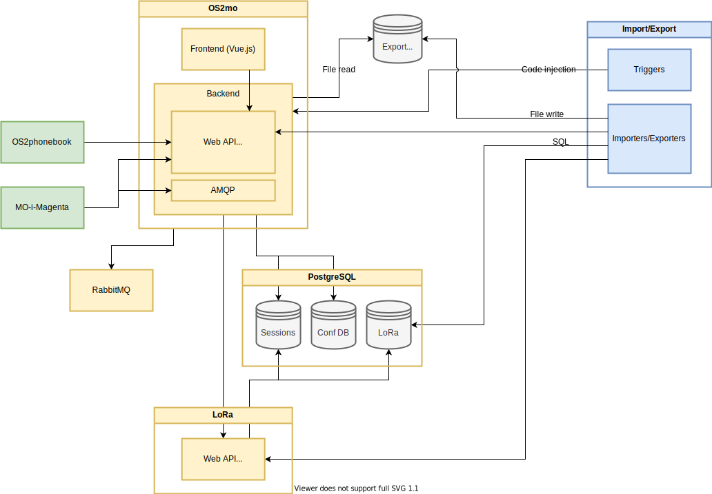

Architecture
============

The following diagram gives an overview of the system architecture of OS2mo
and its surrounding components and integrations. The arrows denote
dependencies on interfaces/APIs/etc.

- The yellow boxes consist of the OS2mo core components, that are deployed as
  part of a typical OS2mo installation.
- The blue boxes are OS2mo import/export integrations.
- The green boxes are Magenta applications, that are part of the
  larger OS2mo landscape.

