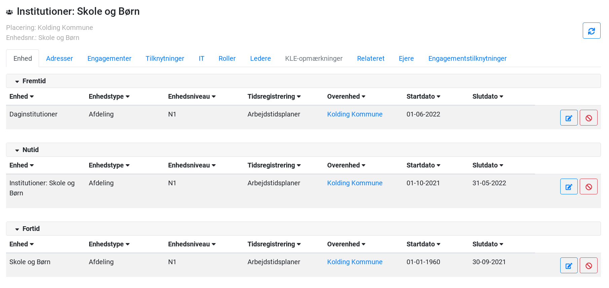

## Introduktion

OS2mo er bygget til at håndtere en eller flere organisationer (løn, administrativ, økonomi, MED/AMR mv.), dens medarbejdere og andre tilknyttede personer (eksterne konsulenter, praktikanter, mv.).

OS2mo implementerer den fællesoffentlige rammearkitektur og har to OIO-services implementeret (Organisation, Klassifikation).

Dette dokument beskriver en række grundbegreber og -logikker samt den funktionalitet, der er indlejret i brugergrænsefladen, jf. hhttps://morademo.magentahosted.dk/ bruce/bruce

For øvrig dokumentation, se https://rammearkitektur.docs.magenta.dk/os2mo/index.html

For at få et overblik over hvilke integrationer der er udviklet, se https://rammearkitektur.docs.magenta.dk/os2mo/arkitektur-design/overview.html

Der findes også en implementeringshåndbog: https://rammearkitektur.docs.magenta.dk/os2mo/drift-support/cookbook.html

## Overordnede begreber og fælles funktionalitet

### Organisation og Organisationsenhed

En organisation er en juridisk enhed med rettigheder og ansvar. Eksempler på organisationer er myndigheder (fx et ministerium, en styrelse, en kommune), NGO'er eller virksomheder.

En organisationsenhed er en del af en organisation og kan kun eksistere i forbindelse med denne. Eksempelvis kan et kontanthjælpskontor kun eksistere som en del af en kommune, og en it-afdeling eksisterer kun som en del af en virksomhed.

### Personer (medarbejder, praktikant, ekstern konsulent, etc.)

En person er en digital repræsentation af en fysisk person. Personer hentes typisk fra lønsystemet eller CPR-Registret og er altid indplaceret i organisationsenhed.

### Dobbelthistorik og Fortid, Nutid og Fremtid
Det er i OS2mo muligt at have overblik over fortidige, nutidige og fremtidige registreringer vha. følgende tabs under hvert faneblad.

