## Introduktion

OS2mo er bygget til at håndtere en eller flere organisationer, dens medarbejdere og andre tilknyttede personer (eksterne konsulenter, praktikanter, mv.). Organisationstyperne kan fx være lønørganisationen, den administrative organisation, økonomiorganisationen, projektorganisationen, MED/AMR, mv.

Det smarte ved OS2mo er, at samtlige organisationer og samtlige tilknyttede personer håndteres i én applikation. Alle oplysningerne kan sendes videre til andre systemer, således at disse grundlæggende oplysningerne altid er ens i alle systemer, der er forbundet til OS2mo, herunder fx organisationsdiagrammet:

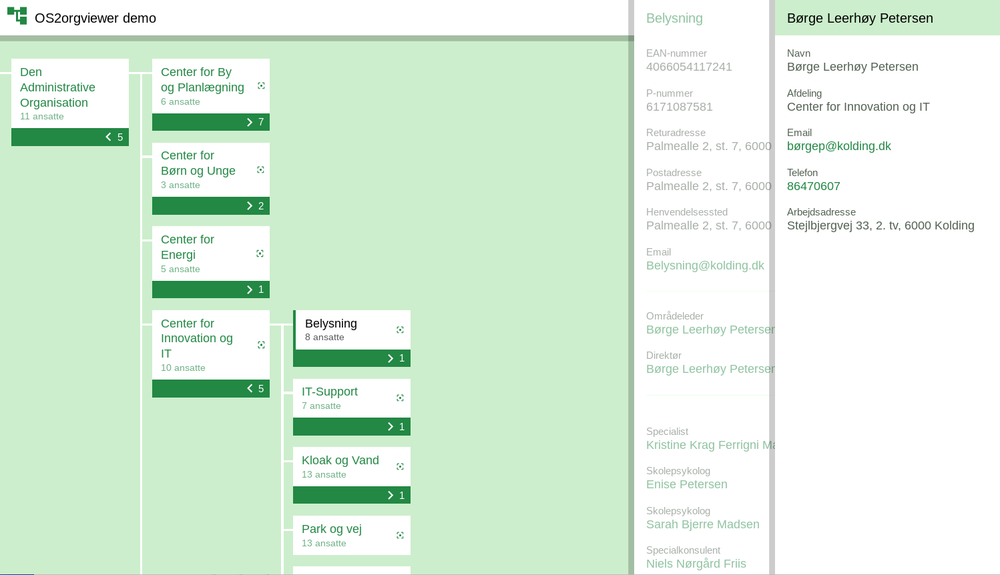

Dette dokument beskriver en række grundbegreber og -logikker samt den funktionalitet, der er indlejret i brugergrænsefladen.

Se [øvrig dokumentation.](https://rammearkitektur.docs.magenta.dk/os2mo/index.html)

For at få et overblik over hvilke [integrationer.](https://rammearkitektur.docs.magenta.dk/os2mo/arkitektur-design/overview.html) der er udviklet.

Der findes også en [implementeringshåndbog.](https://rammearkitektur.docs.magenta.dk/os2mo/drift-support/cookbook.html)

## Overordnede begreber og fælles funktionalitet

### Organisation og Organisationsenhed

En organisation er en juridisk enhed med rettigheder og ansvar. Eksempler på organisationer er myndigheder (fx et ministerium, en styrelse, en kommune), NGO'er og private virksomheder.

En organisationsenhed er en del af en organisation og kan kun eksistere i forbindelse med denne. Eksempelvis kan et kontanthjælpskontor kun eksistere som en del af en kommune, og en it-afdeling eksisterer kun som en del af en virksomhed.

### Personer (medarbejder, praktikant, ekstern konsulent, etc.)

En person er en digital repræsentation af en fysisk person. Personer hentes typisk fra lønsystemet eller CPR-Registret og er altid indplaceret i en eller flere organisationsenheder.

### Dobbelthistorik og Fortid, Nutid og Fremtid

[Dobbelthistorik](https://en.wikipedia.org/wiki/Bitemporal_Modeling), eller bitemporalitet, betyder, at to tidsakser (registreringstid og virkningstid) håndteres:

**Registreringstid** er tidspunktet for selve registreringen, fx oprettelsen af en enhed eller en medarbejder. Denne ’tid’ er ikke synlig i brugergrænsefladen, men vil altid kunne spores i databasen.

**Virkningstid** er den periode, inden for hvilken en registrering er gyldig, fx at en enhed eksisterer fra 1. januar 2020 til 31. december 2024.

Enheden 'IT-support kan altså oprettes på forhånd (den 3. januar 2022 = registreringstid), men først træde i kraft den 1. februar 2022 og ikke have nogen slutdato (1. februar til uendelig = virkningstid).

Det er altså i OS2mo muligt at have overblik over fortidige, nutidige og fremtidige oplysninger, planlægge dem på forhånd og inspicere dem retrospekt. Alle oplysningerne er tilgængelige i de tre "tids-tabs", Fremtid, Nutid og Fremtid, under hvert faneblad. Man kan altså se alle de ændringer der er foretaget over tid i brugergrænsefladen.

#### Afslut og Redigér ####

**Afslut**

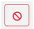

Det er muligt at afslutte en registrering, sådan at fx en medarbejders engagement i organisationen bliver bragt til ophør på en specifik dato, og vedkommendes konti i andre systemer (fx Active Directory) bliver nedlagt. Når datoen for afslutningen af ansættelsen oprinder, vil medarbejderens engagement flytte sig fra Nutid til Fortid og blive inaktivt.

**Redigér**

Det er muligt at redigere en registrering for at ændre en af registreringens oplysninger. Det kan fx være, at et telefonnummer skal redigeres, eller en tilknytningstype skal ændres. Hvis den nye tilknytningstype skal være gældende fra i dag, vil den gamle tilknytningstype rykke ned under Fortidstabben, og den ny tilknytningstype vil være gældende og at finde under Nutidstabben. På den måde er der synlig historik på alle de ændringer, man foretager.

I eksemplet nedenfor har Marie tilknytningen "Projektgruppemedlem", men det er planlagt, at hun skal være projektleder pr. en fremtidig dato, nemlig 01-02-2020, hvorfor ændringen nu kan ses under Fremtidstabben. Når datoen oprinder, vil ændringen blive flyttet ned under Nutidstabben, mens den registrering, der findes under Nutidstabben, vil blive flyttet ned under Fortidstabben.

Det bemærkes, at såfremt *startdatoen* ikke ændres, vil det resultere i en *overskrivning* af den eksisterende registrering, og der vil *ikke* blive oprettet historik på oplysningen, fordi det ikke bliver opfattet som en ændring, en en rettelse, en korrektion (fx ifm. fejlindtastning).

## OS2mo’s brugergrænseflade

OS2mo består af to moduler:

1. **Medarbejdermodulet**, som håndterer tilknyttede personer og deres stamdata.
2. **Organisationsmodulet**, som håndterer organisationsenheder og deres stamdata. Det er også muligt at skabe relationer mellem Organisationsenheder vha. modulet ’Organisationssammenkobling’.

De to moduler indeholder:

1. En Header
2. Et Organisationshierarki – I venstre side (findes dog ikke i Medarbejderdelen).
3. En Detaljeside - I midten.
4. En række Hovedarbejdsgange – I højre side.

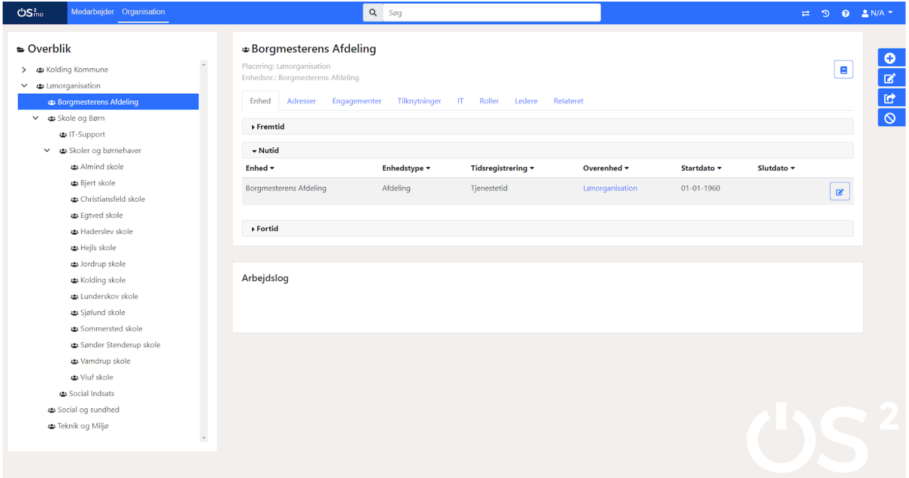

### Header

OS2mo’s header ser således ud:

Headeren består af følgende elementer:

1. OS2mo-ikon, der fører tilbage til startsiden.
2. Medarbejder- & Organisations-knapper, der leder til det ene og det andet modul.
3. Søgefunktion, som søger på medarbejdere, når man befinder sig i Medarbejdermodulet, og på enheder, når man er i Organisationsmodulet.
4. Datovælger, der kan spole i tid.
5. Rapporter, hvor man kan tilgå rapporter.
6. Indsigt.
7. Sprog - dansk og engelsk.
8. Log ind/ud-knap.

Yderligere forklaringer til **Søgefunktion**, **Rapporter** og **Indsigt**:

#### Søgefunktionen

Søgefunktionen fungerer i kontekst med enten Medarbejderdelen eller Organisationsdelen:

Under Medarbejderdelen kan man søge på:

- Brugernavn, dvs fornavn eller efternavn eller fuldt navn (ex Karen Hammer Nielsen)
- BrugerVendt Nøgle (ex Bd5tr)
- CPR-nummer uden bindestreg (ex 2908623439)

Under Organisationsdelen kan man søge på:

- Administrativ- eller Løn-organisation (ex Svendborg Kommune)
- Organisationsenhedsnavn (ex Egtved skole)
- Enhedsnummer (BrugerVendt Nøgle, ex EgtSko)

#### Søgefunktionen+

**Hvad kan man søge på?**

Det er også muligt at få tilpasset sin søgning. I så fald bliver det muligt at søge på:

**Medarbejderes:**

- UUID
- Medarbejdernavn
- Kaldenavn
- CPR-nummer (uden bindestreg)

**Medarbejderes adresseregistreringer (undtagen DAR-adresser). Eksempelvis:**

- Telefonnummer
- Email

**Medarbejderes  it-konto-registreringer. Eksempelvis:**

- az ident

**Organisationsenheders:**

- UUID
- Enhedsnavn
- Enhedsnummer - BVN (brugervendt nøgle)

**Organisationenheders adresse-registreringer (undtagen DAR-adresser). Eksempelvis:**

- LOS ID
- OrgID
- Adresse
- Telefonnummer
- Email

**Organisationenheders it-konto-registreringer**

**Hvad kommer frem i søgeresultat?**

**Medarbejder**

- Navn
- Udvalgte adresse--registreringer (fx telefonnummer, email)
- Udvalgte it-konto-oplysninger (fx “AZ ident”)

**Organisation**

- Navn
- Organisatorisk sti
- Udvalgte adresse-registreringer (fx LOS-ID, mag-kort)
- Udvalgte it-konto-oplysninger

#### Rapporter

Rapporter er forskellige sammenstillinger af de data, der findes i OS2mo. Rapporterne bliver opdateret hver nat, så de altid indeholder de nyeste data. Rapporternes indhold afhænger af, hvad der er bestilt. En rapport kan fx være et link til en csv-fil, som angiver, hvem der er leder for hvem:

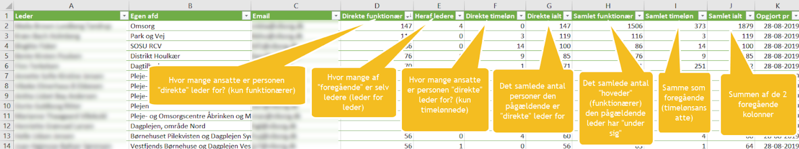

#### Indsigt

Indsigt er ikke idriftssat endnu, men er et modul, som tillader brugerne selv at sammenstille data på kryds og tværs og downloade pdf'er eller csv'er.

### Organisationshierarki med mulighed for flere parallelle organisationer

I venstre side af skærmen findes et organisationshierarki, der giver overblik over organisationen og mulighed for navigation i den:

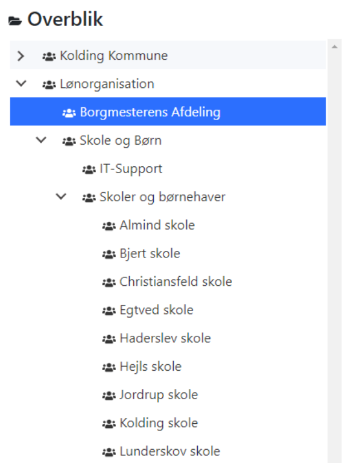

Bemærk, at det er muligt at have flere organisationer indlæst, fx den administrative organisation, lønorganisationen, MED/AMR-organisationen. I ovenstående eksempel er der tale om de to førstnævnte.

### Detaljeside

Når en organisationsenhed vælges, vil information om den være fordelt på en række faneblade:

Det samme gør sig gældende, når en medarbejder vælges:

#### Fanebladet Enhed

En organisationsenhed er en del af en organisation (fx Brønderslev Kommune) og kan kun eksistere i forbindelse med denne. Eksempelvis kan et kontanthjælpskontor kun eksistere som en del af en kommune.

Organisationsenheder kan spænde fra mindre enheder, som fx teams eller grupper, til store og komplekse enheder, som fx en forvaltning, der indeholder mange andre andre niveauer af underenheder.

Eksempler på organisationsenheder er teams, afdelinger, sektioner, kontorer, udvalg, projektgrupper, styregrupper, daginstitutioner, hold og lignende.

**Enhedstype** bruges til at skelne mellem de formål, enhederne har. Enhedstype skal bruges beskrivende og til at udsøge organisationsenheder af en bestemt enhedstype.
Eksempel: Afdeling, underafdeling, sektion, enhed, direktørområde, center.

**Enhedsniveau** udstilles fx i kommuner, der benytter lønsystemet SD-Løn, og angiver her, hvorvidt der er tale om en organisationsenhed, som tilhører den administrative organisation eller lønorganisationen. Enhedsniveau kan også blot benyttes til at angive et hierarki.

**Tidsregistrering** benyttes i nogle kommuner til at identificere, hvilken type tidsregistrering, enheden benytter sig af. Dette felt anvendes ikke i alle kommuner, og visning af det kan slås fra i MOs konfiguration.

**Overenhed** fortæller, hvilken enhed der ligger umiddelbart over de valgte enhed.

**Start- og slutdato** angiver hvornår sidste ændring på enheden er foretaget, og eventuelt hvornår den slutter.

Fanebladet findes ikke i Medarbejderdelen.

#### Fanebladet Adresser

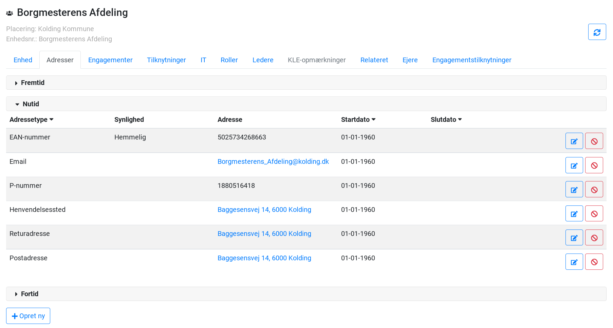

Er en liste af de forskellige kontaktformer, der er tilgængelige for organisationer, organisationsenheder og medarbejdere.

Eksempler på adressetyper er: Postadresse, email-adresse, EAN-nummer, P-nummer, Henvendelsessted, webadresse.

Det er muligt at behæfte en ‘Synlighed’ til alle Adressetyper. Synligheden ændrer ikke på, om adressen kan ses i MO, men indikerer overfor MOs brugere, om adressen må videregives, og anvendes i øvrigt af MOs integrationer til at afgøre, i hvilke sammenhænge en adresse må udstilles i (hjemmesider, rapporter, organisationsdiagram, mv). Det kan typisk dreje sig om, at man ikke ønsker at udstille et telefonnummer på fx intranettet.

#### Fanebladet Engagementer

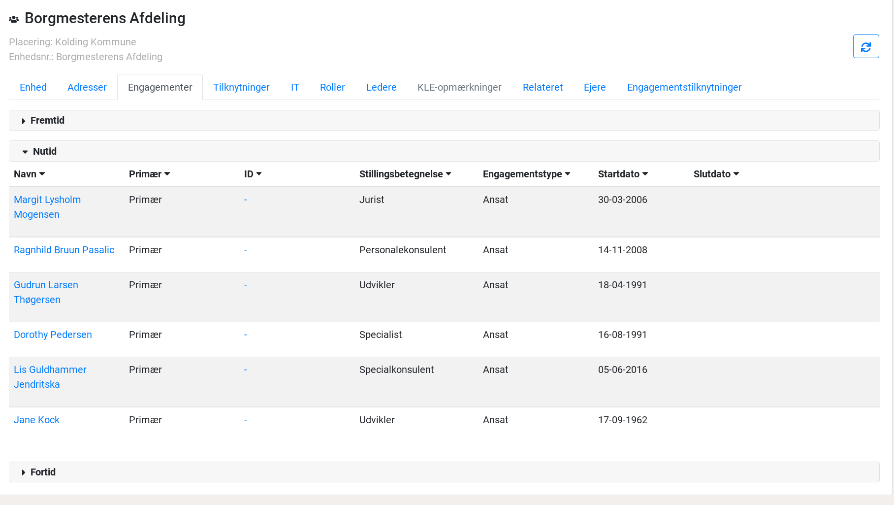

Et engagement beskriver et forhold mellem en person og en organisationsenhed. Engagementet kan bruges til at beskrive den rolle, en person har i en organisation, fx at en person er "Projektansat" (**Engagementstype**) med **Stillingsbetegnelsen** ‘Jurist’.

**Primær** angiver hvorvidt der er tale om en primær ansættelse. Det har fx betydning for oprettelsen af Active Directory-kontoen.

#### Fanebladet Tilknytninger

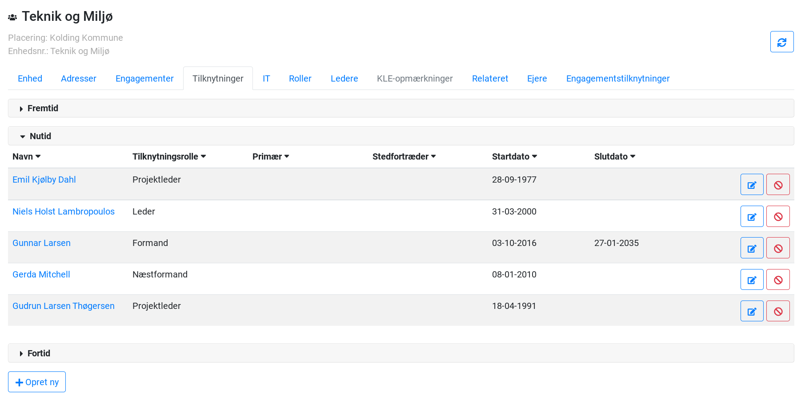

En ‘Tilknytning’ definerer et forhold mellem en person og en organisationsenhed. Der er modsat engagementet ikke tale om en ansættelse, men om en funktion, en person udfylder i forbindelse med en anden organisationsenhed, end den vedkommende er ansat i.

Tilknytninger er typisk benyttet til at forbinde en medarbejder midlertidigt til en anden enhed ifm. et midlertidigt projekt. Det benyttes også hyppigt til at knytte medarbejdere til MED/AMR-organisationen. Det er også muligt at angive stedfortrædere for fx tillidsrepræsentanter. I Medarbejderdelen er det også muligt at angive, hvilken faglig organisation, vedkommende repræsenterer, fx LO - Dansk El-forbund.

#### Fanebladet IT

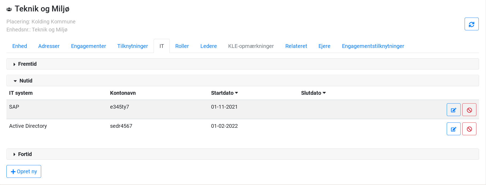

Fanebladet ’IT’ giver et overblik over, hvilke it-systemer organisationsenheden benytter. Under Medarbejderdelen vises medarbejderens systemkonti, fx fra OPUS eller Active Directory.

#### Fanebladet IT-Tilknytninger

Udover lønmæssig indplacering (ansættelse / engagement) er en person indplaceret i forhold til sit arbejdssted. Dette er ofte, men ikke altid, identisk med den lønmæssige indplacering. I praksis er det ikke personen, men deres it-bruger, der er indplaceret. Enkelte personer har mere end én it-bruger, som er placeret og har rettigheder forskellige steder. Derfor er det ikke muligt at benytte eksempelvis "Tilknytning" eller "Engagement" (se ovenfor), da ingen af dem er forbundet til it-brugeren.
Derfor er det nødvendigt at kunne markere den primære it-bruger, så de aftagersystemer, der kun tillader én bruger pr. person, kan få udvalgt den rette bruger. Derudover er der i nogle tilfælde behov for at tilknytte en brugervendt stillingsbetegnelse til IT-brugeren, som ikke er identisk med den stillingsbetegnelse, der er hentet fra lønsystemet og placeret under engagementer.

Oprettelsen af en it-tilknytning ser således sådan ud:

**Valideringer**

Følgende valideringer er gældende:

***It-konti*** (i et bestemt system)

- En it-konto må kun være tilknyttet én person (et CPR-nummer).
- En given person må maksimalt have én primær it-konto pr. it-system

Fx kan én person have it-konti Y11 og Y22 til ét it-system og Y33 til et andet. Dvs. tre it-konti som hver især kan tilknyttes organisation en eller flere gange.

***It-konti-tilknytning***

- En person må maksimalt have én it-tilknytning til en given it-konto pr. organisationsenhed.

Fx: Y11 fra samme it-system må kun være tilknyttet samme organisationsenhed én gang.

Fx: Y11 og Y22 fra samme it-system kan være tilknyttet samme organisationsenhed.

- En person må maksimalt have én primær it-tilknytning for en given it-konto.

Fx: Y11 kan ikke være tilknyttet to forskellige organisationsenheder som primær på samme tid.

Fx: Y11 og Y22 fra samme it-system kan være knyttet til samme organisationsenhed som primær.

#### Fanebladet Roller

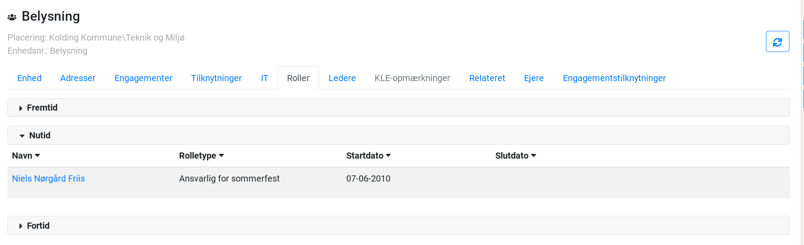

En Rolle definerer endnu et forhold mellem en person og en organisationsenhed. Der er typisk tale om en dagligdagsfunktion, som en afdeling har behov for. I eksemplet er der vist en asvarlig for organiseringen af sommerfesten.

Andre eksempler: Fraværsregistrant, DPO eller superbruger på en it-løsning.

#### Fanebladet Ledere

En leder er en ansat, som har bestemmende indflydelse på organisationen ved hjælp af specifikke beføjelser og ansvarsområder.

Ledere kan beskrives vha:

- **Lederansvar** beskriver de ansvarstyper, en leder kan have. Eksempel: MUS-ansvarlig, Personaleansvarlig. En leder kan have flere ansvarsområder.
- **Ledertype** indikerer ofte lederens funktion og hierarkiske placering eller tilknytning til et specifikt organisatorisk niveau. Eksempel: Direktør, Beredskabschef, Centerchef, Institutionsleder.
- **Lederniveau** er en hierarkisk beskrivelse. Eksempel: Niveau 1, 2, 3.

For ledere gælder det (i Organisationsdelen), at de er markeret med en stjerne (*), hvis de er nedarvede fra en overordnet organisationsenhed (se skærmbilledet ovenfor) som følge af at enheden ikke har en direkte leder. Nedarvede ledere kan ikke redigeres eller afsluttes fra andre steder end den organisationsenhed, de er direkte ledere for.
Det er desuden muligt at gøre en lederfunktion vakant, hvis den midlertidigt ikke er besat:

En lederfunktion gøres vakant ved at klikke på Redigeringsknappen og manuelt slette lederes navn:

#### Fanebladet KLE-opmærkninger

Det er muligt at opmærke sine enheder med [KL's Emnesystematik (KLE)](http://www.kle-online.dk/soegning). Disse opmærkninger kan så sendes videre til andre systemer, der har behov for dem ifm. rettighedsstyring (fx FK ORG og OS2rollekatalog).

Fanebladet findes ikke i Medarbejderdelen.

#### Fanebladet Relateret

Viser om en organisationsenhed har en relation til en anden:

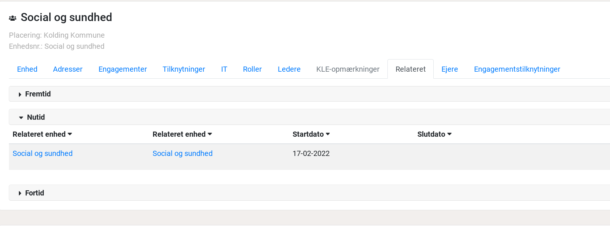

Relationer mellem enheder etableres og nedlægges i Organisationssammenkoblingsmodulet, som tilgås fra forsiden:

#### Fanebladet Orlov

En ‘Orlov’ beskriver fritagelse for tjeneste i en periode. Man kan eventuelt bruge den til at suspendere en konto i Active Directory. Informationen kan altså sendes videre til andre systemer.

Eksempel: Uddannelsesorlov, Sygeorlov, Barselsorlov.

Fanebladet findes ikke i Organisations-delen.

#### Fanebladet Ejere

Konceptet 'Ejer' benyttes til at foretage rollebaseret adgangsstyring. Det betyder, at det er muligt at give visse personer rettigheder til at redigere i en specifik del af OS2mo, mens andre (adminsitratorer) har rettigheder til at redigere overalt i Os2mo. I eksemplet ovenfor har Alfa ret til at redigere i afdelingen "Teknik og Miljø", men hvis han prøver at rette andre steder, vil han modtage denne besked:

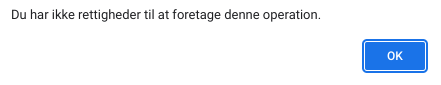

Kræver at rettighedsstyring er sat op via [Keycloak](https://www.keycloak.org/)

## Hovedarbejdsgange

I Organisationsdelen findes fire arbejdsgange:

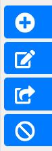

1. Opret enhed
2. Omdøb enhed
3. Flyt enhed
4. Afslut enhed

I Medarbejder-delen er der fem:

1. Ny medarbejder
2. Orlov
3. Flyt engagement
4. Flyt mange engagementer
5. Opsig medarbejder

Som hovedregel gælder det, at arbejdsgange, der hidrører Organisationsdelen, udelukkende skal benyttes, hvis OS2mo er autoritativ for organisationen. Hvis organisationen hver nat hentes fra et andet system (fx KMD LOS), vil ændringer foretaget direkte i OS2mo blive overskrevet hver nat.

Såfremt lønsystemet er autoritativt for medarbejderne, gælder det ligeledes, at OS2mo’s medarbejder-arbejdsgange som hovedregel ikke bør benyttes, idet ændringer foretaget i OS2mo vil blive overskrevet af den næstkommende synkronisering fra fx lønsystemet.

*Det er altså kun, hvis OS2mo er autoritativ, at arbejdsgangene bør benyttes.*

Fælles for arbejdsgangene er, at en startdato skal angives (slutdatoen er optionel). Startdatoen kan være fortidig, nutidig eller fremtidig. Generelt er det sådan, at en organisationsenhed eller en medarbejder ikke må eksistere uden for hhv. den tilhørende overenhedens eller enheds gyldighedsperiode.

Oprettes en medarbejder med en fremtidig startdato, vil medarbejderen fremgå af ‘Fremtids’-tabben.

Oprettes en organisationsenhed med en fremtidig startdato, vil den kun fremgå af organisationstræet, hvis Datovælgeren indstilles til den fremtidige dato. Ellers vil den først dukke op i organisationstræet på pågældende dato.

Når man opretter en organisationsenhed, kan man tilknytte en række informationer til den:

Når man opretter en medarbejder, hentes vedkommende via indtastning af CPR-nummer fra CPR-registret (såfremt denne integration er tilvalgt). Man kan som med enheder tilknytte en række informationer til medarbejderen:

Regler for cpr-numre er at man via *MOs brugergrænseflade* ikke kan oprette en bruger med et cpr-nummer som fx 111111-XXXX (eller 111111XXXX), fordi brugergrænsefladen validerer, at cpr-nummeret består af 10 cifre.

Man kan derimod godt via *MOs service-API* godt oprette en bruger med et cpr-nummer som fx 111111XXXX, men ikke en bruger med et cpr-nummer som fx 111111-XXXX (bemærk - mellem 111111 og XXXX.).

Der er en række "lag" i MO's cpr-validering:

1. Et cpr-nummer skal bestå af 10 cifre (denne validering sker kun i MOs brugergrænseflade og ikke i MOs service-API.).
2. Et cpr-nummer skal bestå af 10 tegn, uden evt. separator ("-").
3. Et cpr-nummer skal indeholde en gyldig dato.
4. Et cpr-nummer kan valideres mod KMD's Serviceplatform, hvis denne integration er sat op.

Hvis man er interesseret i at arbejde med fiktive, men valide cpr-numre, skal man benytte guiden [Fiktive CPR numre](https://modst.dk/media/17386/fiktive-cpr-numre.pdf).

Når en enhed eller en medarbejder er oprettet, kan de fremsøges, og de informationer, der er tilknyttet til dem, vil fremgå af brugergrænsefladen.

Nogle steder vil det være muligt at redigere og afslutte enkelte registreringer. Hvor det ikke er muligt, er det pr. design. Fx er det ikke muligt at redigere eller afslutte en nedarvet leder.

