# Administrationsmodulet

Det er muligt at holde styr på MOs bagvedliggende data i MO.

Adminstrationsmodulet er delt i to:

- **IT-systemer og -roller**. Man kan oprette, ændre og nedlægge *IT-systemer og -roller* i MO, hvilket gør, at man også kan oprette *IT-brugere* i MO: "Som administrator ønsker jeg at oprette en medarbejder som bruger i system X og tildele hende specifikke roller".
- **Klassifikationer**. Man kan oprette, ændre og nedlægge *klasser* i MO, hvilket betyder, at man fx kan oprette *Stillingsbetegnelser* i MO: "Som administrator ønsker jeg at oprette stillingsbetegnelsen 'Ekstern konsulent', så jeg kan opmærke medarbejdere med den".

De to moduler gennemgås nedenfor og kan tilgås i MO via venstremenuens punkt, **Administration**:

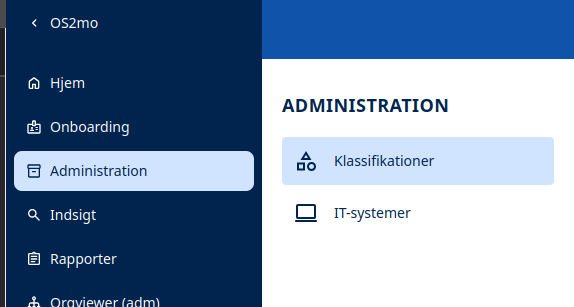

## IT-systemer og -roller

Formålet med dette modul er at tillade administrator at vedligeholde *IT-systemer og -roller*.

### Brugergrænsefladen

Når man er inde i IT-systemer i MO, præsenteres man for dette billede:

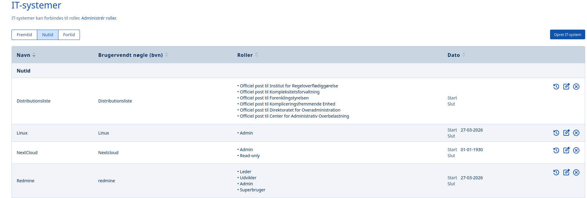

#### Oprettelse af IT-systemer & -roller

Oprettelsen af IT-systemer og -roller foretages i to skridt:

- først IT-systemet
- derpå de tilknyttede IT-roller

Der vælges "Opret IT-system" til højre i ovenstående billede, hvorpå denne formular kommer frem:

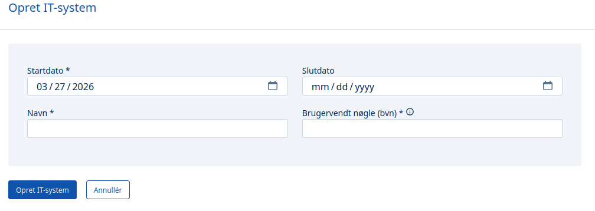

Her angives datoer, navn og brugervendt nøgle, og oprettelsen sker ved tryk på knappen "Opret IT-system".

Når det er gjort, klikkes "Administrér roller":

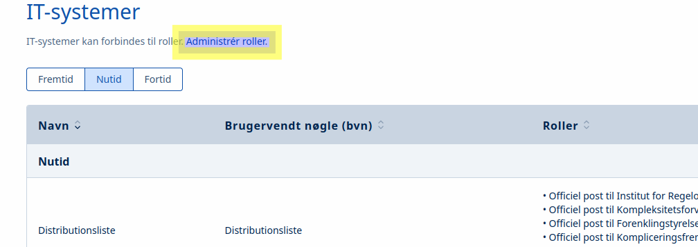

Hvorpå man kan oprette og tilknytte it-roller til det IT-system, man lige har lavet:

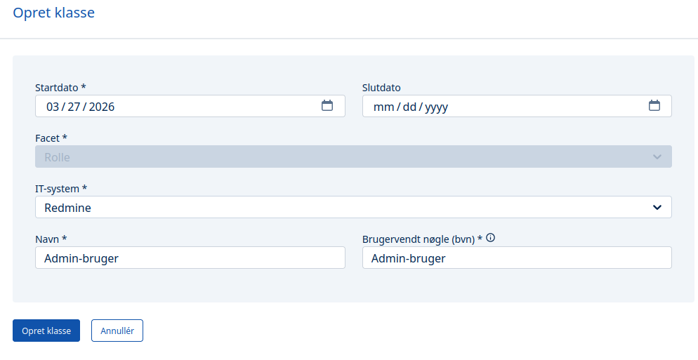

Nu er IT-systemer og dets IT-roller klar til at blive anvendt i MO, så man kan oprette IT-brugere:

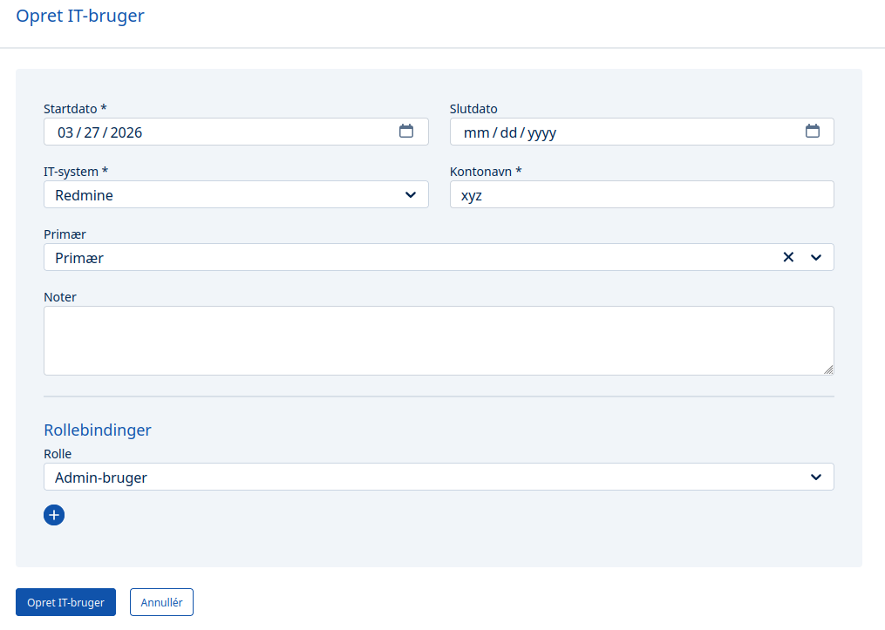

#### Ændring og sletning af IT-system og -rolle

Ved bruge af hhv. blyant- og slette-ikonet til højre for et IT-system, kan man ændre og afslutte det:

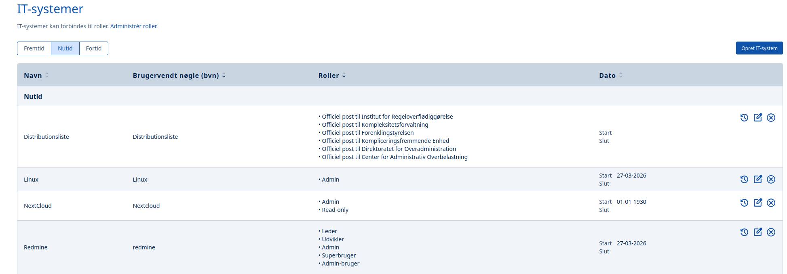

### Datostyring af IT-systemer og -roller

Som det fremgår af ovenstående, er det muligt at datostyre sine IT-systemer og -roller, så man fx kan oprette dem med fremtidig virkning.

## Klassifikationsmodulet

Formålet med dette modul er at tillade administrator at vedligeholde *Klasser*. 

### Definition

**Facetter & Klasser**

Det, der normalt går under navnet *metadata*, kaldes *klasser* i [OIO-standarden](https://arkitektur.digst.dk/specifikationer/organisation/oio-specifikation-af-model-organisation), og derfor benyttes den samme term i MO.

En *klasse* beskriver et objekt i MO (en person, en ansættelse, en organisationsenhed, en ledertype, en orlovstype, etc.) og hører altid hierarkisk under en såkaldt *facet*.

Eksempel 1:

- **Orlovstype** (facet)
    - Barselsorlov (klasse)
    - Forældreorlov (klasse)
    - Sygeorlov (klasse)

Eksempel 2:

- **Ledertype** (facet) 
    - Beredskabschef (klasse)
    - Centerchef (klasse)
    - Direktør (klasse)
    - Institutionsleder (klasse)
    - Områdeleder (klasse)
    - Sekretariatschef (klasse)

### Brugergrænsefladen

Når man er inde i Klassifikationsmodulet i MO, præsenteres man for dette billede:

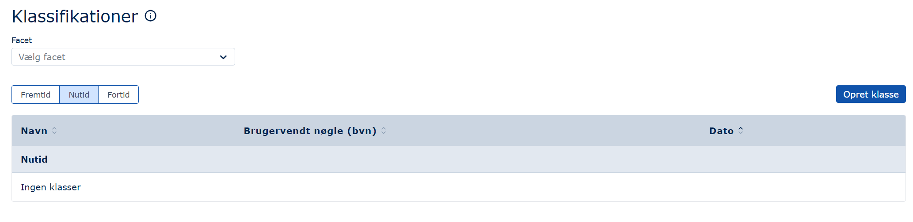

#### Oprettelse af klasser

Der vælges "Opret klasse" til højre i ovenstående billede, hvorpå denne formular kommer frem:

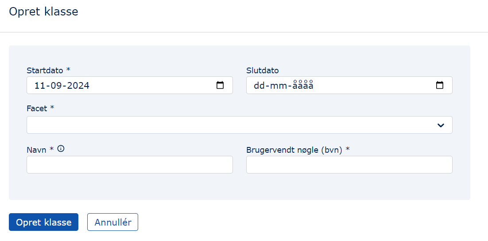

Herefter vælges, hvilken facet klassen skal høre under, et datointerval angives, og klassen navngives. Denne navngivning skal duplikeres i feltet "Brugervendt nøgle (bvn) *", og der kan trykkes på knappen "Opret klasse":

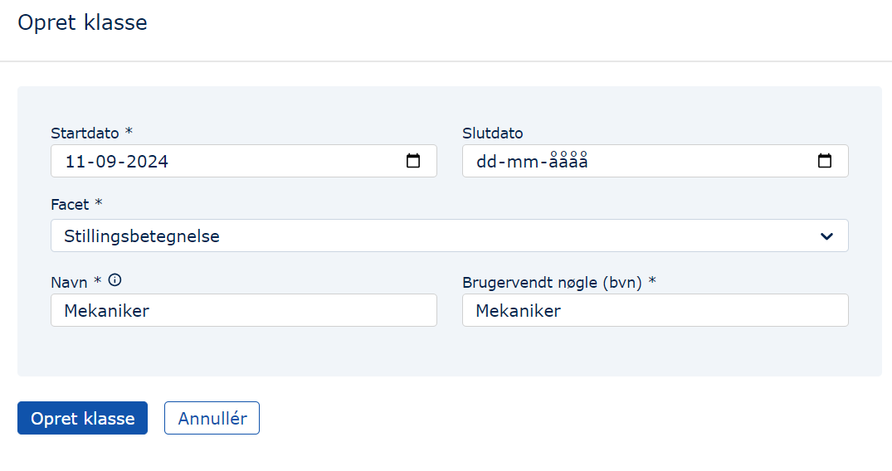

Når det er gjort, dukker den nye klasse, 'Mekaniker', op to steder:

I listen af klasser i Klassifikationsmodulet, så en administrator kan vedligeholde den:

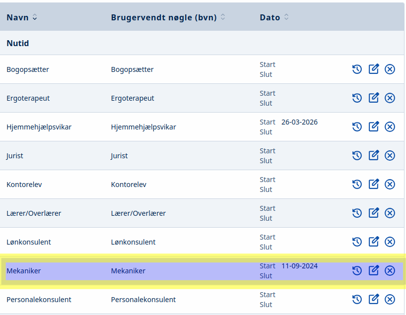

Og i dropdowns inde i MO, så en MO-forvalter kan benytte den til at hæfte en stillingsbetegnelse på en ansat:

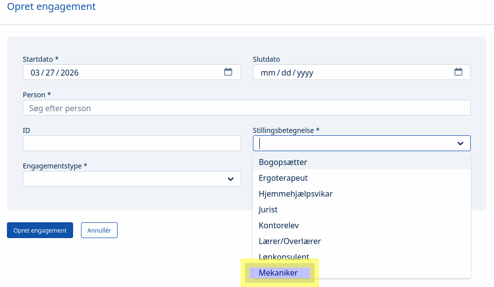

#### Ændring af klasser

Den facet, man ønsker at ændre klasser til, vælges:

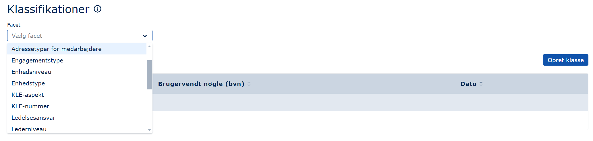

Man klikker på blyant-ikonet til højre for den klasse, man ønsker at ændre, og foretager den ønskede ændring:

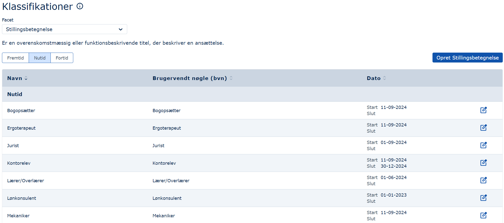

#### Sletning af klasser

Den korrekte facet vælges, og man trykker på krydset ud for den klasse, der skal slettes:

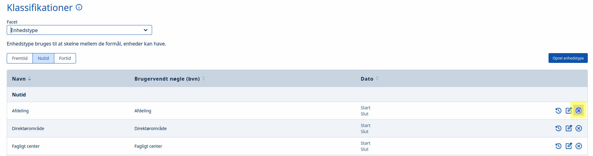

Herefter angives klassens slutdato:

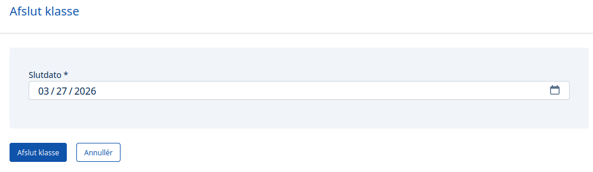

### Datostyring af klasser

Som det fremgår af ovenstående, er det muligt at datostyre sine klasser, så man fx kan oprette dem med fremtidig virkning.
