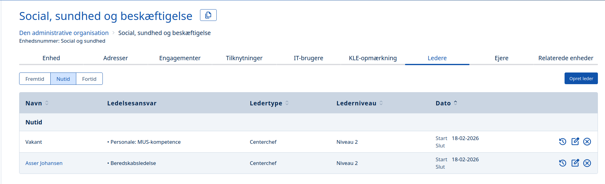
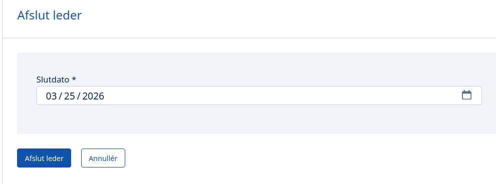
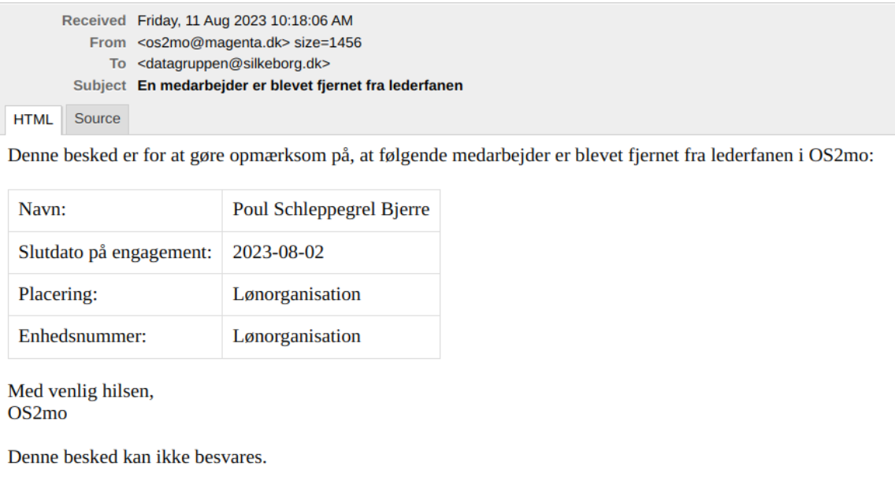

# Email-notifikationer

Når en hændelse indtræffer i MO, kan der automatisk blive sendt email-notifikationer til rette vedkommende.

Eksempler på hændelser:

- en leder stopper, og lederfunktionen bliver vakant (se beskrivelse nedenfor).
- en 'MED'-person stopper (TR, AMR, LR, mv.), og positionen bliver vakant
- en person ansættes, og der skal sendes notifikationer til systemejere, som skal oprette personen manuelt i deres systemer.
- en person fratræder, og der skal sendes notifikationer til systemejere, som skal nedlægge personen manuelt i deres systemer.
- der skal straksoprettes en vikar

# Konkret eksempel: En leder stopper

Der kan automatisk blive sendt email-notifikationer , når en leders engagement afsluttes i organisationen. Personens lederrolle bliver fjernet fra lederfanen i OS2mo og flyttet ned under ”Fortid”. Lederfanen i OS2mo ser således ud:

Det er muligt at afslutte en leder fra fanen ved brug af ’fjern’-knappen (det røde stopskilt, der findes ud for lederen på skærmbilledet ovenfor):

Når lederen er fjernet, sendes email-notifikationen til rette vedkommende. Hvis slutdato bliver sat til en dato i fremtiden, sendes email-notifikationen på den valgte dato. Emailen kan se således ud:

# Test af løsningen

Løses kan testes på følgende måde:

**Test 1**

- Fjern en leder fra lederfanen med øjeblikkelig virkning (dsv. slutdato er i dag eller i fortiden).
- Bekræft at der modtages en email med oplysninger om den fjernede leder.

**Test 2**

- Sæt en slutdato på en leder.
- Bekræft at der modtages en email på den valgte dato.

**Test 3**

- Tilføj en ny leder.
- Lav fx ændringer i ’lederniveau’, ’startdato’, ’ledertype’.
- Bekræft at der ikke modtages email.
