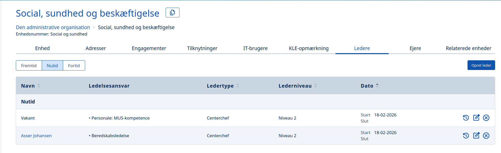
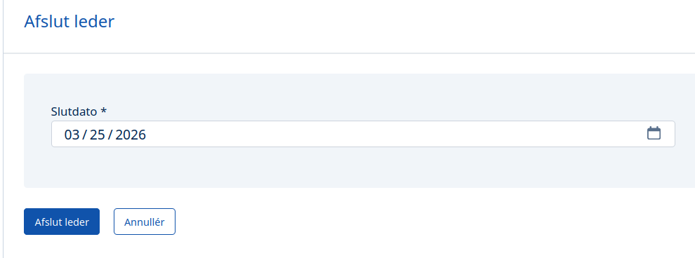
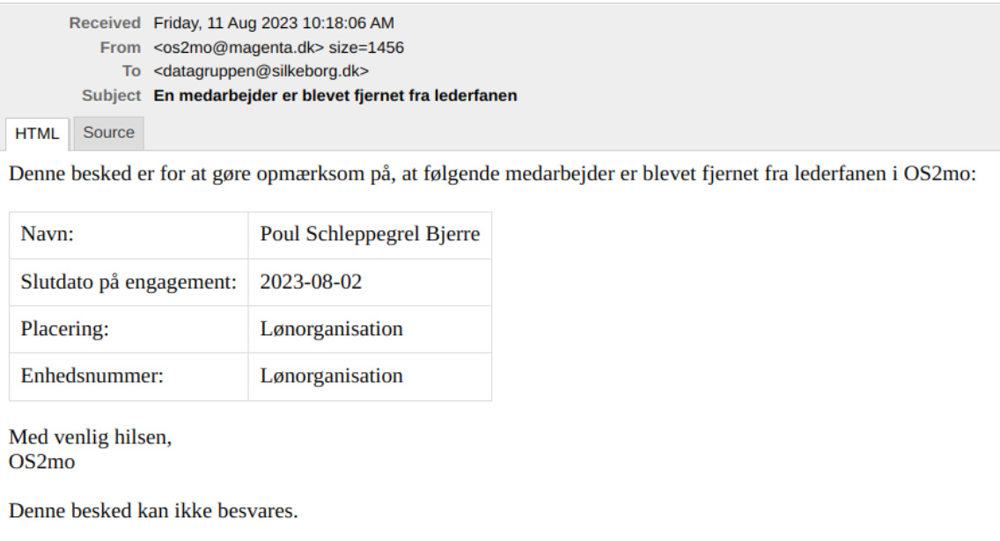

# 📬 Få tilsendt en email automatisk, når du skal være opmærksom på noget

MO kan automatisk sende notifikationer, når nedenstående hændelser indtræffer. Det sikrer, at relevante personer bliver informeret rettidigt og kan handle hurtigt.

## ✉️ Ny email til nyansatte

Når en nyansat medarbejder får oprettet sin første arbejds-email, sender MO automatisk en besked til rette vedkommende. Det kan f.eks. være:

- Medarbejderens private email
- En fælles postkasse
- Medarbejderens leder

**Baggrund**
En bruger oprettes i MO og bliver synkroniseret til Active Directory (AD). MOs integration til AD’et genererer et brugernavn og dermed en arbejdsemail-adresse, som sendes tilbage til MO. Idet MO opretter email-adressen, sendes en notifikation til rette vedkommende.

## 👤 Leder fratræder eller lederrolle bliver vakant

- Når en leder fratræder, bliver der automatisk sendt en notifikation.
- Når en lederrolle bliver vakant, bliver der ligeledes automatisk sendt en notifikation.

Disse beskeder hjælper med at sikre, at alle enheder til enhver tid har en aktiv leder tilknyttet.

## 🏢 Manglende relationer mellem enheder

I organisationer med både en **lønorganisation** og en **administrativ organisation** skal enhederne være korrekt relateret i MO. Hvis denne relation mangler:

- Kan medarbejdere ikke automatisk flyttes mellem organisationerne
- Sendes en email-notifikation til MO-administratoren, som kan oprette den manglende relation

Dette understøtter korrekt placering af medarbejdere og drift af automatisering.

## 💻 It-brugere og -roller

Når MO skal oprette en it-bruger i et system, som MO ikke har en systemintegration med, kan MO sende en notifikation til systemets administrator, så vedkommende manuelt kan oprette brugeren med de relevante roller.

Ved ændringer til brugeren eller brugerens roller, sender MO også en email, så systemadministratoren kan foretage de nødvendige opdateringer i det eksterne system.

## 🔔 Konkret eksempel: En leder stopper

Der kan automatisk blive sendt email-notifikationer, når en leders engagement afsluttes i organisationen. Når en leders engagement afsluttes vil personens lederrolle enten blive fjernet fra lederfanen i MO og flyttet ned under **”Fortid”**, eller også vil lederrollen blive stående i **"Nutid"** som *Vakant*. Lederfanen i MO ser således ud:

Det er muligt at afslutte en leder fra fanen ved brug af **'Afslut'**-knappen (det blå kryds, der findes ud for de to lederroller på skærmbilledet ovenfor):

Når lederen er fjernet, sendes email-notifikationen til rette vedkommende (typisk en fælles postkasse, så man ikke er personafhængig). Hvis slutdatoen bliver sat til en dato i fremtiden, sendes email-notifikationen på den valgte dato; hvis den er sat i fortiden, sendes notifikationen med det samme.

Emailen kan se således ud:

## ✅ Test af løsningen

Løsningen kan testes på følgende måde:

### 🔹 Test 1
- Fjern en leder fra lederfanen med øjeblikkelig virkning (dvs. slutdato er i dag eller i fortiden).
- Bekræft at der modtages en email med oplysninger om den fjernede leder.

### 🔹 Test 2
- Sæt en slutdato på en leder.
- Bekræft at der modtages en email på den valgte dato.

### 🔹 Test 3
- Tilføj en ny leder.
- Lav fx ændringer i 'lederniveau', 'startdato' eller 'ledertype'.
- Bekræft at der **ikke** modtages email.

## 🛠️ Udvidelser

Hvis der er behov for at modtage notifikationer på andre hændelser, kan dette tilpasses. Kontakt MO-leverandøren for opsætning af ekstra scenarier.
