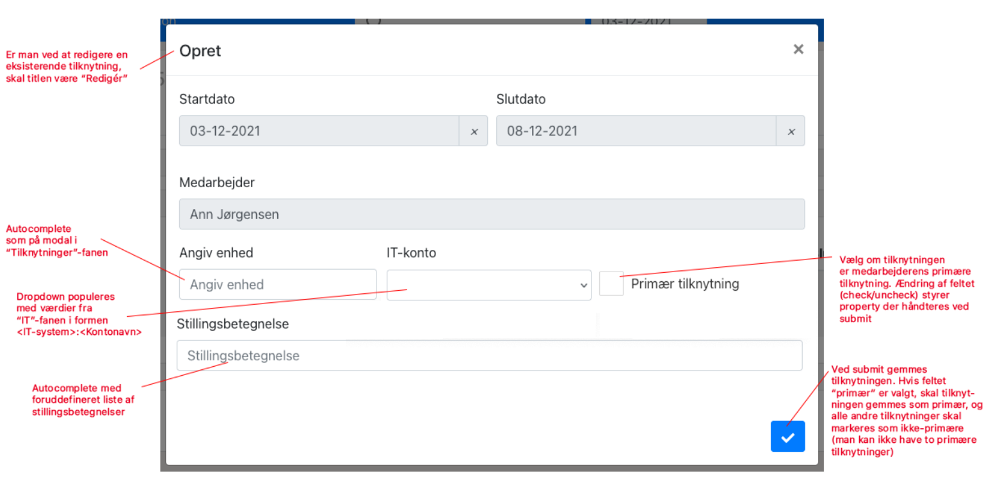
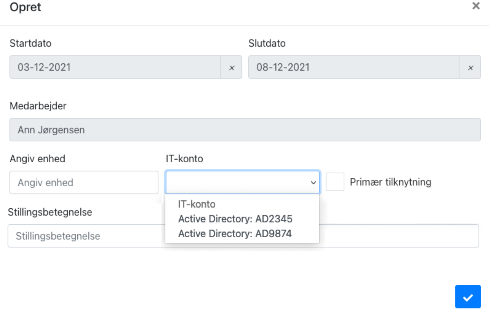
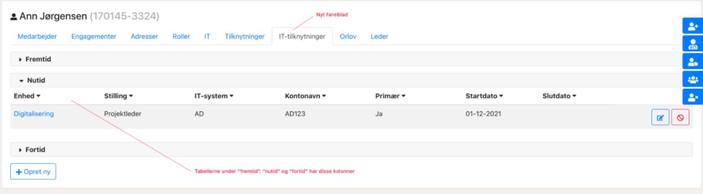

# Indplacering af it-brugere

## Motivation

Udover lønmæssig indplacering (engagementer) er en person indplaceret i forhold til sit arbejdssted. Dette er ofte, men ikke altid, identisk med den lønmæssige indplacering. I praksis er det ikke personen, men deres it-bruger, der er indplaceret. Enkelte personer har mere end én it-bruger, som er placeret og har rettigheder forskellige steder.
For disse personer er det derfor også nødvendigt at kunne markere den primære it-bruger, så de aftagersystemer, der kun tillader én bruger pr. person, kan få udvalgt den rette bruger. Derudover er der i nogle tilfælde behov for at tilknytte en brugervendt stillingsbetegnelse til it-brugeren, som ikke er identisk med den ofte overenskomstbaserede stillingsbetegnelse, der er hentet fra lønsystemet og placeret under engagementer.

## Trinbeskrivelse af oprettelse af en it-tilknytning

1. Klik på fanen Medarbejder
2. Udsøg en medarbejder i søgefeltet
3. Klik på fanen IT-tilknytning
4. Klik på +Opret ny
5. Vælg organisationsenhed ved at søge på navnet
6. Vælg it-konto udfra dropdown menu
7. Vælg om denne konto er den primære
8. Vælg brugervendt stillingsbetegnelse ved at søge på titel (vælges ud fra foruddefineret liste)
9. Afslut ved at klikke på flueben

# Udstilling af den nyoprettede it-tilknytning

