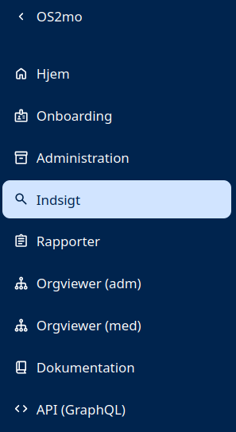
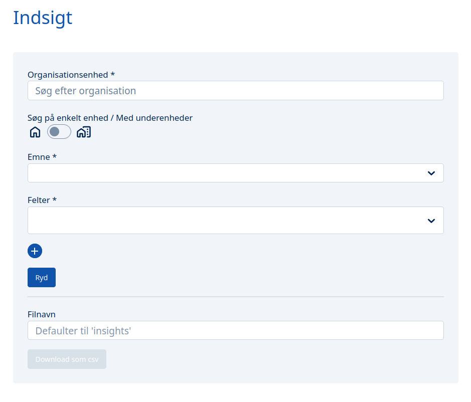
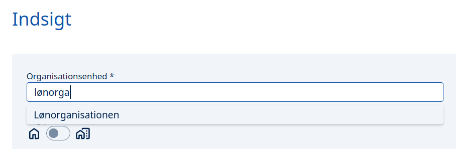
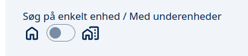
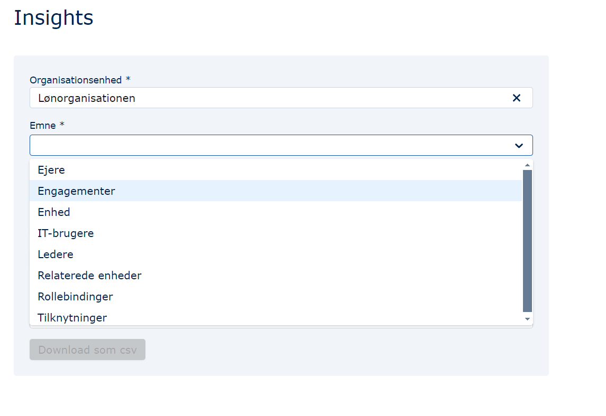
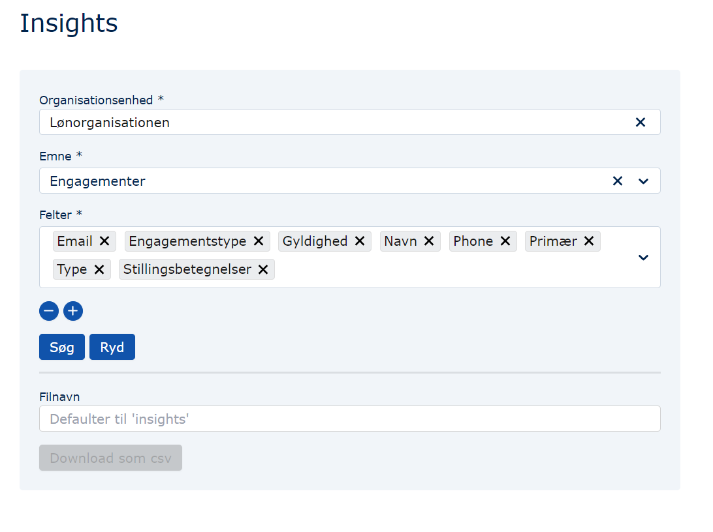
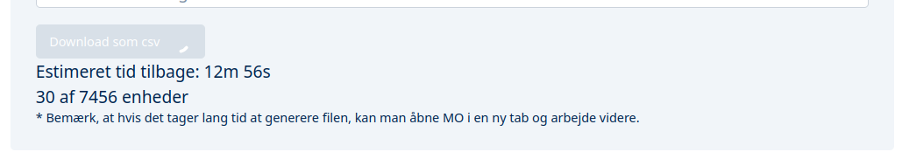
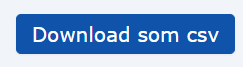
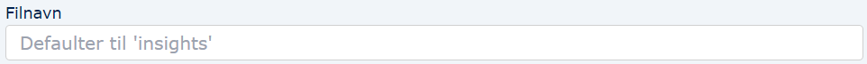
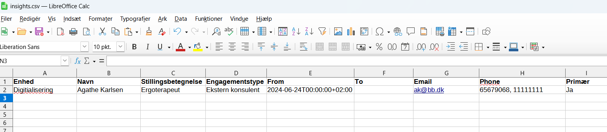

# Få indsigt i de data, der findes i MOs mave

Insights er et modul, der giver muligheden for selv at sammensætte data fra MO og udskrive dem i en csv-fil, der kan åbnes i et regnearksformat (Calc LibreOffice; Excel; Google Sheets).

Formålene med modulet er mange og afhænger af, hvilke data der sammenstilles.

Et eksempel er generering af et udtræk bestående af enheder, lederfunktioner og engagementer, så man kan se, hvem der er chef for hvem og hvor.

## Brugergrænsefladen

Når man klikker på Indsigt i venstremenuen:

 bliver man præsenteret for dette billede:

Man skriver den enhed, man vil have data på, i søgefeltet:

Når en organisationsenhed er fremsøgt, kan man ved slideren vælge, om de underliggende enheder skal inkluderes i forespørgslen eller ej:

Herefter vælges hvilke andre data, man er interesseret i.

Det sker ved valg af "Emne":

Herefter kan der tilføjes eller fjernes data under "Felter" fra det Emne, der er valgt:

Hvis man ønsker, at csv-filen skal indeholde flere Emner, trykkes der på "+"-knappen:

hvorpå det bliver muligt at tilføje flere data. Ønsker man at fjerne et emne, trykkes der på "-"-knappen:

Herefter trykkes "Søg", hvorpå genereringen af filen igangsættes. Hvor lang tid det tager at generere filen, afhænger af, hvor mange data der er valgt. MO beregner automatisk, hvor lang tid der er tilbage af en forespørgsel:

Bemærk, at hvis man klikker bort fra Indsigt, afbrydes forespørgslen. Hvis du vil arbejde videre i MO, mens du venter, kan du åbne MO i en anden browser.

Når "Download som csv"-knappen aktiveres (bliver blå), kan der trykkes på den, og csv-filen bliver hentet ned på din computer:

Kald din fil, hvad du vil. Hvis feltet efterlades tomt, bliver den navngivet "insights":

En eksempelfil med oplysninger om engagementer i én enhed kan se sådan ud:

Hvis man ønsker helt at fjerne data fra søgningen, trykkes "Ryd":

