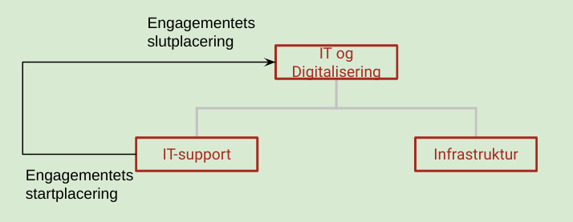
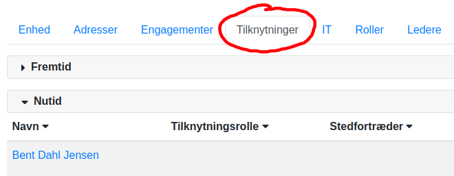
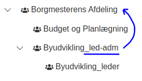

# Lederhåndtering i MO

Nedenfor findes de automatikker, der er udviklet til håndtering af ledere i MO.

Det er muligt at oprette ledere manuelt i MO, og når det er gjort, er der en række arbejdsgange, der bliver
automatiserede:

(Bemærk, at det udelukkende er SD-kommuner, der har behov for følgende arbejdsgange, idet LOS/OPUS-kommuner selv
opmærker ledere i lønsystemet.)

1. **Automatisk flytning af en leders engagement**: Når en leder bliver opmærket manuelt i MO, vil lederens engagement
   automatisk vil blive flyttet til den enhed, som man har oprettet lederen i. Se afsnittet
   om [Opret Leder i MO](#opret-leder-i-mo).
2. **Automatisk afslutning af ledere i MO**: Når en leders sidste engagement ophører, vil vedkommendes lederrolle
   ligeledes blive afsluttet automatisk. Se afsnittet
   om [Automatisk afslutning af ledere i MO](#automatisk-afslutning-af-ledere-i-mo).
3. **Opret leder i SD** og placere ledern deri. Når indlæsningen til MO finder
   sted, vil lederen automatisk blive indplaceret korrekt i MO. Se afsnittet
   om [Indplacer leder i leder-enhed i SD-Løn](#opret-leder-i-sd).

## Opret leder i MO

Det er muligt at aktivere en komponent i OS2mo, som sikrer, at en leders engagement altid
er placeret i samme enhed som enheden, hvor medarbejderens lederrolle findes. Mekanismen
illustreres af eksemplet på nedenstående figur:



1. En medarbejder har et engagement, som er placeret i enheden "IT-support".
2. En OS2mo-bruger opmærker manuelt medarbejderen til at være leder i enheden
   "IT og Digitalisering".
3. Komponenten flytter herefter automatisk medarbejderens engagement fra "IT-support"
   til "IT og Digitalisering".

Konkret gælder følgende regler for flytning af lederens engagement (kan tilpasses
efter behov):

1. Når en medarbejder gøres til leder i en enhed, flyttes medarbejderens engagement
   automatisk til enheden, hvor medarbejderen er blevet gjort til leder. Hvis
   medarbejderen har mere en ét engagement, foretages der ikke nogen flytning, da
   komponenten ikke har mulighed for at vide, hvilket engagement der skal flyttes.
2. Øvrige eksisterende ledere på enheden afsluttes automatisk.

## Automatisk afslutning af ledere i MO

Når en leder ikke længere har et gyldigt engagement, dvs. når lederens _sidste_ ansættelse stopper, vil personens
lederrolle ligeledes blive afsluttet automatisk. Hvis personens engagement får tildelt en slutdato i fremtiden - uanset
om der er tale om en nyoprettet medarbejder eller en eksisterende medarbejder - vil lederrollen også blive afsluttet på
samme dag som det engagement, der udløber sidst.

Hermed

- automatiseres ophør af lederrollen
- reduceres mængden af manuelt vedligehold
- minimeres risiko for fejl i lederdata
- effektiviseres tidsforbruget

## Opret leder i SD

Når en leder er indplaceret i en leder-enhed i SD-Løn, bliver denne enhed og lederen indlæst i MO.

Automatitkken i MO gør derefter følgende:

1. Flytter lederen fra leder-enheden til den enhed, lederen skal være leder af.
2. Tilføjer evt. manglende ledertype-oplysninger om lederen (om der fx er tale om en Direktør eller en
   Kommunaldirektør).
3. Afslutter ledere, der ikke længere har noget engagement i den enhed, de er ledere i.

### Detaljeret beskrivelse

Dette afsnit beskriver hvordan logikken opfører sig, når den eksekveres:

1. Det tjekkes om alle aktuelle ledere fortsat har engagementer i de organisationsenheder, de er indplacerede i. Hvis
   det ikke er tilfældet, sættes dags dato som slutdato på lederen.
2. For alle organisationsenheder, hvis navn ender med `_leder` og som _ikke_ er præfikset med `Ø_`:


- Hentes alle ansatte som har en tilknytning til `_leder`-enheden:



- Tjekkes at hver ansatte har et aktivt engagement i overenheden. Hvis mere end én medarbejder har en tilknytning
  til `_leder`-enheden, tjekkes hvilken ansættelse der er den seneste startdato: Denne person bliver sat som leder i
  overenheden.

- Mappes hvert enhedsniveau til et leder-level:

  

- Gøres lederen _også_ til leder af overenhedens overenhed, hvis overenheden har `_led-adm`i sit navn.

  

  I eksemplet ovenfor, hvor lederen bliver leder af to enheder, identificeres leder-level fra den øverste enhed,
  altså fra Borgmesterens Afdeling.

Når en leder er blevet valgt ud fra de ovenstående kriterier, vil alle tilknytninger i `_leder`-enheden termineres, så
kun én tilknytning resterer.

### Teknik

#### Configuration

The follow environment variables can be used to configure the application:

- `MO_URL`: Base URL for MO
- `CLIENT_ID`: Keycloak client ID
- `CLIENT_SECRET`: Keycloak client secret corresponding to the Keycloak client
- `ROOT_UUID`: UUID of the root organisation unit. Instance dependant.
- `MANAGER_TYPE_UUID`: Default UUID for `Manager type`. Instance dependant.
- `RESPONSIBILITY_UUID`: Default UUID for `Manager type`. Instance dependant.
- `MANAGER_LEVEL_MAPPING`: Dict with `org-unit level UUID` classes as keys and `manager level UUID` as values. Used to
  map from `org_unit_level` to `manager_level`.

#### Usage

To start the container using `docker-compose`:

```
$ docker-compose up -d
```

After the container is up and running, the script can be run manually by triggering a `FastAPI` endpoint:

- By using the GUI at:<br>
  `http://localhost:8000/docs`
  and triggering `/trigger/all`.
- Calling the endpoint from terminal: <br>
  `$ curl -X 'POST' 'http://localhost:8000/trigger/all'`<br>

As it checks and updates managers you will get a lot of output in `docker logs`, especially if you have opted
for `debug` information from logs.

Once the script has finished the last lines will look like this:

```
sd_managerscript_1  | 2022-12-09 10:38.30 [info     ] Filter Managers
sd_managerscript_1  | 2022-12-09 10:38.30 [info     ] Updating Managers
sd_managerscript_1  | 2022-12-09 10:38.30 [info     ] Updating managers complete!

```

---

#### Development

---

##### Prerequisites

- [Poetry](https://github.com/python-poetry/poetry)

##### Getting Started

1. Clone the repository:

```
git clone git@git.magenta.dk:rammearkitektur/os2mo-manager-sync.git
```

2. Install all dependencies:

```
poetry install
```

3. Set up pre-commit:

```
poetry run pre-commit install
```

##### Running the tests

You use `poetry` and `pytest` to run the tests:

`poetry run pytest`

You can also run specific files

`poetry run pytest tests/<test_folder>/<test_file.py>`

and even use filtering with `-k`

`poetry run pytest -k "Manager"`

You can use the flags `-vx` where `v` prints the test & `x` makes the test stop if any tests fails (Verbose, X-fail)

##### Injecting test data into OS2mo

Test data have been prepared for local development. Using the test data requires
a running OS2mo instance locally as well as the standard test data from Kolding, which is included in OS2mo repository.

Before using this integration locally you need to clone and run the `OS2MO` container
from [OS2MO repo](https://git.magenta.dk/rammearkitektur/os2mo):
Once cloned you can start main `OS2MO` container using:
`docker-compose up --build -d`

You can now inject test data from this repository by changing folder to where this repository is located locally.
Then run the following command:

```
poetry run python tests/test_data/inject_test_data.py "603f1c82-d012-4d04-9382-dbe659c533fb"
```

UUID passed as an parameter is required password

##### Development info

Sending and fetching data to/from `OS2MO` is done using a `GraphQL` client imported
from `Ra-clients` [repos here](https://git.magenta.dk/rammearkitektur/ra-clients)
