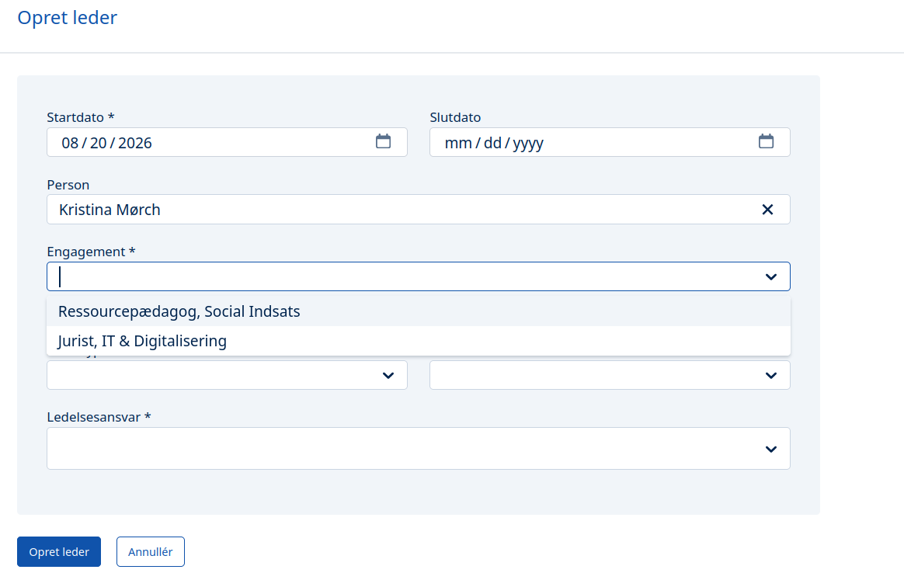
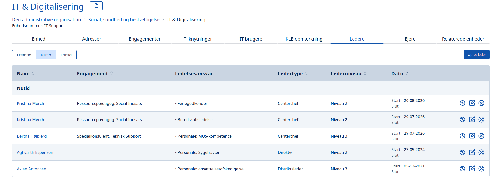
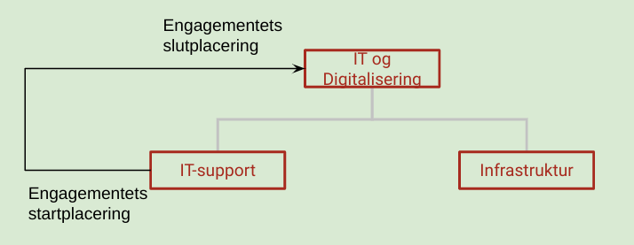
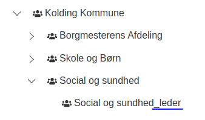
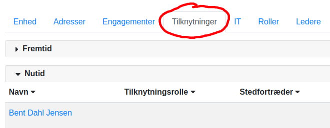
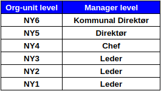
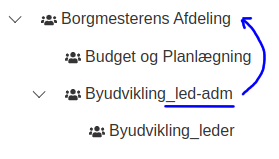

# Lederhåndtering i MO

Nedenfor findes de automatikker og funktionaliteter, der er udviklet til håndtering af ledere i MO.

## Lederroller og engagementer

En lederrolle i MO er som udgangspunkt koblet til det **engagement** (den ansættelse), der bemyndiger personen til at bestride lederrollen. Ingen bestrider en lederrolle blot i kraft af, hvem de er som person – man er leder, fordi man er blevet ansat til det.

Koblingen betyder bl.a., at:

- Det altid er entydigt, hvilken ansættelse en person er leder i kraft af – også når personen har flere ansættelser.
- Integrationer og eksportværktøjer (fx SafetyNet, organisationsdiagrammet og rapporterne) kan udlede den korrekte leder, når en leder har flere engagementer.
- Loggen gør opmærksom på ledere, hvor koblingen mangler.

## Betjening i brugergrænsefladen

Ved oprettelse og redigering af ledere – både fra medarbejder- og organisationssiden – angives det engagement, der bemyndiger personen til lederrollen:

Det er også muligt at markere "Tilknyt ikke et engagement", hvis man ønsker at knytte lederrollen til (CPR-)personen i stedet for til et engagement. Bemærk, at denne mulighed forventes udfaset på et senere tidspunkt.

Ledertabellerne har en Engagementskolonne, så man let kan se, hvilken ansættelse en leder er leder i kraft af, om noget:

## Automatikker

Det er muligt at oprette ledere manuelt i MO, og når det er gjort, kan en række arbejdsgange automatiseres.

*Bemærk, at det udelukkende er SD-kommuner, der har behov for følgende arbejdsgange, idet LOS/OPUS-kommuner selv
opmærker ledere i lønsystemet.*

1. **Automatisk flytning af en leders engagement**: Når en leder opmærkes manuelt i MO, flyttes lederens engagement automatisk til den enhed, lederen er oprettet i. Se afsnittet om [Opret Leder i MO](#opret-leder-i-mo).
2. **Automatisk afslutning af ledere i MO**: Når en leders sidste engagement ophører, bliver vedkommendes lederrolle automatisk afsluttet eller sat vakant. Se afsnittet om [Automatisk afslutning af ledere i MO](#automatisk-afslutning-af-ledere-i-mo).
3. **Opret leder i SD**: Lederen oprettes i en leder-enhed i SD-Løn, og MO indplacerer automatisk lederen korrekt ved indlæsningen. Se afsnittet om [Indplacer leder i leder-enhed i SD-Løn](#opret-leder-i-sd).

## Opret leder i MO (automatisk løft af lederens engagement)

Det er muligt at aktivere en komponent i MO, som sikrer, at en leders engagement altid er placeret i samme enhed som den enhed, hvor lederrollen findes ("elevate managers"). Mekanismen er hændelsesbaseret: Den udføres med det samme, når lederobjekter ændres i MO.

Mekanismen illustreres af eksemplet på nedenstående figur:

1. En medarbejder har et engagement, som er placeret i enheden "IT-support".
2. En MO-bruger opmærker manuelt medarbejderen til at være leder i enheden "IT og Digitalisering".
3. Komponenten flytter herefter automatisk medarbejderens engagement fra "IT-support" til "IT og Digitalisering".

Funktionen virker også, når lederen har flere engagementer: Det er engagementet, der er koblet til lederrollen (jf. afsnittet Lederroller og engagementer ovenfor), der flyttes.

Derudover gælder (kan tilpasses efter behov):

- Øvrige eksisterende ledere på enheden afsluttes automatisk.

## Automatisk afslutning af ledere i MO

Lederroller afsluttes automatisk, når det ansættelsesgrundlag, de hviler på, ophører:

- Er lederrollen koblet til et engagement, afsluttes - lederrollen (eller sættes som vakant), når dette engagement ophører. Får engagementet tildelt en slutdato i fremtiden, afsluttes lederrollen pr. samme dato.
- Er lederrollen ikke koblet til et engagement (knyttet til personen), afsluttes rollen, når personens *sidste* aktive engagement ophører, i tilfælde af, at vedkommende har flere engagementer.

> **Bemærk:** Integrationen kan konfigureres således at lederroller ikke afsluttes, men i stedet sættes vakante pr. den dato, hvor lederens engagement ophører. Ved vakance påsættes den korrekte slutdato/vakantdato automatisk.

Automatikken kører på MOs eventsystem og lytter direkte på lederhændelser, hvilket betyder, at den reagerer med det samme. Den anvender fuld tidslinjelogik, så også ugyldige lederperioder (fx perioder, hvor lederen ikke havde noget aktivt engagement) genskrives korrekt.

For teknikere: Der findes et /trigger/all-endpoint, så samtlige ledere kan synkroniseres/genberegnes på én gang, fx efter en konfigurationsændring.

Hermed:

+ automatiseres ophør / vakance af lederrollen
+ reduceres mængden af manuelt vedligehold
+ minimeres risiko for fejl i lederdata
+ effektiviseres tidsforbruget

## Opret leder i SD  (Leder-kasser)

Når en leder er indplaceret i en til formålet oprettet leder-enhed i SD-Løn, bliver denne enhed og lederen indlæst i MO.

Automatitkken i MO gør derefter følgende:

1. Flytter lederen fra leder-enheden til den enhed, lederen skal være leder af.
2. Tilføjer evt. manglende ledertype-oplysninger om lederen (om der fx er tale om en Direktør eller en    Kommunaldirektør).
3. Afslutter ledere, der ikke længere har noget engagement i den enhed, de er ledere i.

### Detaljeret beskrivelse

Dette afsnit beskriver hvordan logikken opfører sig, når den eksekveres:

1. Det tjekkes om alle aktuelle ledere fortsat har engagementer i de organisationsenheder, de er indplaceret i. Hvis det ikke er tilfældet, sættes dags dato som slutdato på lederen.
2. For alle organisationsenheder, hvis navn ender med `_leder` og som *ikke* er præfikset med `Ø_`:

- Hentes alle ansatte som har en tilknytning til `_leder`-enheden:

- Tjekkes, at hver ansatte har et aktivt engagement i overenheden. Hvis mere end én medarbejder har en tilknytning til `_leder`-enheden, vælges den ansættelse, der har den seneste startdato: Denne person bliver sat som leder i overenheden.

- Mappes hvert enhedsniveau til et leder-level:

  

- Gøres lederen *også* til leder af overenhedens overenhed, hvis overenheden har `_led-adm`i sit navn.

  

  I eksemplet ovenfor, hvor lederen bliver leder af to enheder, identificeres leder-level fra den øverste enhed,
  altså fra Borgmesterens Afdeling.

Når en leder er blevet valgt ud fra de ovenstående kriterier, vil alle tilknytninger i `_leder`-enheden termineres, så kun én tilknytning resterer.

### Teknik

Integrationen konfigureres via miljøvariable i integrationens container (bl.a. rodenhed, standard-ledertype, standard-lederansvar samt mapning fra enhedsniveauer til lederniveauer). Konfigurationen foretages af Magenta i forbindelse med idriftsættelse.
