# MED-organisationen i MO

Nedenfor findes en guide til opbygning og vedligehold af MED-organisationen i OS2mo.

# Formål

Det er lovpligtigt at vedligeholde et overblik over sin MED-organisation.

Formålet med at have sin MED-organisation i OS2mo er at vedligehold og overblik er nemt.

MED-organisationen kan desuden udstilles på intranettet i et organisationsdiagram, så alle medarbejdere umiddelbart kan tilgå ajourførte oplysninger om fx deres arbejdsmiljørepræsentant og deres tillidsmandsrepræsentant (navn, email, telefonnummer, mv.).

MED-organisationen kan også udskrives til fx Excel-format så administrative medarbejdere kan arbejde videre med MED-organisationen i dette format. Det forudsætter bestilling af en sådan rapport.

# Forudsætninger

Der er behov for indlæsning af tre datasæt i OS2mo, så MED-organisationen og de tilknyttede medarbejdere kan oprettes med de korrekte metadata:

- **Enhedstyper** til opmærkning af MED-organisationen: Fx Lokal-MED, Center-MED, Direktør-MED, Hoved-MED, AMG.
- **Tilknytningsroller** til opmærkning af medarbejdere: Fx LR formand, LR, FTR næstformand, FTR, TR næstformand, TR, AMR næstformand, AMR.
- **Hovedorganisationer / Faglige organisationer** til opmærkning af tilhørsforhold: Fx LO (3F, HK, FOA, etc), FTF (DLF, BUPL, etc), AC (Djøf, DM, etc).

## Option Rollebaseret adgang i OS2mo

Det er desuden muligt at differentiere adgangen til OS2mo, så fx udvalgte HR-medarbejdere har skriveadgang til MED-organisationen, men ikke til lønorganisationen eller til den administrative organisation i OS2mo. Det sikrer mod fejl.

Rollebaseret adgang i OS2mo kræver:

- **Installation af Keycloak**, herunder konfiguration af [ADFS](https://rammearkitektur.docs.magenta.dk/os2mo/guides/adfs-setup.html) og [opsætning af OU’er i Active Directory](https://rammearkitektur.docs.magenta.dk/os2mo/guides/adfs-rbac-setup.html).
- **Implementering af Ejer-begrebet** i OS2mo.

Når det er gjort, kan man tildele Ejer-rollen til rette vedkommende i OS2mo og dermed give skriveadgang til den del af OS2mo, som håndterer MED-organisationen:

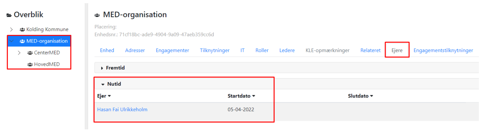

# ​Arbejdsgange

_Disclaimer: Følgende screenshots er taget fra et test-miljø og varierer fra kommunens OS2mo. Bemærk også at alle cpr-numre er fiktive._

## Opret MED-organisationen

I organisationsmodulet skal man oprette en rodorganisation og de tilhørende underenheder:

### Oprettelse af rodorganisationen

Klik på Organisation:

Klik på Opret enhed i højremenuen:

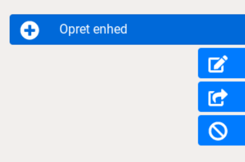

Udfyld dialogboksen med ønskede metadata om rodenheden og tryk ‘v’ nederst i højre hjørne:

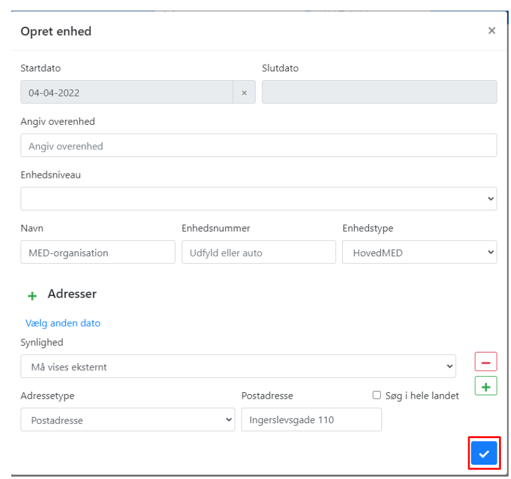

Obligatoriske oplysninger er:

- Startdato
- Navn
- Enhedstype

Bemærk, at for at oprette en rodenhed, skal der ikke angives overenhed.

Rodenheden kan nu ses i organisationshierarkiet til venstre (i dette eksempel ‘MED-organisation’):

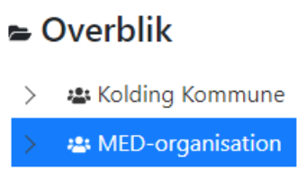

### Oprettelse af underenhederne

Proceduren fra ‘Oprettelse af rodorganisationen’ ovenfor følges med undtagelse af, at der nu skal angives en overenhed:

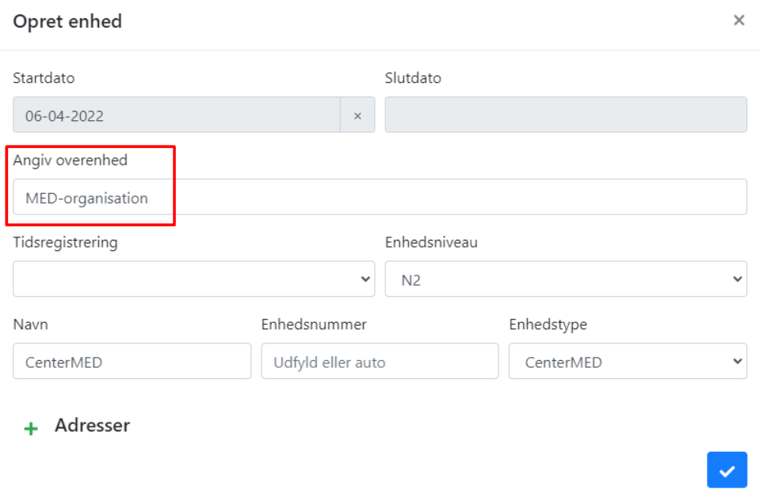

I takt med at underenhederne bliver oprettet, kan de ses i MED-organisationens hierarki:

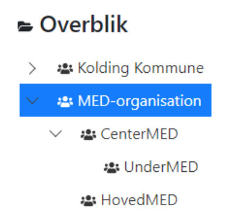

## Opret medarbejdere i MED-organisationen

### Oprettelse af tilknytningerne

Når MED-organisationen er oprettet, skal medarbejdere tilknyttes til den fra den administrative organisation / lønorganisationen.

En medarbejder tilknyttes til en MED-enhed ved at vælge den relevante MED-enhed, klikke på fanen ‘Tilknytninger’ og vælge ‘+Opret ny’:

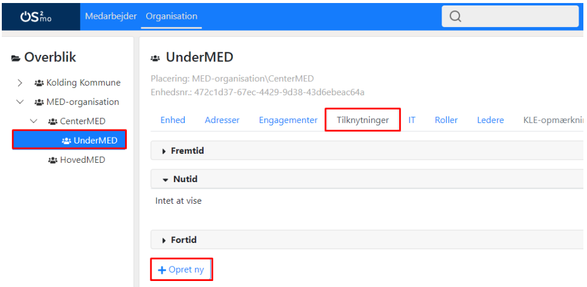

I den dialogboks der kommer frem

- Sættes start- og evt. slutdato
- Fremfindes medarbejderen ved søgning
- Vælges Tilknytningsrolle
- Angives Hovedorganisation / Faglig organisation
- Fremfindes stedfortræder: Ved nogle tilknytningsroller er der mulighed for at vælge stedfortræder. Kommunen skal fortælle hvilke. I dette tilfælde fordrer tilknytningsrollen ‘AMR’ en stedfortræder:

### Se tilknyttede medarbejdere under MED-enheden

Når ovenstående arbejdsgang er fuldført, kan man se den tilknyttede medarbejder (plus evt. stedfortræder) under MED-enheden og fanen ‘Tilknytninger’:

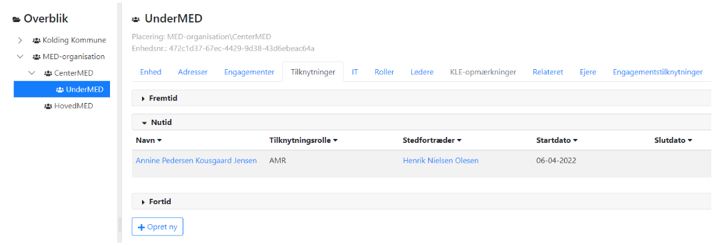

### Se tilknyttede medarbejdere under medarbejderen selv

Det er også muligt at se den tilknyttede medarbejder under sig selv ved at vælge fanen ‘Tilknytninger’:

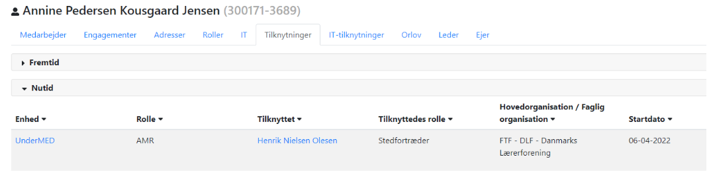

### Se stedfortrædere under stedfortræderen selv

Og man kan ligeledes se stedfortræderen under sig selv ved at vælge fanen ‘Tilknytninger’:

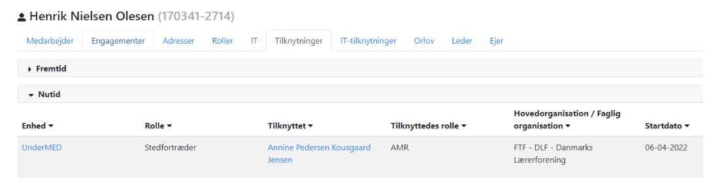

### Gør Tilknytningsrolle vakant

Det er muligt at gøre en tilknytningsrolle vakant - Det gøres ved at redigere en tilknytningsrolle og fjerne den tilknyttede medarbejder:

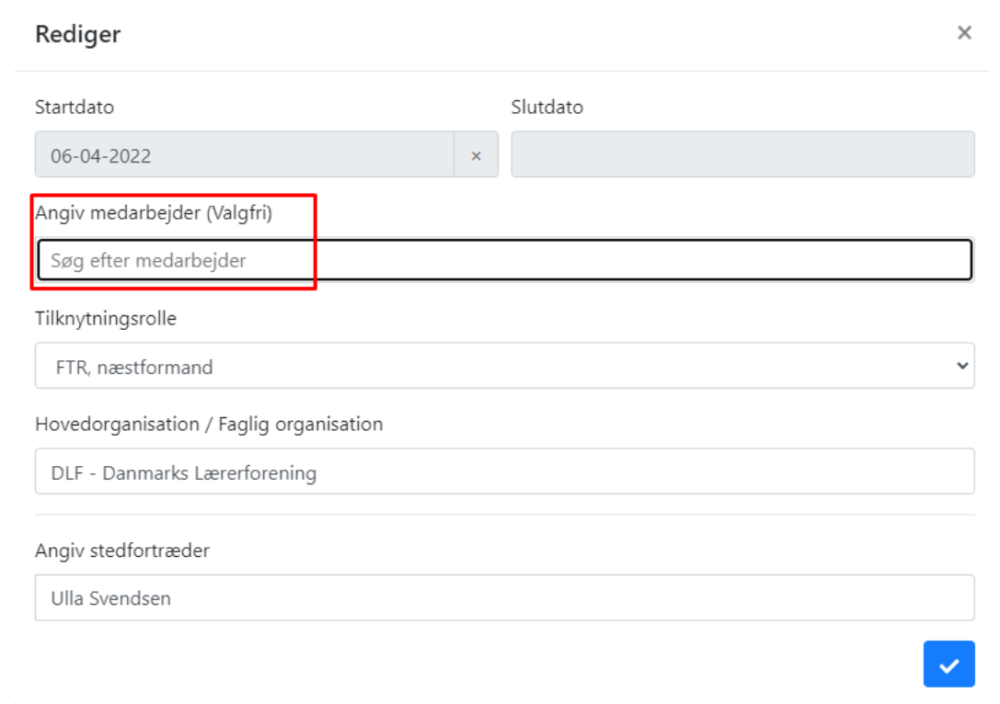

Operationen vil føre til dette billede i oversigten over de medarbejdere der er tilknyttet til MED-enheden:

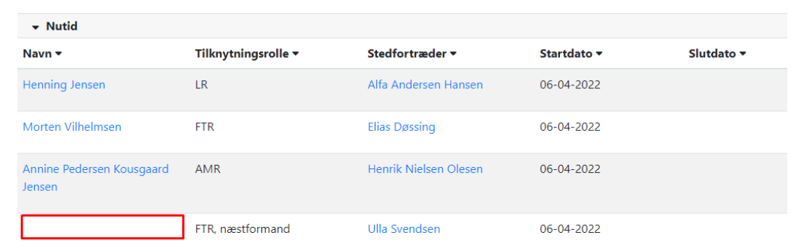

## Vedligehold

Når hele MED-organisationen er opbygget, skal den vedligeholdes i OS2mo.

### MED-enheder

MED-enhederne vedligeholdes som alle enheder i OS2mo:

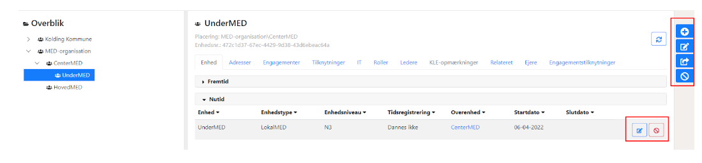

### Tilknytningsroller

Tilknytningsrollerne redigeres vha. knapperne ud for hver tilknytningsrolle...:

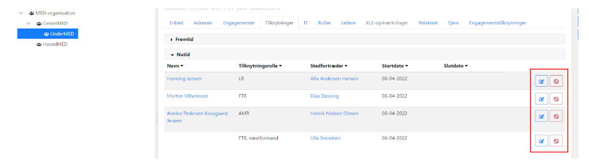

…eller under hver medarbejder under fanen ‘Tilknytninger’:

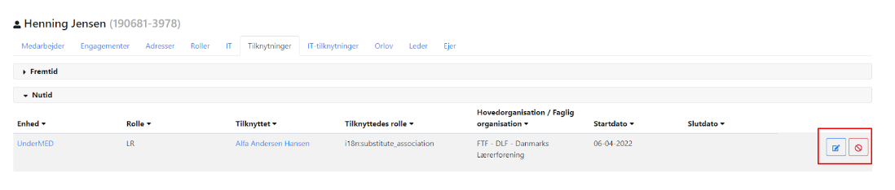

## Udstilling andre steder

### Rapport

Det er muligt at genere af MED-data i fx en csv-fil som kan hentes inde fra MOs brugergrænseflade. De data der skal indgå i udtrækket skal specificeres først.

### Organisationsdiagram

Lig den administrative organisation kan MED-organisationen udstilles i et organisationsdiagram på intranettet / internettet.

Du kan læse mere om organisationsdiagrammet [her](https://rammearkitektur.docs.magenta.dk/os2mo/data-import-export/exporters/org-chart.html)

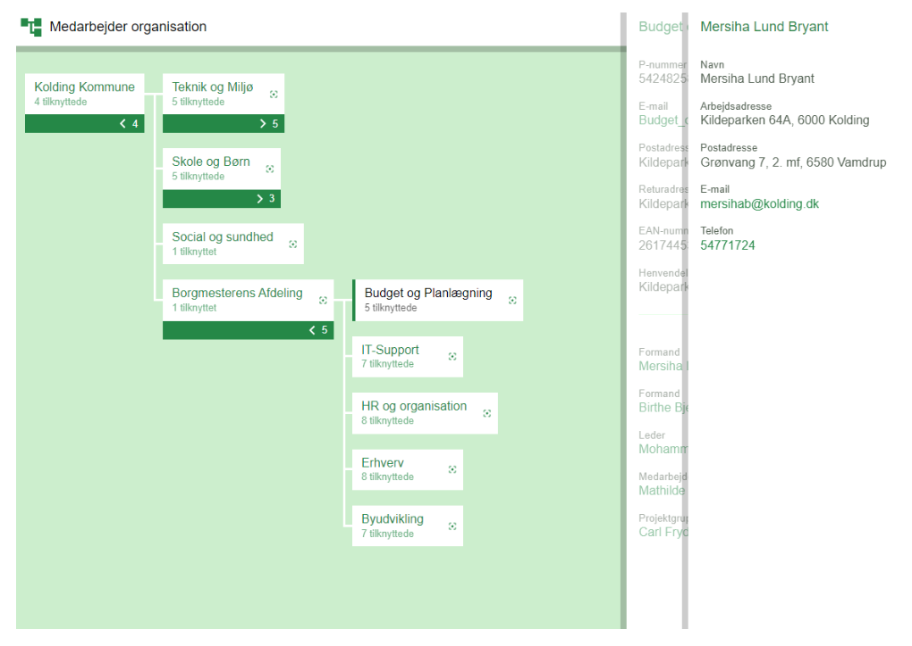
