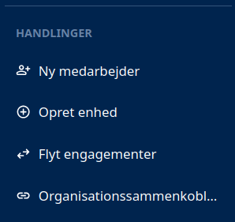
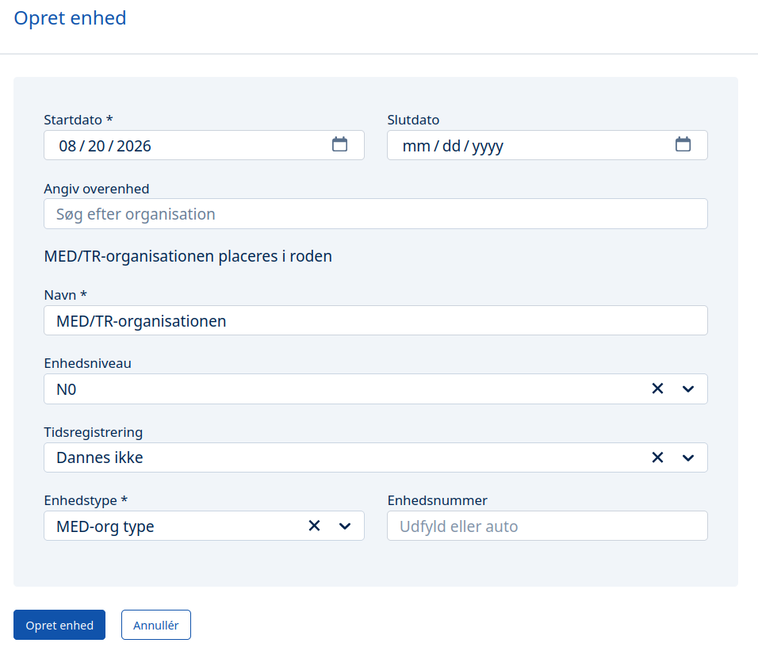
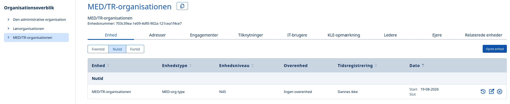
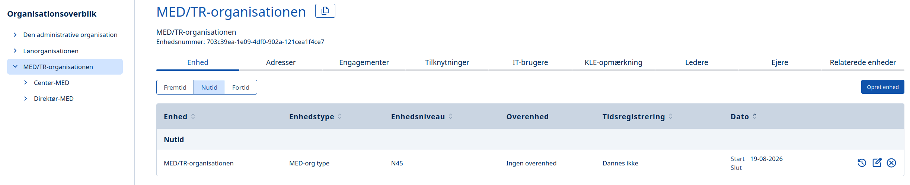
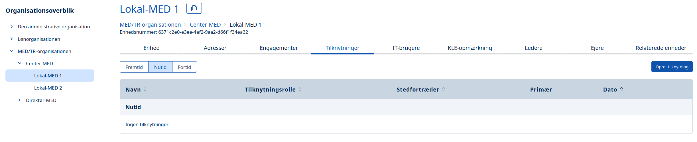
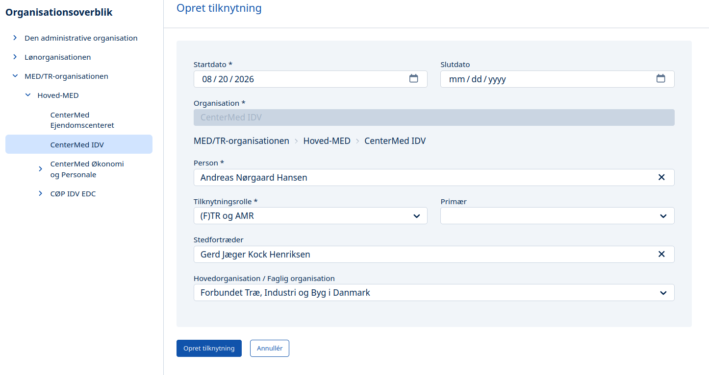
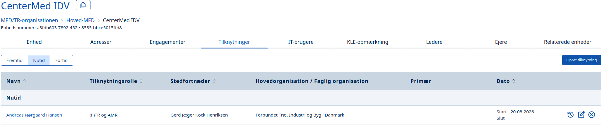
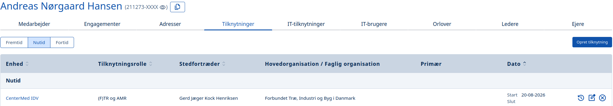
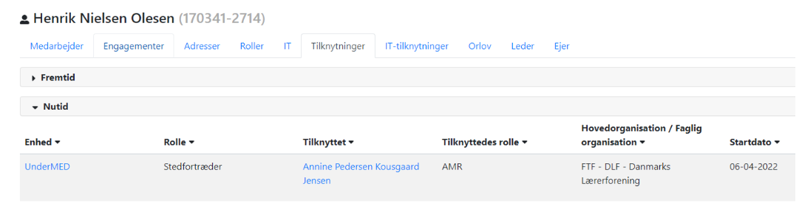

# MED/TR-organisationen i MO
Nedenfor findes en guide til opbygning og vedligehold af MED-organisationen i MO.

## Formål

Det er lovpligtigt at vedligeholde et overblik over sin MED-organisation.

Formålet med at have sin MED/TR-organisation i MO er at vedligehold og overblik er nemt samt at datagrundlaget (de ansatte) findes her også, så alle nødvendige informationer er ved hånden.

MED/TR-organisationen kan desuden udstilles på intranettet i et organisationsdiagram, så alle medarbejdere umiddelbart kan tilgå ajourførte oplysninger om fx deres arbejdsmiljørepræsentant og deres tillidsmandsrepræsentant (navn, email, telefonnummer, mv.).

MED/TR-organisationen kan også udskrives til fx Excel-format så administrative medarbejdere kan arbejde videre med MED/TR-organisationen i dette format. Det forudsætter bestilling af en sådan rapport.

## Forudsætninger

Der er behov for indlæsning af tre datasæt i MO, så MED/TR-organisationen og de tilknyttede medarbejdere kan oprettes med de korrekte metadata:

- **Enhedstyper** til opmærkning af MED-organisationen: Fx Lokal-MED, Center-MED, Direktør-MED, Hoved-MED, AMG.
- **Tilknytningsroller** til opmærkning af medarbejdere: Fx LR formand, LR, FTR næstformand, FTR, TR næstformand, TR, AMR næstformand, AMR.
- **Hovedorganisationer / Faglige organisationer** til opmærkning af tilhørsforhold: Fx LO (3F, HK, FOA, etc), FTF (DLF, BUPL, etc), AC (Djøf, DM, etc).

## Option Rollebaseret adgang i OS2mo

Det er desuden muligt at differentiere adgangen til MO, så fx udvalgte HR-medarbejdere har skriveadgang til MED-organisationen, men ikke til lønorganisationen eller til den administrative organisation i OS2mo. Det sikrer mod fejl.

## ​Arbejdsgange

*Disclaimer: Følgende screenshots er taget fra et test-miljø og varierer fra kommunens OS2mo. Bemærk også at alle cpr-numre er fiktive.*

## Opret MED-organisationen

I organisationsmodulet skal man oprette en rodorganisation og de tilhørende underenheder:

### Oprettelse af rodorganisationen

Klik på Organisation:

Udfyld dialogboksen med ønskede metadata om rodenheden og tryk ‘Opret enhed’ nederst. Idet der er tale om en rodenhed, skal der *ikke* angives en overenhed:

Obligatoriske oplysninger er:

- Startdato
- Navn
- Enhedstype

Rodenheden kan nu ses i organisationshierarkiet til venstre (i dette eksempel ‘MED/TR-organisationen’):

### Oprettelse af underenhederne

Proceduren fra ‘Oprettelse af rodorganisationen’ ovenfor følges med undtagelse af, at der nu skal angives en overenhed.

I takt med at underenhederne bliver oprettet, kan de ses i MED-organisationens hierarki:

## Opret medarbejdere i MED-organisationen

### Oprettelse af tilknytningerne

Når MED/TR-organisationen er oprettet, skal medarbejdere knyttes til den fra den administrative organisation.

En medarbejder tilknyttes til en MED/TR-enhed ved at vælge den relevante MED/TR-enhed, klikke på fanen ‘Tilknytninger’ og vælge ‘Opret tilknytning’:

I den formular, der kommer frem

- Sættes start- og evt. slutdato
- Fremfindes medarbejderen ved søgning
- Vælges Tilknytningsrolle
- Fremfindes stedfortræder: Ved nogle tilknytningsroller er der krav om at tilknytte en stedfortræder. I dette tilfælde fordrer tilknytningsrollen ‘(F)TR og AMR’ en stedfortræder
- Angives Hovedorganisation / Faglig organisation:

### Se tilknyttede medarbejdere under MED-enheden

Når ovenstående arbejdsgang er fuldført, kan man se den tilknyttede medarbejder (plus evt. stedfortræder) under MED-enheden og fanen ‘Tilknytninger’:

### Se tilknyttede medarbejdere under medarbejderen selv

Det er også muligt at se den tilknyttede medarbejder under medarbejderen ved at vælge fanen ‘Tilknytninger’:

### Se stedfortrædere under stedfortræderen selv

Og man kan ligeledes se stedfortræderen under sig selv ved at vælge fanen ‘Tilknytninger’:

## Fjern stedfortræder

Stedfortrædere kan fjernes fra en tilknytning igen ved at redigere tilknytningen og fjerne stedfortræderen.

## Vedligehold

Når hele MED/TR-organisationen er opbygget, skal den vedligeholdes i MO.

### MED-enheder

MED/TR-enhederne vedligeholdes som alle enheder i MO.

### Tilknytningsroller

Tilknytningsrollerne redigeres vha. knapperne ud for hver tilknytningsrolle.

…eller under hver medarbejder under fanen ‘Tilknytninger’.

## Udstilling andre steder

### Rapport

Det er muligt at genere af MED/TR-data i fx en csv-fil som kan hentes inde fra MOs brugergrænseflade.

### Organisationsdiagram

Lig den administrative organisation kan MED/TR-organisationen udstilles i et organisationsdiagram på intranettet.

Du kan læse mere om organisationsdiagrammet [her](https://rammearkitektur.docs.magenta.dk/os2mo/features/org-chart.html).
