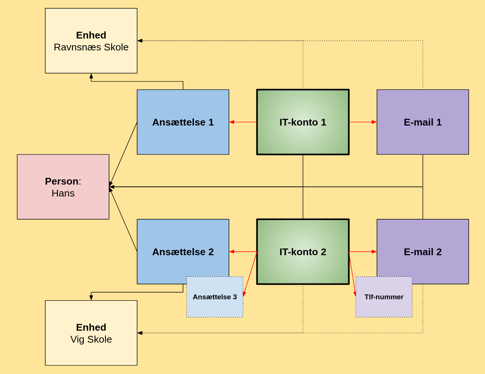

# Én person - flere digitale identiteter

## En automatiseret, fleksibel og compliant måde at arbejde på
Det er almindeligt, at folk har flere job, og hvert job kræver adgang til forskellige it-systemer. Det betyder, at du har brug for et unikt brugernavn – en digital identitet – til hvert af dine job for at din organisation er compliant.

For at gøre det lettere understøtter MO oprettelsen af flere it-konti pr. person.

Denne form for digitale personlighedsspaltning er illustreret herunder:

I illustrationen har Hans to ansættelser - én på Ravnsnæs Skole og én på Vig Skole. I sit ene job har han behov for at tilgå tre it-systemer, og i sit andet job to. Hver it-konto har en email-adresse tilknyttet, som også er hans logon.
De røde pile er det nye, der gør det muligt for MO at håndtere flere digitale identiteter. Bemærk, at det også er muligt at knytte en it-konto til såvel flere ansættelser og flere ‘adresser’ (IT-konto 2, der er koblet til Ansættelse 2 og 3 samt E-mail 2 og Tlf-nummer).
De stiplede pile viser blot, at det ligeledes er muligt for en enhed at have it-konti og email-adresser tilknyttet.

Med denne funktion i MO kan man altså nu oprette flere it-konti for én og samme person, der har flere ansættelser, og tilknytte hver it-konto til den rigtige ansættelse og den rigtige e-mail. Alt sammen sker automatisk via integrationen til Active Directory.

En af fordelene er, at e-mails, der vedrører vidt forskellige arbejdsfunktioner, ikke blandes sammen i én inbox.

Det gør desuden, at det er nemt at skelne mellem de adgange, personens forskellige digitale identiteter har.

## Hvorfor er det vigtigt med flere digitale identiteter?

### Princippet om mindste privilegium (*least privilege*)
Dette princip er en fundamental del af it-sikkerhed, som lovgivninger og standarder bygger på. Det handler om, at en bruger eller et system kun skal have de rettigheder og den adgang, der er absolut nødvendig for at udføre en specifik opgave.

Princippet er ikke et direkte lovkrav i sig selv, men det er en anbefalet praksis i f.eks. GDPR og det nye NIS2-direktiv, som stiller krav om passende tekniske og organisatoriske foranstaltninger for at beskytte data og kritiske systemer.

For at overholde dette princip er man nødsaget til at differentiere adgangen til systemer. Dette kan i praksis opnås ved at tildele forskellige digitale "roller" eller "identiteter" til den samme person, alt efter hvilke data de skal tilgå.

Selvom loven ikke siger "du skal have tre identiteter", så siger den i realiteten, at du skal implementere et system, der sikrer, at kun de rette personer har adgang til de rette data. Den mest effektive måde at opnå dette på er ved at differentiere adgangen baseret på jobfunktion, hvilket i praksis resulterer i flere digitale "identiteter" eller adgangsprofiler for den samme person.

### Styrket adgangskontrol
NIS2 kræver, at organisationer implementerer forbedret adgangskontrol. Den nye funktion i OS2mo, der kan håndtere flere it-konti for samme person, er et direkte bidrag til dette. Ved at sikre, at rettigheder er tilknyttet specifikke ansættelser eller roller, kan man opnå en mere granuleret og præcis adgangsstyring. Det minimerer risikoen for, at medarbejdere har unødvendige adgange, hvilket er et kernepunkt i NIS2.

### Minimering af manuelle processer
Manuelle processer er en stor kilde til fejl og sikkerhedshuller. Når oprettelse og tildeling af rettigheder automatiseres, som OS2mo muliggør, reduceres risikoen for menneskelige fejl. Dette er med til at skabe en mere robust og konsekvent sikkerhedspraksis, der er et centralt krav i NIS2.
