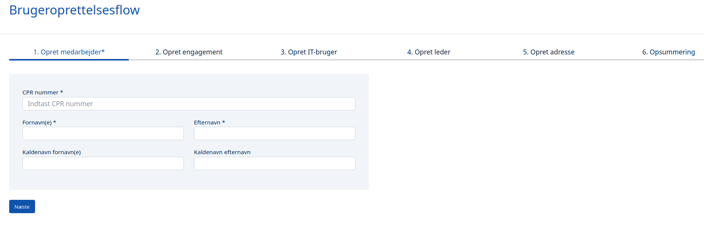
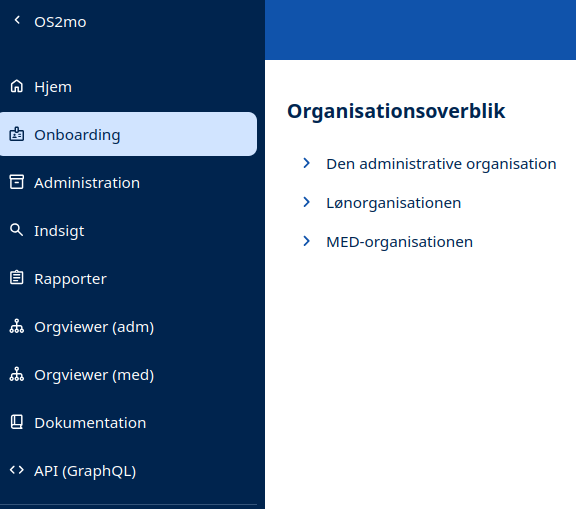
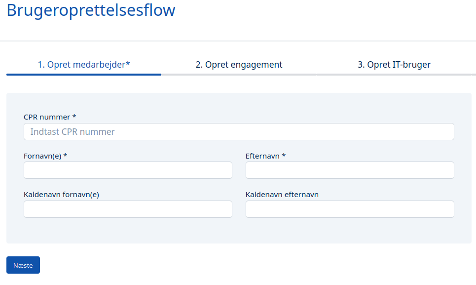
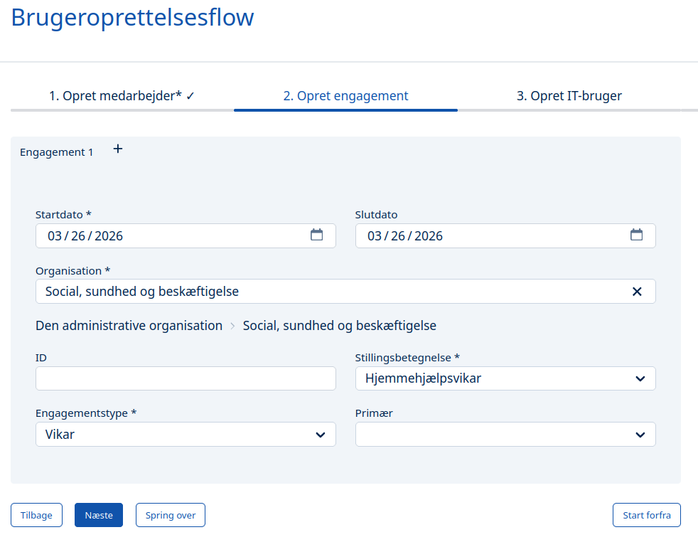
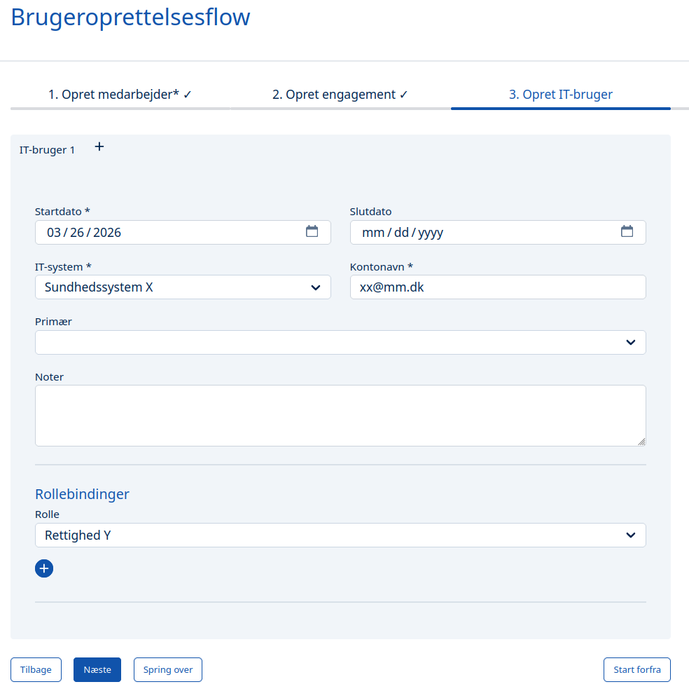
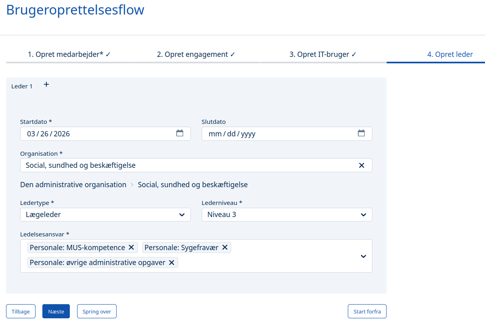
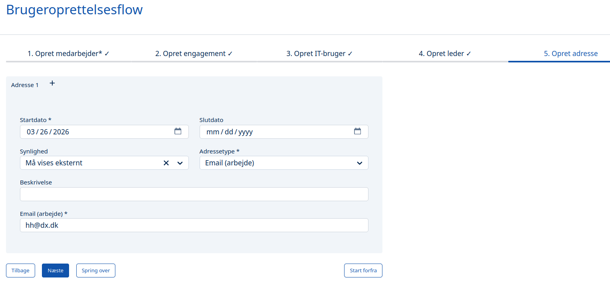
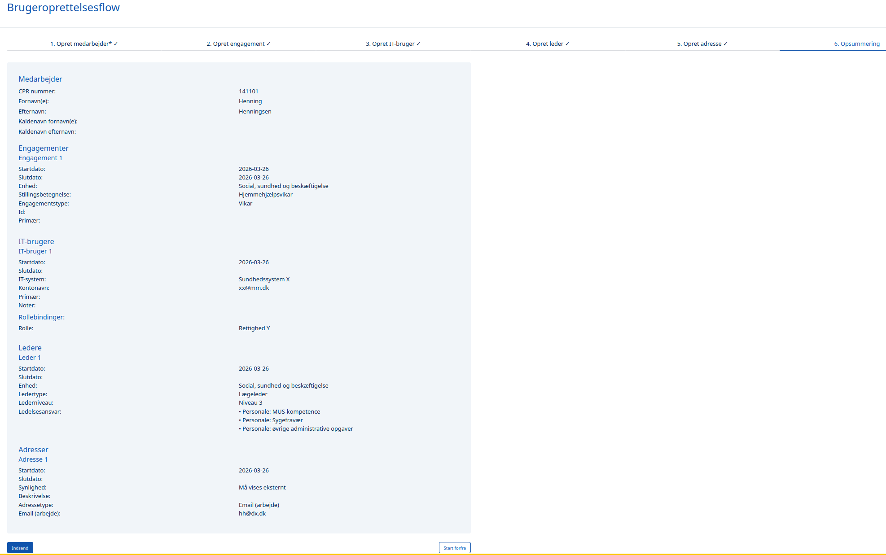

# Formål

Det er muligt at oprette brugere i MO via **Brugeroprettelsesmodulet**.

Formålet er især at kunne straksoprette medarbejdere, der skal have hurtig adgang til de systemer, de skal arbejde med, eller de døre, de skal åbne. Der er typisk tale om vikarer i fx pleje- og omsorgsområdet:

Bemærk, at Brugeroprettelsesflowet både kan benyttes til straksoprettelser, hvor kun 2 af nedenstående arbejdsgange er nødvendige (Opret medarbejder; Opret enaggement), men også til 'almindelige' medarbejdere eller ledere, hvor flere af arbejdsgangene kan være nødvendige.

## Arbejdsgange

Åbn venstremenuen og vælg 'Onboarding':

## Opret medarbejder
Dernæst dukker oprettelsesflowet frem og det første skridt er at indtaste persondata:

Ved indtastning af CPR-nummer hentes autoritative oplysninger fra [Det Centrale Personregister](https://www.borger.dk/samfund-og-rettigheder/Folkeregister-og-CPR/Det-Centrale-Personregister-CPR).

## Opret engagement

Næste skridt er at oprette et *engagement* - ansættelsen - til medarbejderen:

Bemærk, at det er muligt at oprette flere engagementer til medarbejderen på samme tid (ved klik på plusset (+) ved siden af "Engagement 1").

Brugeroprettelsesmodulet understøtter dermed også fremadrettet planlægning, fordi man kan datostyre hvert enkelt engagement – fx kan en vikars arbejdsperiode således planlægges for den næste uge på forhånd.

## Opret IT-bruger

Hvis personen skal oprettes i et eller flere IT-systemer, kan det angives i næste skridt:

## Opret leder

Hvis personen skal udfylde en lederrolle, kan det angives i næste skridt. Bemærk, at også her er det muligt at oprette flere lederroller ad gangen:

## Opret adresse

Herefter kan 'adresser' tilføjes. Også her kan flere adresser tilføjes på én gang, fx email. postadresse, telefon, lokation., etc:

## Opsummering

Inden man trykker Indsend, får man muloigheden for at dobbeltjekke de indtastede oplysninger:

Når der er trykker Indsend, bliver medarbejderen automatisk oprettet i MO og nogle sekunder - maks minutter - senere i de tilstødende systemer, fx Active Directory, FK Organisation, sundhedsplatforme, m.fl.
