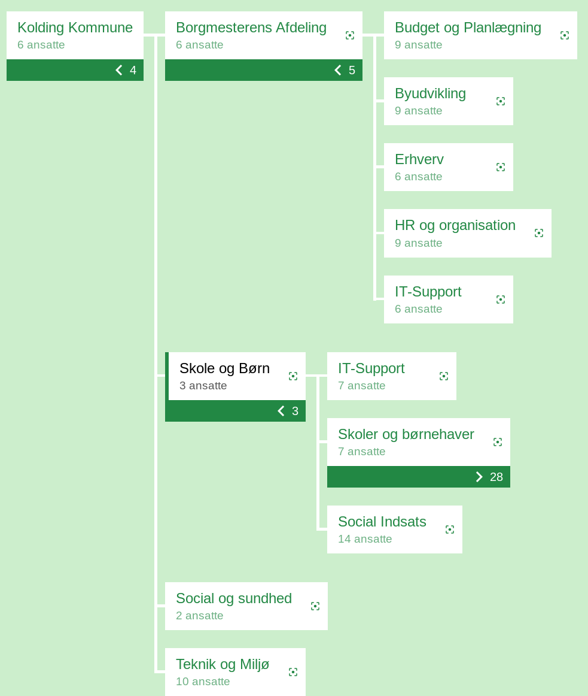
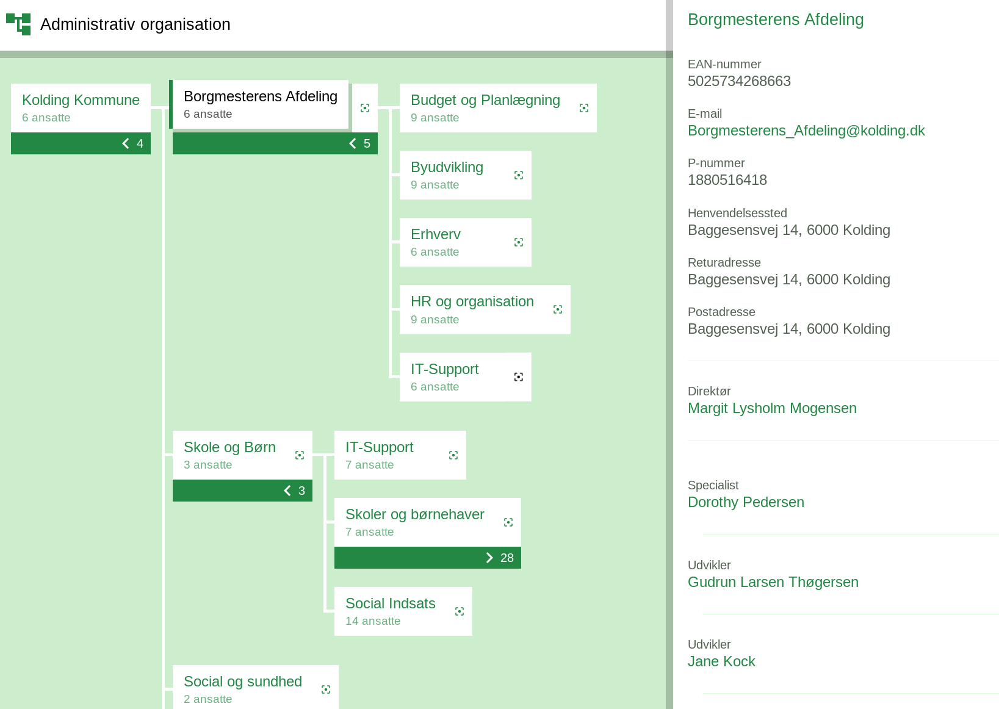
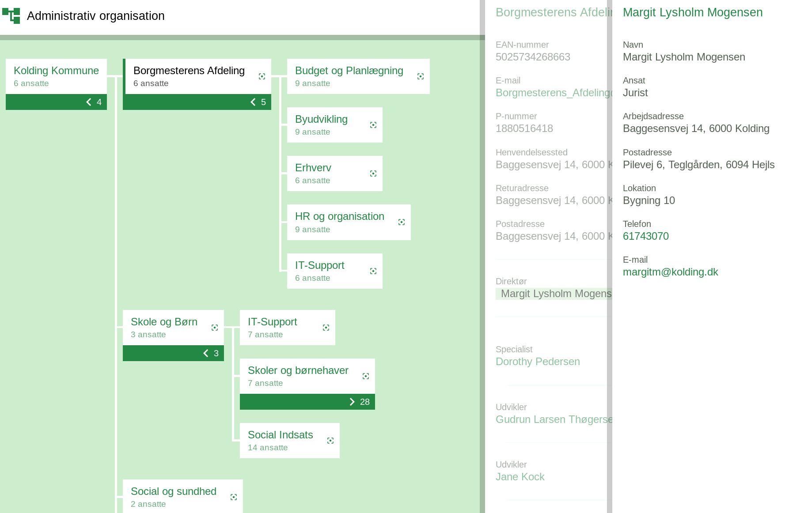
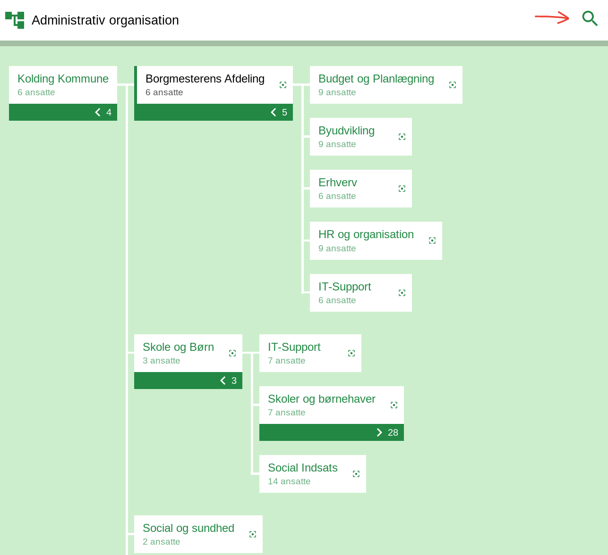
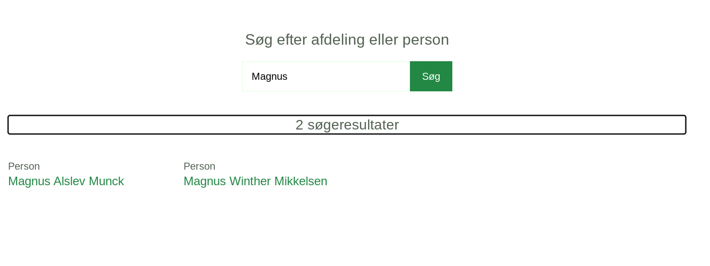
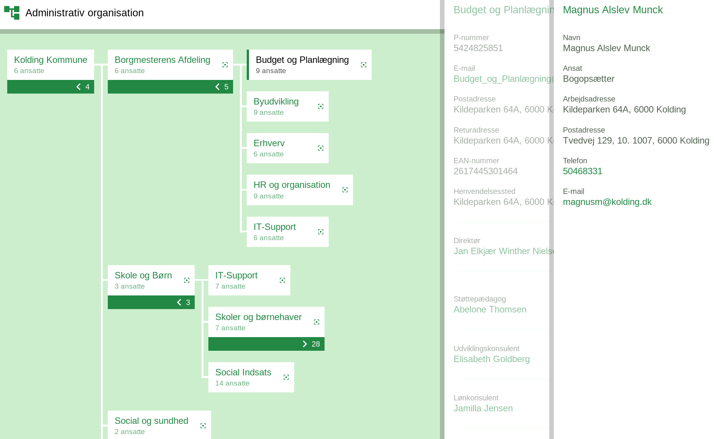

# Organisationsdiagram til MO

## Formål

Formålet med organisationsdiagrammet er gøre MOs data tilgængelige for alle i organisationen.

Organisationsdiagrammet kan bruges såvel som opslagsværk som overblik over linjeorganisationen og MED-organisationen.

### Præsentation af data

#### Visning af organisationer

Det er muligt at udstille flere organisationer via forskellige adresser (URLer). Således kan man fx vælge at udstille sin administrative organisation med ansatte og ledere i ét organisationsdiagram og sin MED-organisation med tillidsrepræsentantskabet i et andet.

Organisationsdiagrammet bliver opdateret ‘on-the-fly’, når der sker ændringer i OS2mo.

#### Visning af enheder i en træstruktur

Enheder vises i en træstruktur, så man tydeligt kan se enhedernes hierarkiske tilhørsforhold.

Bemærk, at diagrammet kan udstilles både vandret og lodret.

#### Udfoldning af træstruktur

Der er toggle-knapper for hver enhed, som viser eller skjuler overenheder og underenheder til denne.

#### Visning af detaljer for enhed

Ved klik på en enhed fremkommer en liste af personer, som er tilknyttet enheden, deres leder samt kontaktinformation på enheden.

#### Visning af detaljer for person

Ved klik på en person (fra enhedens personliste) fremkommer detaljerede oplysninger om personen - herunder kontaktinformation.

### Navigation og deling

#### Navigation mellem enheder

Der navigeres mellem enheder ved at folde den visuelle træstruktur ud og klikke eller ‘tabbe’ sig frem til enheder.

#### Navigation fra enhed til person

Fra enhederne kan man åbne personlister. Fra personlister kan man åbne persondetaljer.
På telefoner og andre små skærme vil personlister og persondetaljer fylde hele skærmen.
På større skærme vil personlister og persondetaljer optage en kolonne til højre på skærmen.

#### Deling af trævisning via URL

Som udgangspunkt vises træstrukturen med den rodenhed, der er konfigureret, og dennes underenheder vil være foldet ud. Når man klikker rundt i trævisningen, opdateres URLen med den enhed, der aktuelt er i fokus.

Man kan dele visningen ved at kopiere websidens URL og sende den til en anden part. Modtageren kan indsætte URLen i sin egen browser og få åbnet en trævisning, hvor samme enhed er i fokus og dens underenheder allerede er foldet ud.

Når man åbner en enhed for at vise dens personliste og individuelle personer, opdaterer dette også URLen. Dette bruges i søgefunktionen til at linke til visning af bestemte personer.

### Søgefunktion

Søgefunktionen vises i toppen af skærmen.

Ved klik på luppen kommer man til søgesiden. Når man indtaster i søgefeltet, får man et søgeresultat med personer eller enheder, der passer til det søgte.

Vælger man en person eller enhed fra søgeresultatet, forsvinder søgeresultatet for at gøre plads til visning af den specifikke enhed eller person i træstrukturen.

Der kan søges på:

1. Enhedsnavn
2. Personers navn

### Opdatering af data

Når data opdateres i OS2mo, opdateres organisationsdiagrammet umiddelbart herefter.

## Datavisning

### For visning af enheder

For hver organisationsenhed vises:

1. Enhedens navn
2. Antal ansatte eller tilknyttede (for hhv. linje- og MED-organisation)
3. Antal underenheder

### For visning af enhedsdetaljer

Når man klikker på en enhed, vises følgende informationer om den:

1. Enhedens navn
2. Enhedens kontaktinformation
3. Enhedens leder samt stillingsbetegnelse
4. Enhedens medlemmer (personliste) med navn og stillingsbetegnelse

### For visning af person

1. Navn (fulde navn)
2. Ansættelsestype
3. Stillingsbetegnelse
4. Kontaktinformation, fx email, telefon, arbejdsadresse og lokation.

## Brugeroplevelse

### Tilgængelighed

Løsningen lever op til krav om tilgængelighed og kan derfor udstilles på både intranet og hjemmeside.

### Look and feel

Løsningen kan integrere lokale design, fra farvekoder til logo.

### Responsivt layout

Løsningen kan anvendes på både små og store skærme.

### Understøttelse af browsere

Understøttelse af browsere inkluderer bagudkompatibilitet med Internet Explorer 11 og aktuel version af Safari.

## Øvrig funktionalitet

### Print styles

Organisationsdiagrammet kan printes (ctrl-p). Antal ark afhænger af organisationens størrelse.

### mailto-link i e-mail-adresser

Når der vises persondetaljer, kan email vises i et mailto-link, så det er muligt at sende mails direkte (såfremt man har en mailklient installeret på sit system). Man skal være opmærksom på spamfare ved at oplyse om email på offentligt tilgængelige websites.
​

### CORS-settings på servere

Løsningen skal køre på en server, hvor CORS-setup tillader, at der hentes data via OS2mo APIet.
