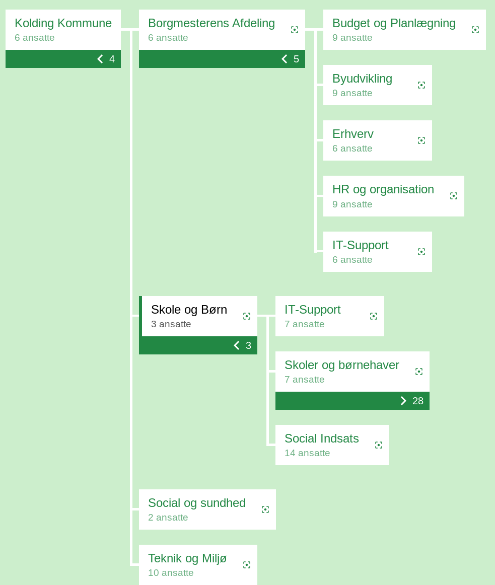
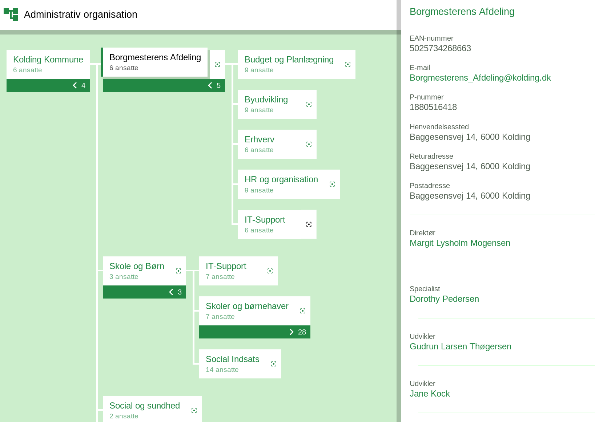
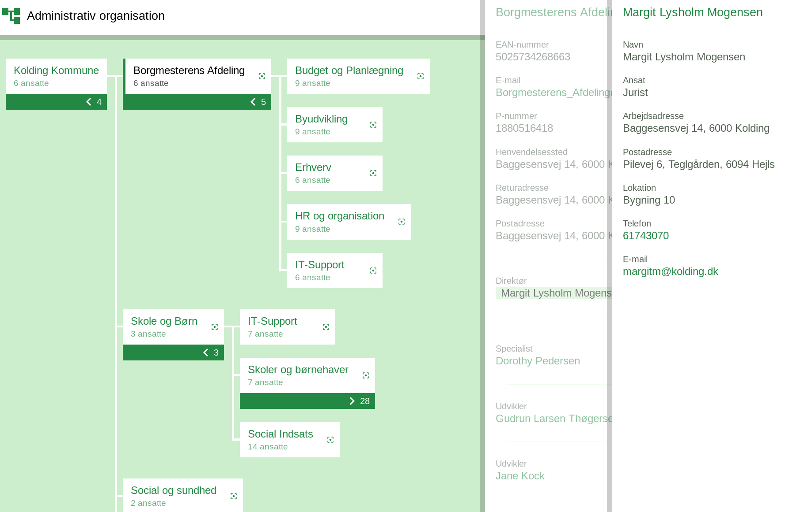
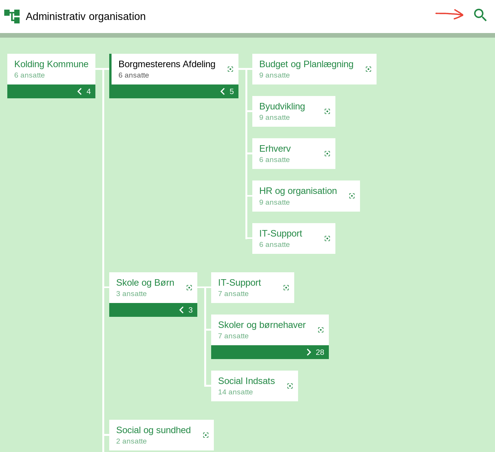
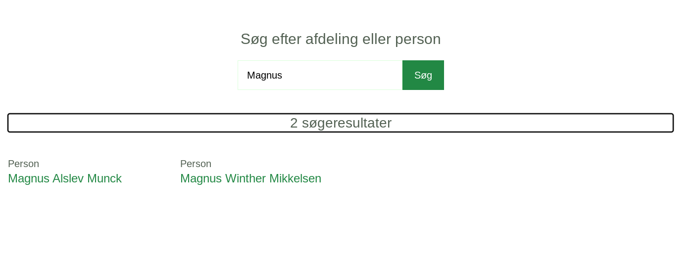
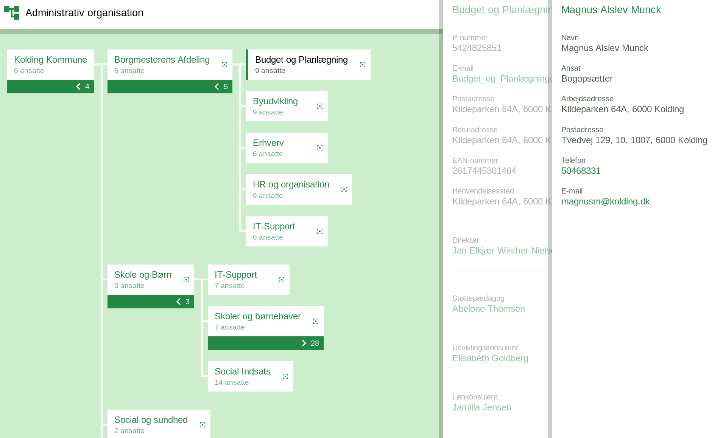

# Organisationsdiagram til MO

## Formål

Formålet med organisationsdiagrammet er gøre MOs data tilgængelige for alle i organisationen.

Organisationsdiagrammet kan bruges såvel som opslagsværk som overblik over linjeorganisationen og MED/TR-organisationen.

Organisationsdiagrammet læser data fra MO, dvs. hvis data ændres i MO, afspejles det *med det samme* i organisationsdigrammet.

### Præsentation af data
#### Visning af organisationer
Det er muligt at udstille flere organisationer via forskellige adresser (URL'er). Således kan man fx vælge at udstille sin administrative organisation med ansatte og ledere i ét organisationsdiagram og sin MED/TR-organisation med tillidsrepræsentantskabet i et andet.

#### Visning af enheder i en træstruktur
Enheder vises i en træstruktur, så man tydeligt kan se enhedernes hierarkiske tilhørsforhold.

#### Udfoldning af træstruktur
Der er toggle-knapper for hver enhed, som viser eller skjuler overenheder og underenheder til denne.

#### Visning af detaljer for enhed
Ved klik på en enhed fremkommer en liste af personer, som er er ansatte eller/og tilknyttet enheden, deres leder(e) samt kontaktinformation på enheden.

#### Visning af detaljer for person
Ved klik på en person (fra enhedens personliste) fremkommer detaljerede oplysninger om personen - herunder kontaktinformation.

#### Visning af tilknytninger og engagementer i samme diagram

Det er muligt at vise såvel engagementer som tilknytninger i ét og samme diagram, fx så både ansatte og MED/TR-repræsentanter fremgår.

#### Kaldenavn
Det er muligt at udstille Kaldenavn i organisationsdiagrammet i stedet for CPR-navn, såfremt Kaldenavn er angivet i MO. Det betyder også, at det er muligt at søge på Kaldenavn. Kaldenavne benyttes typisk, når CPR-navnet ikke ønskes udstillet.

#### Ledere og engagementer
Som standard vises både lederrollen og lederens engagement(er) i diagrammet. Ønsker man kun at vise lederrollen, kan dette vælges i konfigurationen

### Navigation og deling

#### Navigation mellem enheder
Der navigeres mellem enheder ved at folde den visuelle træstruktur ud og klikke eller ‘tabbe’ sig frem til enheder.

#### Deling af trævisning via URL
Som udgangspunkt vises træstrukturen med den rodenhed, der er konfigureret, og dennes underenheder vil være foldet ud. Når man klikker rundt i trævisningen, opdateres URL'en med den enhed, der aktuelt er i fokus.

Man kan dele visningen ved at kopiere websidens URL og sende den til en anden part. Modtageren kan indsætte URL'en i sin egen browser og få åbnet en trævisning, hvor samme enhed er i fokus, og dens underenheder allerede er foldet ud.

Når man åbner en enhed for at vise dens personliste og individuelle personer, opdaterer dette også URL'en. Dette bruges i søgefunktionen til at linke til visning af bestemte personer.

### Søgefunktion
Søgefunktionen vises i toppen af skærmen.

Ved klik på luppen kommer man til søgesiden. Når man indtaster i søgefeltet, får man et søgeresultat med personer eller enheder, der passer til det søgte.

Vælger man en person eller enhed fra søgeresultatet, forsvinder søgeresultatet for at gøre plads til visning af den specifikke enhed eller person i træstrukturen.

Der kan søges på:

1. Enhedsnavn
2. Personers navn (herunder Kaldenavn, hvis dette er konfigureret)

## Datavisning
### For visning af enheder

For hver organisationsenhed vises:

1. Enhedens navn
2. Antal ansatte eller tilknyttede (for hhv. linje- og MED/TR-organisation)
3. Antal underenheder

### For visning af enhedsdetaljer
Når man klikker på en enhed, vises følgende informationer om den:

1. Enhedens navn
2. Enhedens kontaktinformation
3. Enhedens leder samt stillingsbetegnelse
4. Enhedens medlemmer (personliste) med navn og stillingsbetegnelse

### For visning af person

1. Navn (fulde navn eller kaldenavn, afhængigt af konfiguration)
2. Ansættelsestype
3. Stillingsbetegnelse
4. Kontaktinformation, fx email, telefon, arbejdsadresse og lokation.

## Brugeroplevelse
### Tilgængelighed
Løsningen lever op til krav om tilgængelighed og kan derfor udstilles på både intranet og hjemmeside.

### Look and feel
Løsningen kan integrere lokale design, fra farvekoder til logo.

### Responsivt layout
Løsningen kan anvendes på både små og store skærme.

### Understøttelse af browsere
Understøttelse af browsere inkluderer bagudkompatibilitet med Internet Explorer 11.

## Øvrig funktionalitet
### Print styles
Organisationsdiagrammet kan printes (ctrl-p). Antal ark afhænger af organisationens størrelse.

### mailto-link i e-mail-adresser
Når der vises persondetaljer, kan email vises i et mailto-link, så det er muligt at sende mails direkte (såfremt man har en mailklient installeret på sit system). Man skal være opmærksom på spamfare ved at oplyse om email på offentligt tilgængelige websites.
​
### CORS-settings på servere
Løsningen skal køre på en server, hvor CORS-setup tillader, at der hentes data via MO API'et.
