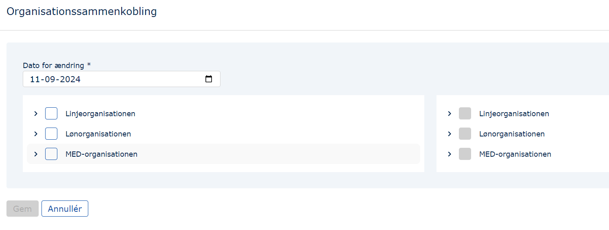
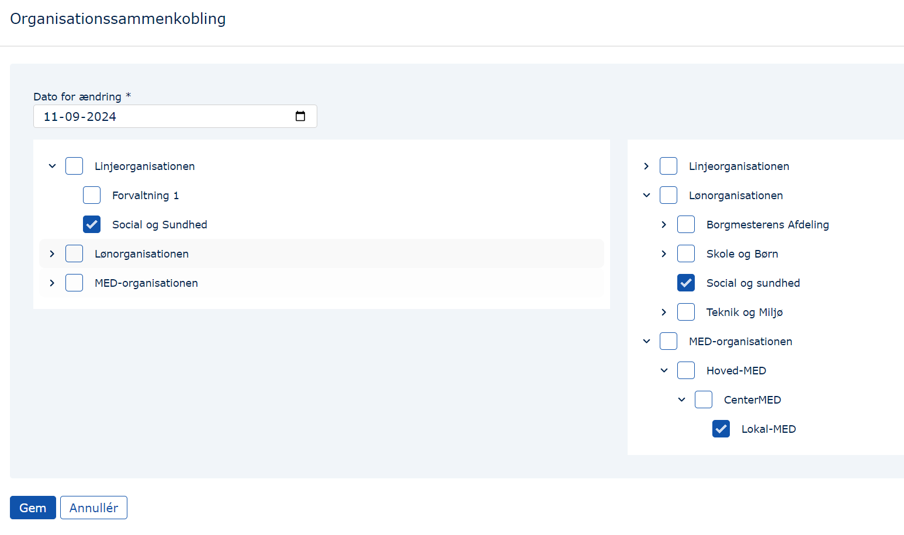
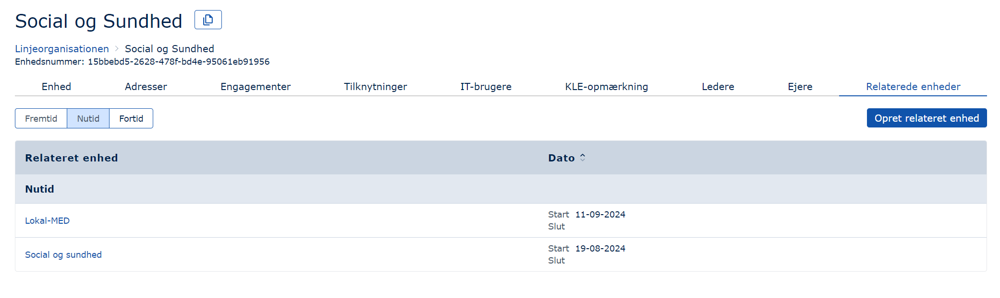
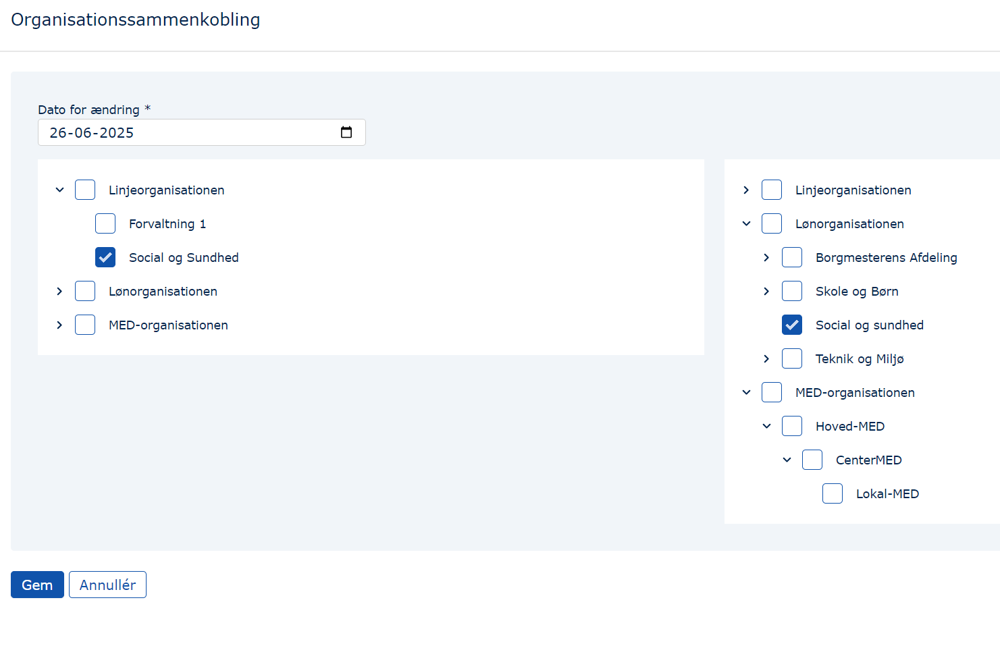

## Formål

Formålet med at relatere enheder til hinanden er multipelt:

Det kan blive brugt til at automatisere nogle arbejdsgange, fx mhp. automatisk overførsel af postadresser fra én enhed til en anden.

Relationerne kan også eksporteres til andre systemer. Fx har en kunde selv brygget et PowerShell-script sammen, der leverer data til deres intranet med MED-organisation, organisationssammenkobling og MED-medlemmer. På baggrund af de data kan intranettet præsentere den enkelte bruger for, hvilke MED-udvalg der er relevante i relation til en persons ansættelse.

For at opnå det resultat har denne kunde altså skabt relationer mellem enhederne i linjeorganisationen og enhederne i MED-organisationen.

## Brugergrænsefladen

Når man er inde i Organisationssammenkoblings-modulet i MO, bliver man præsenteret for dette billede:

### Oprettelse af sammenkoblinger

For at relatere en enhed til en anden enhed eller andre enheder, skal man:

1. Navigere til de enheder, der skal kobles sammen, i hhv. organisationerne til venstre og til højre, og sætter flueben (bemærk muligheden for at oprette en 1-mange relation):

   

2. Angive en startdato.

3. Trykke "Gem".

4. Se relationerne under de nu relaterede enheder:

   

### Sletning af relationer

1. Naviger hen til den enhed fra hvilken man vil fjerne en relation:

   

2. Fjern den eller de relationer, der skal fjernes, ved at fjerne flueben. Husk at angive, hvornår termineringen skal træde i kraft - Det kan både være en fortidig, nutidig og fremtidig dato:

   

3. Tryk "Gem".

4. Se relationerne under de nu relaterede enheder:

   
