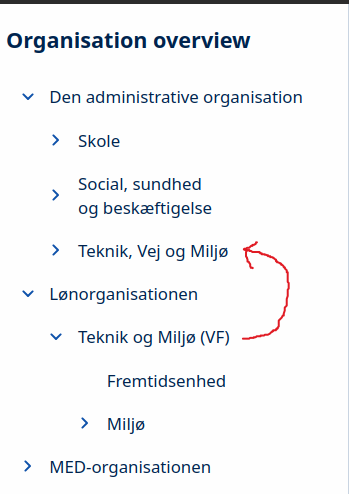
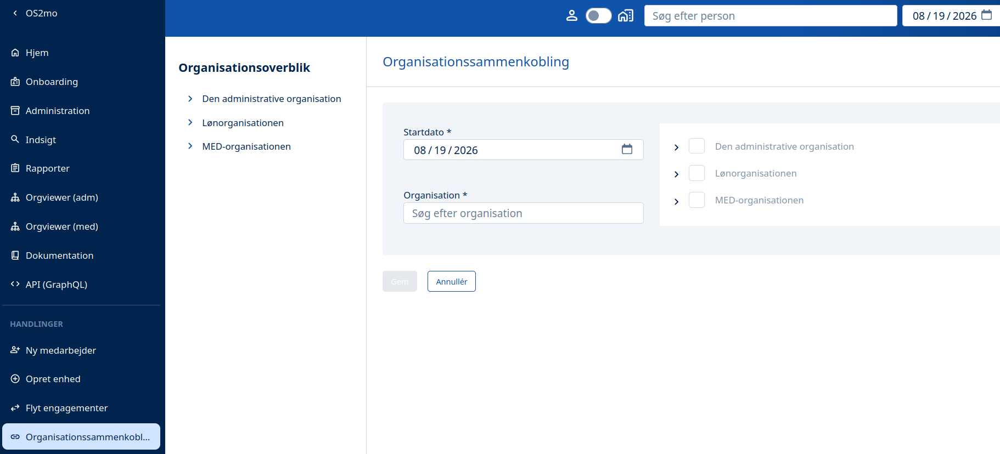
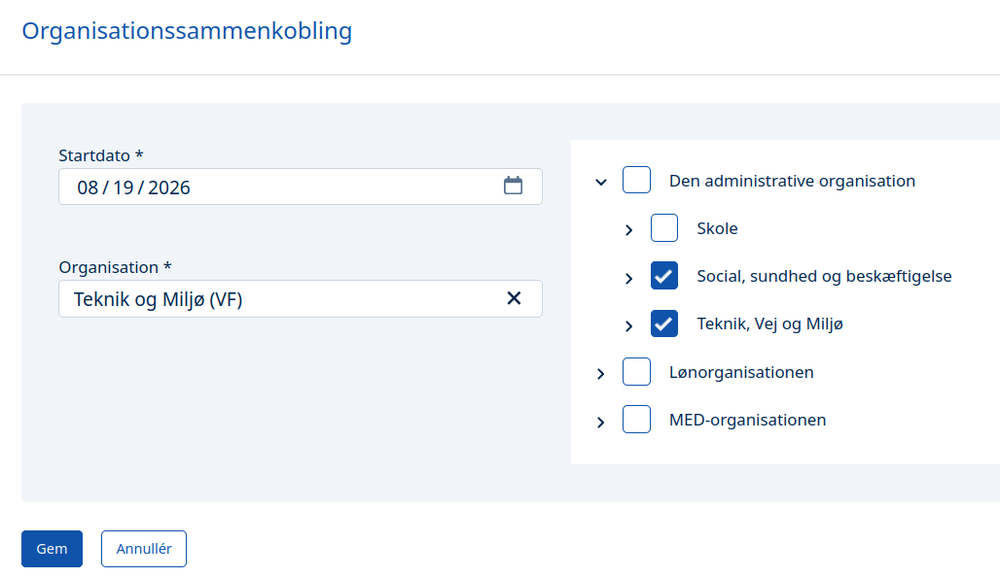
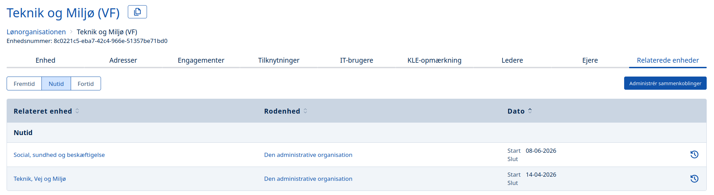
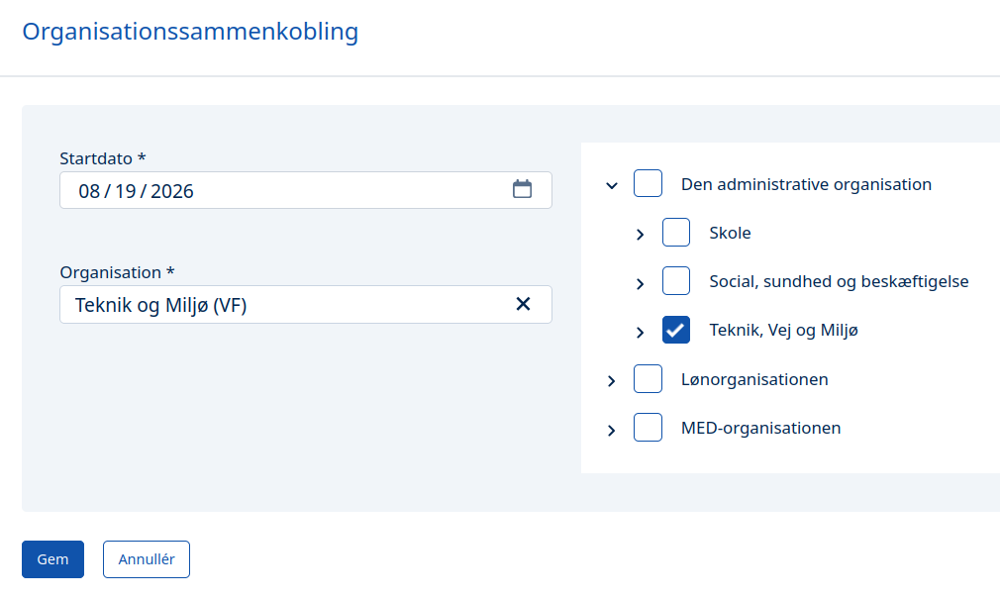
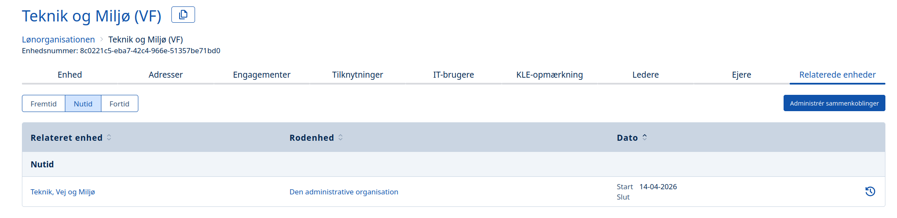

# Formål

Formålet med at relatere enheder til hinanden handler i høj grad om at binde lønorganisationsenheder fra et lønsystem sammen med enheder i den administrative organisation, så engagementer (ansættelser) fra lønenheder automatisk bliver flyttet over i den administrative enhed, de bor i. I nedenstående eksempel er Teknik og Miljø (VF) fra lønorganisationen koblet sammen med Teknik, Vej og Miljø i den administrative organisation, så når en ny medarbejder bliver ansat synkroniseres ind i MO fra lønsystemet, bliver vedkommende automatisk flyttet over i den administrative organisations ditto-enhed (Teknik og Miljø (VF) --> Teknik, Vej og Miljø).

Relationerne kan også eksporteres til andre systemer. Fx har en kunde selv brygget et PowerShell-script sammen, der leverer data til deres intranet med MED-organisation, organisationssammenkobling og MED-medlemmer. På baggrund af de data kan intranettet præsentere den enkelte bruger for, hvilke MED-udvalg der er relevante i relation til en persons ansættelse.

For at opnå det resultat har denne kunde altså skabt relationer mellem enhederne i linjeorganisationen og enhederne i MED-organisationen.

## Brugergrænsefladen

Organisationssammenkoblinger tilgås fra venstremenuens arbejdsgange ved at vælge **Organisationssammenkoblinger**:

### Oprettelse af sammenkoblinger

For at relatere en enhed til en anden enhed eller andre enheder skal man:

1. Angive en **startdato** for sammenkoblingen.

2. Fremsøge den enhed, du vil relatere *fra* (oprindelsesenheden), i feltet **Organisation**. Søgeresultatet viser både enhedens navn og dens organisatoriske placering, så du kan skelne mellem enheder med samme navn. Vælg herefter den eller de enheder, du vil sammenkoble til, ved at sætte flueben i organisationstræet til højre. Bemærk muligheden for at oprette en 1-mange-relation:

3. Trykke "Gem".

### Udstilling af sammenkoblinger

Sammenkoblingerne kan efterfølgende ses under de relaterede enheder på fanebladet **Relaterede enheder**. Tabellen viser både den relaterede enhed, dens **rodenhed** – så man kan se, hvilken hovedorganisation enheden hører til (fx den administrative organisation eller lønorganisationen) – samt sammenkoblingens gyldighedsperiode:

### Redigering og sletning af sammenkoblinger

1. Naviger til enheden, og vælg fanebladet **Relaterede enheder** og tryk på knappen **Administrér sammenkoblinger**.

2. Fjern den eller de relationer, der skal afsluttes, ved at fjerne fluebenet. Husk at angive, hvornår termineringen skal træde i kraft – det kan både være en fortidig, nutidig og fremtidig dato.

3. Tryk "Gem".

4. Se de nye relationer (Social, sundhed og beskæftigelse blev fjernet):

## Rekursive sammenkoblinger (valgfri funktion)

Når man sammenkobler to overliggende enheder, kan MO automatisk lade sammenkoblingen gælde for de underliggende enheder: Engagementer på underenheder bliver da automatisk overført til den overliggende enheds sammenkoblede enhed – dog kun, hvis underenhederne ikke selv har egne sammenkoblinger.

Dermed slipper man for at sammenkoble hver enkelt underenhed manuelt, hvis man ikke har behov for en mere finkornet styring.

Funktionen er slået fra som standard og kan aktiveres ved henvendelse til Magenta.

## Automatikker, der bygger på sammenkoblinger

**Automatisk flytning af medarbejdere**: Når en ny medarbejder indlæses i MO fra lønsystemet, flyttes vedkommende automatisk til den tilhørende enhed i den administrative organisation, hvis enhederne er sammenkoblede.

**Email-notifikation ved manglende sammenkobling**: Hvis en enhed mangler en sammenkobling, som automatikken forudsætter, kan MO sende en [email-notifikation](https://rammearkitektur.docs.magenta.dk/os2mo/features/email-notifikationer.html) til MO-administratoren.
