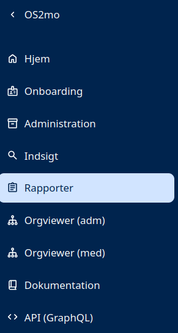

# Rapporter i MO

Det er muligt at få genereret rapporter, fx hver nat, så de indeholder friske data, når man møder på arbejdet om morgenen.

Adgang til rapporterne findes i venstremenuen, så man kan tilgå og downloade dem inde fra MO:

De rapporter, der findes i dag, er beskrevet nedenfor. Ønskes andre sammenstillinger af data i en rapport, kontaktes Magenta på support@magenta.dk.

## Eksisterende rapporter
- **Alle medarbejdere**
    - UUID
    - Navn på person
    - Stilling
    - CPR-Nummer
    - AD-email
    - AD-telefonnummer
    - Enhed

[Eksempel](../Reports/OS2mo%20Ansatte.xlsx)

- **Alle tilknytninger**
    - Org-enhedens UUID
    - Org-enhedens navn
    - Overordnet UUID
    - Navn på person
    - Personens UUID
    - CPR-Nummer

[Eksempel](../Reports/OS2mo%20alle%20tilknytninger.xlsx)

- **Den administrative organisation, enhedstyper samt start- og stopdatoer**
    - Org-enhedens UUID
    - Org-enhedens navn
    - Enhedstype Titel
    - Enhedstypens UUID
    - Gyldig fra
    - Gyldig til

[Eksempel](../Reports/OS2mos%20administrative%20organisation%20inkl.%20start-%20og-%20stopdato%20samt%20enhedstyper.xlsx)

- **Den administrative organisation og dens ansatte**
    - Organisationsenhed
    - Navn på medarbejder
    - Brugernavn
    - Telefon
    - E-mail
    - Adresse

[Eksempel](../Reports/OS2mos%20organisation%20inkl.%20medarbejdere.xlsx)

- **Alle ledere og deres lederansvar**
    - Enhed
    - Navn
    - Ansvar
    - Telefon
    - E-mail

[Eksempel](../Reports/OS2mo%20Alle%20lederfunktioner.xlsx)

- **Medarbejdertelefonbog**
    - Navn
    - Telefon
    - Mobiltelefon
    - Enhed
    - Stillingsbetegnelse

[Eksempel](../Reports/OS2mo%20Medarbejdertelefonbog.xlsx)

- **Stilling og kontaktinformation**
    - CPR
    - Ansættelse gyldig fra
    - Ansættelse gyldig til
    - Fornavn
    - Efternavn
    - Person UUID
    - Brugernavn
    - Org-enhed
    - Org-enhed UUID
    - E-mail
    - Telefon
    - Stillingsbetegnelse
    - Engagement UUID

[Eksempel](../Reports/OS2MO%20Alles%20%20stilling%2Bemail.xlsx)

- **Engagementer og ledere med cpr-numre**
    - Organisationsenhedssti (niveau 1, 2, 3, 4, 5, etc.)
    - Enhedsnavn
    - Enhedstype
    - Medarbejder
    - Stilling
    - Lederniveau
    - Lederbetegnelse
    - Lederansvar
    - Tjenestenummer
    - CPR-nummer
    - E-mail
    - Alder
    - Leder
    - Leders e-mail
    - Brugervendt Nøgle (BvN)
    - Engagementstype

- **Engagementer og ledere med cpr-numre**
    - Organisationsenhedssti (niveau 1, 2, 3, 4, 5, etc.)
    - Leder
    - Medleder 1
    - Medleder 2
    - Administrator
    - Administrativ ansvarlig
    - Personaleledelse
    - Uddannelsesansvarlig
    - Lederniveau
    - Brugervendt Nøgle (BvN)
    - Tjenestenummer
    - Medarbejder
    - E-mail
    - Stillingskode
    - Engagementstype
    - Leders e-mail

- **Engagementer og ledere med cpr-numre**

Rapport, der giver et præcist overblik over kommende nyansættelser og fratrædelser registreret i MO, så tildeling af adgange, oprettelse i andre systemer og øvrig on- og offboarding kan forberedes i god tid. Rapporterne kan tilpasses organisationens behov, så de indeholder de oplysninger, der er brug for.

Andre rapporter kan ligeledes genereres, fx. rapport over MED-organisationens repræsentanter.

## Ledere og engagementer
Rapporter, der indeholder lederoplysninger, kan benytte [koblingen mellem lederrolle og engagement](https://rammearkitektur.docs.magenta.dk/os2mo/features/lederhaandtering.html) til at udlede den korrekte leder – også når en leder har flere ansættelser.

## Personoplsyninger

Bemærk, at rapporterne kan indeholde de samme personoplysninger som MO selv; sørg derfor for passende håndtering af de downloadede filer.
