## Introduktion

MO er bygget til at håndtere en eller flere organisationer, dens medarbejdere og andre tilknyttede personer (eksterne konsulenter, praktikanter, mv.). Organisationstyperne kan fx være lønørganisationen, den administrative organisation, MED-organisationen, økonomiorganisationen, projektorganisationen, mv.

Det smarte ved MO er, at samtlige organisationer og samtlige tilknyttede personer håndteres i ét system. Alle oplysningerne kan og bør sendes videre til andre systemer, således at disse grundlæggende oplysningerne altid er ens i alle systemer, der er forbundet til MO, herunder fx et organisationsdiagram, Active Directory, et patientjournalsystem, et Identity Management system (IdM), m.fl.

Dette dokument beskriver en række grundbegreber og \-logikker samt den funktionalitet, der er indlejret i brugergrænsefladen.

## Overordnede begreber og fælles funktionalitet

### Organisation og Organisationsenhed

En organisationer kan være en juridisk enhed med rettigheder og ansvar. Det kan også være en mere uformel enhed, der oprettes ad hoc i en agil projektorganisation. Eksempler på organisationer er således myndigheder (fx et ministerium, en styrelse, en region, en kommune), NGO'er og private virksomheder, men også MED-udvalg, (midlertidige) teams og universiteter.

En organisationsenhed er en del af en organisation og kan kun eksistere i forbindelse med denne. Eksempelvis kan et kontanthjælpskontor kun eksistere som en del af en kommune, og en it-afdeling eksisterer kun som en del af en virksomhed.

### Personer (medarbejder, praktikant, ekstern konsulent, etc.)

En _person_ i MO er en digital repræsentation af en fysisk person. Personer hentes typisk fra et lønsystem eller CPR-Registret og er altid knyttet til en eller flere organisationsenheder.

### Dobbelthistorik og Fortid, Nutid og Fremtid

[Dobbelthistorik](https://en.wikipedia.org/wiki/Bitemporal_Modeling), eller bitemporalitet, understøttes af MO og tillader, at to tidsakser (_registreringstid_ og _virkningstid_) håndteres:

**Registreringstid** er tidspunktet for selve registreringen, fx oprettelsen af en enhed eller en medarbejder.

Denne tidsakse tilvejebringer typisk de data, der er behov for ifm. med sporbarhed: Hvem har ændret hvilke data hvornår? \- En auditlog.

**Virkningstid** er den periode, inden for hvilken en registrering er gyldig, fx at en enhed eksisterer fra 1\. januar 2020 til 31\. december 2024, eller at en medarbejder er ansat i en given periode.

Organisationsændringer kan altså laves på forhånd, og ansatte kan oprettes i systemet med fremtidig virkning; man kan se, hvornår en specifik medarbejder havde adgang til hvilke it-systemer, og det kan ligeledes spores, hvilken bruger der oprettede vedkommende i systemet.

Alt det betyder, at det i MO er muligt at have overblik over fortidige, nutidige og fremtidige oplysninger, planlægge dem på forhånd og inspicere dem retrospekt. Alle oplysningerne er tilgængelige i de tre "tids-tabs", Fremtid, Nutid og Fremtid, under hvert faneblad. Man kan altså se alle de ændringer, der er foretaget over tid i brugergrænsefladen, nedenfor er der tale om en enheds navn før, nu og siden.

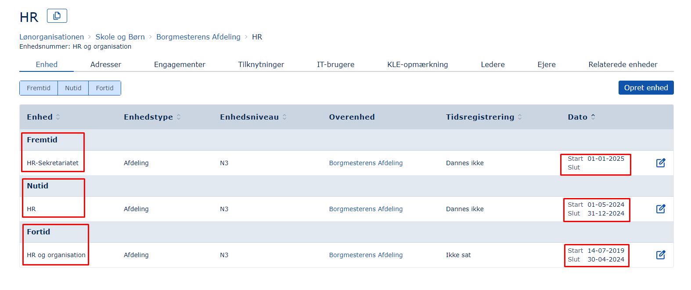

#### Afslut og Redigér

**Redigér**

Det er muligt at ændre i en eksisterende oplysning. Det kan fx være, at et telefonnummer skal redigeres, eller en stillingsbetegnelse skal ændres. Hvis den nye stillingsbetegnelse skal være gældende fra i dag, vil den gamle stillingsbetegnelse rykke ned under Fortidstabben. På den måde er der synlig historik på alle de ændringer, man foretager.

I eksemplet nedenfor har Viggo et job som _Udvikler_, men det er planlagt, at han skal være _Udviklingskonsulent_ pr. en fremtidig dato, nemlig 01-08-2025, hvorfor ændringen kan ses under Fremtidstabben. Når datoen oprinder, vil ændringen træde i kraft og blive flyttet ned under Nutidstabben, mens den registrering, der i dag findes under Nutidstabben, vil blive flyttet ned under Fortidstabben.

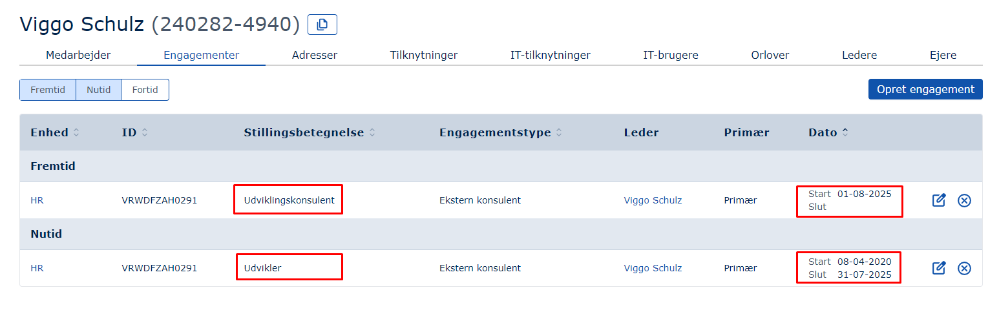

**Overskrivninger**

Såfremt startdatoen ikke ændres, vil det resultere i en _overskrivning_ af den eksisterende registrering, og der vil ikke blive oprettet historik på oplysningen i brugergrænsefladen (men det vil kunne spores i auditloggen), fordi det ikke bliver opfattet som en ændring, men en rettelse (fx ifm. fejlindtastning).

**Afslut**

Det er muligt fx at afslutte en ansættelse, sådan at en medarbejders engagement i organisationen bliver bragt til ophør på en specifik dato, og vedkommendes it-konti i andre systemer (fx Active Directory) bliver nedlagt. Når datoen for afslutningen af ansættelsen oprinder, vil medarbejderens engagement dermed flytte sig fra Nutidstabben til Fortidstabben og blive inaktivt, men fortsat figurere i brugergrænsefladen.

## MOs brugergrænseflade

MO består af en forside og to hoved-moduler:

- **Medarbejdermodulet**, som håndterer tilknyttede personer og deres stamdata.
- **Organisationsmodulet**, som håndterer organisationsenheder og deres stamdata.

## MOs moduler

Herudover findes disse moduler:

- [**Insights**](https://rammearkitektur.docs.magenta.dk/os2mo/features/insights.html), som giver muligheden for at man selv kan sammenstille MOs data og gemme dem i en csv-fil.
- [**Klassifikationer**](https://rammearkitektur.docs.magenta.dk/os2mo/features/klassifikationer.html), som giver muligheden for at ændre eller oprette nye metadata, fx nye stillingsbetegnelser eller nye lederroller.
- [**Organisationsdiagrammet**](https://rammearkitektur.docs.magenta.dk/os2mo/features/org-chart.html), som udstiller organisationen på intranettet eller internettet.
- [**Organisationssammenkobling**](https://rammearkitektur.docs.magenta.dk/os2mo/features/org-sammenkobling.html). Det er muligt at skabe relationer mellem organisationsenheder vha. modulet _Organisationssammenkobling_, hvilket tillader en række automatikker mellem enheder der tilsvarer hinanden i to forskellige Organisationer, fx lønorganisationen og den administrative organisation.
- [**Rapporter**](https://rammearkitektur.docs.magenta.dk/os2mo/features/reports.html), som genererer og hver morgen udstiller friske rapporter indeholdende forskellige datasæt fra MO.

## Forsiden

Forsiden består af en

1. **Header** \- Øverst
2. **Organisationshierarki(er)** – Venstre side
3. **Illustration** \- I midten
4. **Hurtige handlinger** \- Højre side

### Header

MOs header ser således ud:

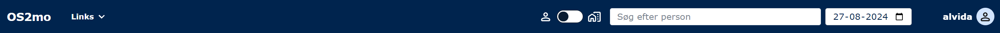

Headeren består af følgende elementer, fra venstre til højre:

1. **Ikon**, der fører tilbage til startsiden.
2. **Links**, hvor links til MOs moduler kan tilføjes. Lige nu findes Organisationsdiagrammet, Insights, Klassifikation og Rapporter. Alle kan tilvejebringes på bestilling. Organisationssammenkoblingsmodulet kommer med MO.
3. [**Søgefunktion**](#sgefunktionen), som søger på medarbejdere eller organisationsenheder afhængigt af om slideren er til venstre eller højre.
4. **Datovælger**, der kan spole frem eller tilbage i tid og loader organisationen som den kommer til at se ud i fremtiden / så ud på et givet tidspunkt i fortiden.
5. **Log ind/ud**\-knap.

Bemærk, at MO findes på dansk og engelsk. MOs sprog vil altid være det sprog, browseren er sat til.

#### Søgefunktionen

Søgefunktionen fungerer i kontekst med enten Medarbejderdelen eller Organisationsdelen:

**Hvad kan man søge på?**

**Medarbejderes:**

- UUID
- Medarbejdernavn
- Kaldenavn
- CPR-nummer (uden bindestreg)

**Medarbejderes adresseregistreringer (undtagen DAR-adresser). Eksempelvis:**

- Telefonnummer
- Email

**Medarbejderes it-konto-navne**

Det kan være et SamAccountName, en SAP-konto, FK org it-bruger, m.fl.

**Organisationsenheders:**

- UUID
- Enhedsnavn
- Enhedsnummer \- BVN (brugervendt nøgle)

**Organisationenheders adresse-registreringer (undtagen DAR-adresser). Eksempelvis:**

- Afdelingskode
- OrgID
- Adresse
- EAN-nummer
- FAX
- Formålskode
- P-nummer
- Skolekode
- Telefonnumre
- Emails præfix ('alexhansen' i [alexhansen@dr.dk](mailto:alexhansen@dr.dk))
- Egen-specificerede adresser, ex "LOS ID", "MagKort"

**Organisationenheders it-konto-navne**

Det kan være et SamAccountName, en SAP-konto, FK org it-bruger, m.fl.

**Hvad kommer frem i søgeresultat?**

**Medarbejder**

- Navn
- Udvalgte adresse-registreringer (fx telefonnummer, email)

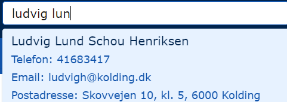

**Organisation**

- Navn
- Organisatorisk overenhed
- Udvalgte adresse-registreringer (fx postadresse, P-nummer)

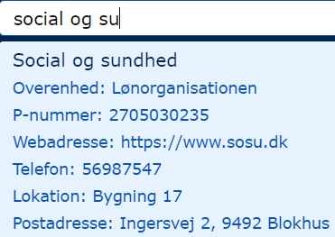

#### Rapporter

Rapporter er forskellige sammenstillinger af de data, der findes i MO. Rapporterne bliver genereret hver nat, så de altid indeholder de nyeste data. Rapporternes indhold afhænger af, hvad der er bestilt. En rapport er et link til en csv-fil, som kan downloades og benyttes til hvad deres formål end er.

De rapporter, der eksisterer, er beskrevne [her](https://rammearkitektur.docs.magenta.dk/os2mo/features/reports.html).

#### Insights

Insights er et modul, som tillader brugerne selv at sammenstille data på kryds og tværs og downloade de filer, der genereres på denne baggrund.

Du kan læse mere om [Insights her](https://rammearkitektur.docs.magenta.dk/os2mo/features/insights.html).

### Organisationshierarki med mulighed for flere parallelle organisationer

I venstre side af skærmen findes et organisationshierarki, der giver overblik over organisationen og mulighed for at navigere i den:

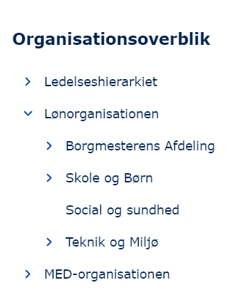

Bemærk, at det er muligt at have flere organisationer indlæst, fx den administrative organisation, lønorganisationen, MED/AMR-organisationen.

### Detaljeside

Når en organisationsenhed vælges, vil information om den være fordelt på en række faneblade, og det samme gør sig gældende, når en medarbejder vælges.

#### Fanebladet Enhed

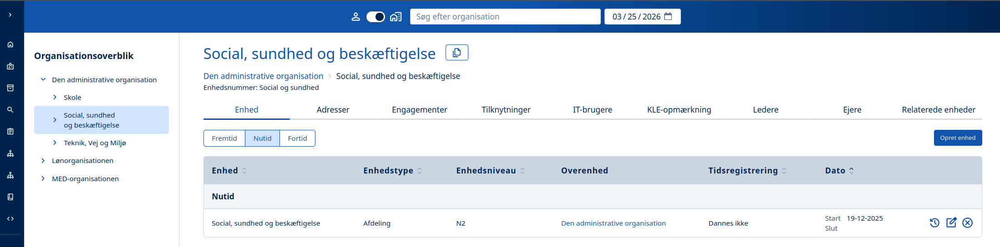

En organisationsenhed er en del af en organisation, og kan kun eksistere i forbindelse med denne. Eksempelvis kan et kontanthjælpskontor kun eksistere som en del af en kommune.

Organisationsenheder kan spænde fra mindre enheder, som fx teams eller grupper, til store og komplekse enheder, som fx en forvaltning, der indeholder mange andre andre niveauer af underenheder.

Eksempler på organisationsenheder er teams, afdelinger, sektioner, kontorer, udvalg, projektgrupper, styregrupper, daginstitutioner og lignende.

**Enhedstype** kan fx bruges til at skelne mellem de formål, enhederne har. Enhedstype bør bruges beskrivende og til at fremfinde organisationsenheder af en bestemt enhedstype. Eksempel: Afdeling, underafdeling, sektion, enhed, direktørområde, center.

**Enhedsniveau** benyttes til at angive organisationens hierarki.

**Tidsregistrering** benyttes i nogle organisationer til at identificere, hvilken type tidsregistrering, enheden benytter sig af.

**Overenhed** fortæller, hvilken enhed der ligger umiddelbart hierarkisk over den valgte enhed.

**Start- og slutdato** angiver hhv. hvornår sidste ændring på enheden er foretaget, og eventuelt hvornår den slutter.

#### Fanebladet Adresser

Er en liste af forskellige kontaktformer og kan være alt fra telefonnumre over EAN-numre til web-adresser.

Det er muligt at behæfte en ‘Synlighed’ til alle Adressetyper. Synligheden ændrer ikke på, om adressen kan ses i MO, men indikerer overfor brugeren, om adressen må videregives, og anvendes i øvrigt af MOs integrationer til at afgøre, i hvilke sammenhænge en adresse må udstilles i (hjemmesider, rapporter, organisationsdiagram, mv). Det kan fx dreje sig om, at man ikke ønsker at udstille et telefonnummer på fx intranettet.

Fanebladet findes også under Medarbejdere i MO og indeholder samme type oplysninger blot for personer:

#### Fanebladet Engagementer

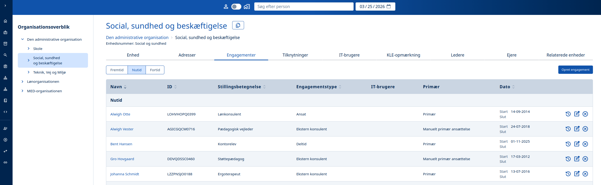

Et engagement beskriver et forhold mellem en person og en organisationsenhed. Engagementet kan bruges til at beskrive den rolle, en person har i en organisation, fx at en person er "Timelønnet", "Månedslønnet" eller bare "Ansat" (**Engagementstype**) med **Stillingsbetegnelsen** "Jurist", "Udvikler" eller "Teknisk Assistent".

**Primær** angiver hvorvidt der er tale om en primæransættelse. Det kan have betydning for i egenskab af hvilken ansættelse en person skal oprettes som it-bruger i et it-system.

Fanebladet udstiller de ansatte i enheden.

Fanebladet findes også under Medarbejdere i MO og indeholder samme type oplysninger blot for den enkelte medarbejder:

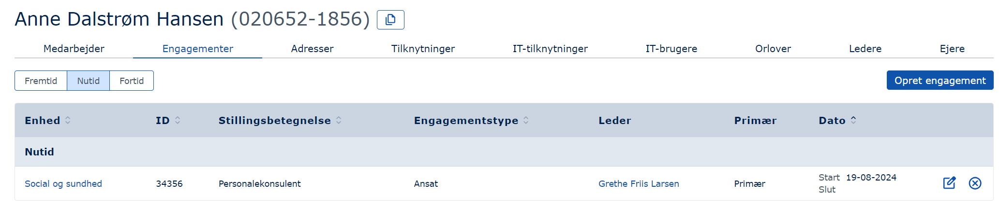

#### Fanebladet Tilknytninger

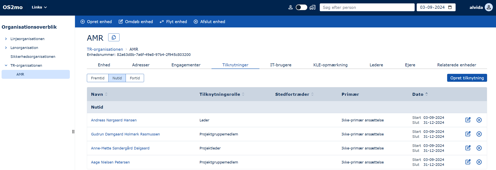

En ‘Tilknytning’ definerer et forhold mellem en person og en organisationsenhed. Der er modsat engagementet ikke tale om en ansættelse, men om en funktion, en person udfylder i forbindelse med en anden opgave.

Tilknytninger er typisk benyttet til midlertidigt at knytte en medarbejder til en anden enhed ifm. et midlertidigt projekt. Det benyttes også hyppigt til at knytte medarbejdere til MED/AMR/TR-organisationen. [Læs mere om MED/AMR/TR-organisationen her](https://rammearkitektur.docs.magenta.dk/os2mo/features/med-organisation.html).

Fanebladet udstiller de tilknytninger, der måttte til enheden.

Fanebladet findes også under Medarbejdere i MO og indeholder samme type oplysninger blot for den enkelte medarbejder:

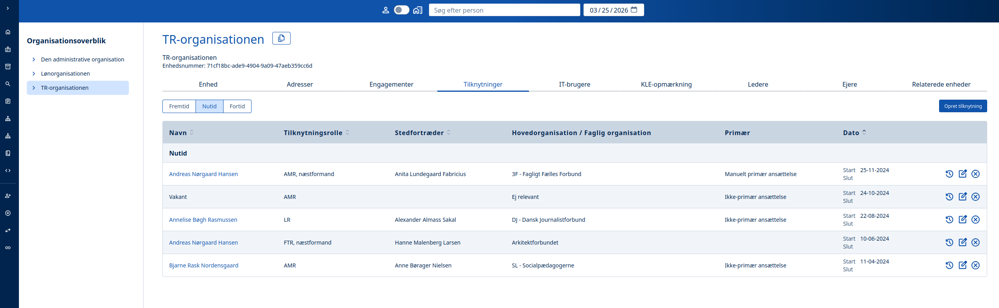

#### Fanebladet IT-brugere

Fanebladet er delt op i to under-faneblade:

#### IT-brugere

Dette underfaneblad tillader vedligehold af kontonavne til forskellige it-systemer og giver et overblik over, hvilke it-systemer organisationsenheden benytter. Under Medarbejderdelen vises medarbejdernes IT-konti, fx fra SAP og Active Directory:

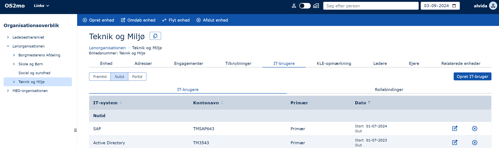

#### Rollebindinger

For hver konto, man har i et it-system, kan der høre forskellige roller.

I nedenstående eksempel har en ansat fået oprettet en it-konto i systemet NextCloud og fået tildelt rollen Admin. Hvis MO er integreret med NextCloud, bliver it-kontoen med tilhørende rolle automatisk oprettet i det system. Er MO og NextCloud ikke integreret, kan oprettelsen i MO udløse afsendelsen af en mail til en system-adminsitrator, som skal stå for den manuelle oprettelse af it-kontoen i NextCloud.

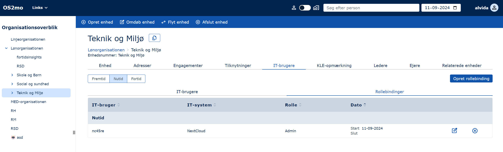

#### Fanebladet KLE-opmærkninger

Det er muligt at opmærke sine enheder med [KL's Emnesystematik (KLE)](http://www.kle-online.dk/soegning).

KL's Emnesystematik er oprindeligt tænkt som en opgavetaksomnomi, der skal give et overblik over, hvem der udfører hvilke opgaver.

Anvendelsen varierer, men hovedformålene er dataafgrænsning og/eller opgavestyring.

Opmærkningerne af organisationen kan sendes videre til andre systemer, der har behov for dem (fx [FK Organisation](https://digitaliseringskataloget.dk/l%C3%B8sninger/organisation), [organisationsdiagrammet](https://rammearkitektur.docs.magenta.dk/os2mo/features/org-chart.html) og/eller IdM-systemer).

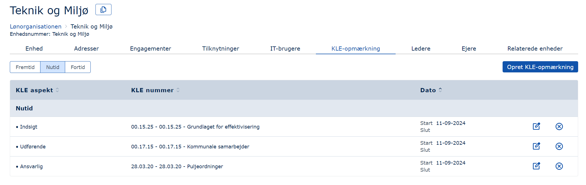

Fanebladet findes ikke i Medarbejderdelen, fordi kun organisationsenheder kan opmærkes pt.

MO får KLE-numrene fra FK Klassifikation, som er en integration, du kan læse mere om [her](https://rammearkitektur.docs.magenta.dk/os2mo/integrations/fkk.html).

#### Fanebladet Ledere

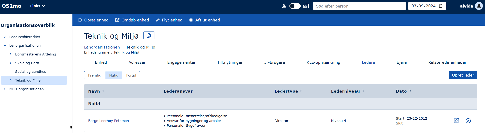

En leder er en ansat, som har bestemmende indflydelse på organisationen ved hjælp af specifikke beføjelser og ansvarsområder.

Ledere kan beskrives vha:

- **Lederansvar** beskriver de ansvarstyper, en leder kan have. Eksempel: MUS-ansvarlig, Personaleansvarlig. En leder kan have flere ansvarsområder.
- **Ledertype** indikerer ofte lederens funktion og hierarkiske placering eller tilknytning til et specifikt organisatorisk niveau. Eksempel: Direktør, Beredskabschef, Centerchef, Institutionsleder.
- **Lederniveau** er en hierarkisk beskrivelse. Eksempel: Niveau 1, 2, 3\.

For ledere gælder det, at de er markeret med en stjerne (\*), hvis de er nedarvede fra en overordnet organisationsenhed som følge af at enheden ikke har en direkte leder.

Det er desuden muligt at gøre en lederfunktion vakant, hvis den midlertidigt ikke er besat:

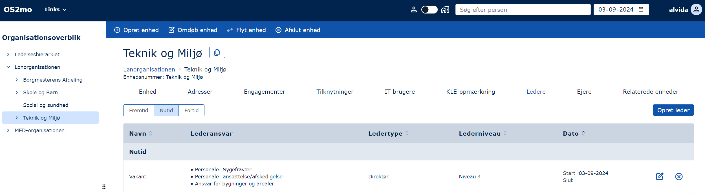

Såfremt en lederfunktion bliver vakant, er det muligt at modtage en [email-notifikation](https://rammearkitektur.docs.magenta.dk/os2mo/features/email-notifikationer.html) herom.

Fanebladet findes også under Medarbejdere i MO og indeholder samme type oplysninger blot for den enkelte ansatte:

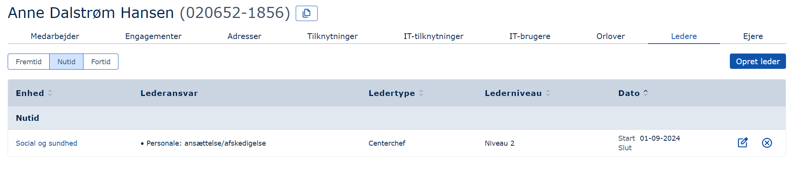

#### Fanebladet Ejere

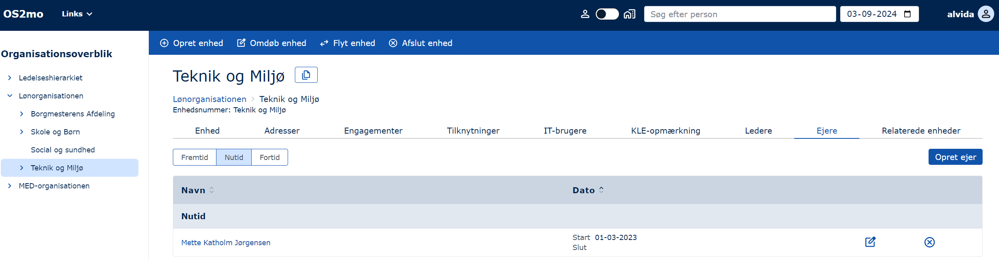

Konceptet 'Ejer' benyttes til at foretage rollebaseret adgangsstyring. Det betyder, at det er muligt at give visse personer rettigheder til at redigere i en specifik del af MO, mens andre (administratorer) har rettigheder til at redigere overalt i MO. I eksemplet ovenfor har Mette ret til at redigere i afdelingen "Teknik og Miljø" og alle dens underenheder, men hvis han prøver at rette andre steder, vil han modtage en fejlbesked.

Denne rettighedsstyring er sat op via [Keycloak](https://www.keycloak.org/), og du kan [læse mere om den her](https://rammearkitektur.docs.magenta.dk/os2mo/tech-docs/iam/auth.html).

Fanebladet findes også under Medarbejdere i MO og indeholder samme oplysninger blot for den enkelte ansatte.

#### Fanebladet Relateret

Viser om en organisationsenhed har en relation til en anden. Relationen kan foregates enten under fanebladet ved at vælge "Opret relateret enhed", eller i selve Organisationssammenkoblingsmodulet:

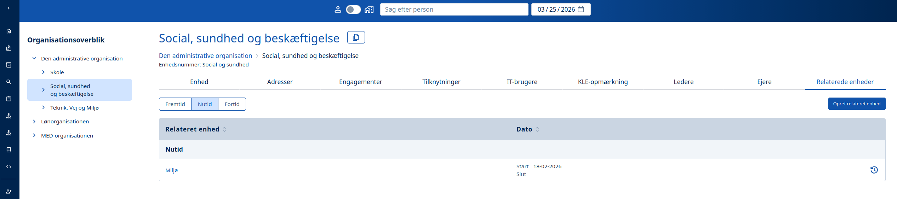

Sammenkoblingerne kan benyttes til forskellige formål, fx til at flytte postadresser fra en lønorganisationsenhed til dens pendant i den administrative organisation.

Bemærk, at sammenkoblingerne kan datostyres.

### Faneblade, der kun eksisterer i medarbejderdelen af MO

#### Fanebladet Medarbejder

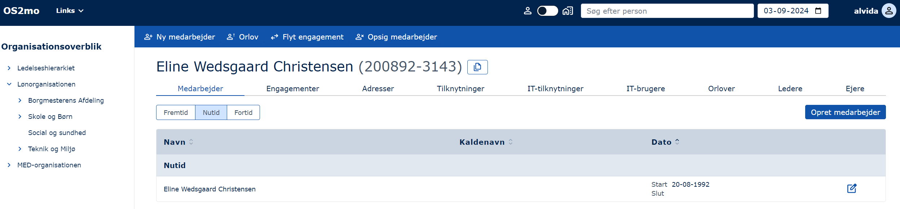

Under denne fane ses stamoplysninger på en person, nemlig navn, kaldenavn samt datoer.

- **Navnet** er altid personens CPR-navn.
- **Kaldenavnet** benyttes især, hvis man ikke er interesseret i at korrespondancer indeholder personfølsomme oplysninger. Det kan fx være fordi man arbejder med udsatte børn og unge. Hvis et kaldenavn er sat, vil en integration til et andet system kunne konfigureres til at videreformidle dette og ikke CPR-navnet.
- **Datoer**. Som udgangspunkt vil startdatoen være ens fødselsdato. Såfremt der ændres i en stamoplysning - fx at et kaldenavn angives - vil startdatoen ændres til at matche denne dato, og hvis man er interesseret i at se en persons fødselsdato, skal man klikke på Fortid:

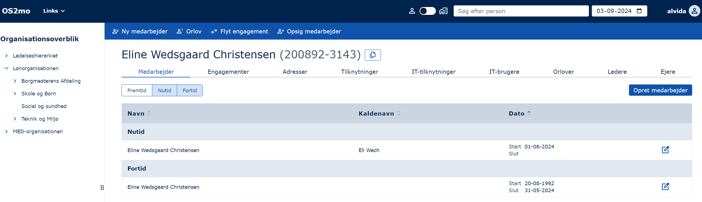

#### Fanebladet IT-Tilknytninger

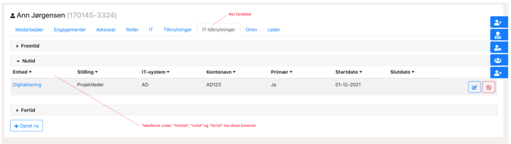

Udover lønmæssig indplacering (ansættelse / engagement) er en person it-mæssigt indplaceret i forhold til sit arbejdssted. Dette er ofte, men ikke altid, identisk med den lønmæssige indplacering. I praksis er det ikke personen, men deres it-bruger, der er indplaceret. Enkelte personer har mere end én it-bruger, som er placeret og har rettigheder forskellige steder. Derfor er det ikke muligt at benytte eksempelvis "Tilknytning" eller "Engagement" (se ovenfor), da ingen af dem er forbundet til it-brugeren. Derfor er det nødvendigt at kunne markere den primære it-bruger, så de aftagersystemer, der kun tillader én bruger pr. person, kan få udvalgt den rette bruger. Derudover er der i nogle tilfælde behov for at tilknytte en brugervendt stillingsbetegnelse til IT-brugeren, som ikke er identisk med den stillingsbetegnelse, der er hentet fra lønsystemet og placeret under engagementer.

Oprettelsen af en it-tilknytning ser således sådan ud:

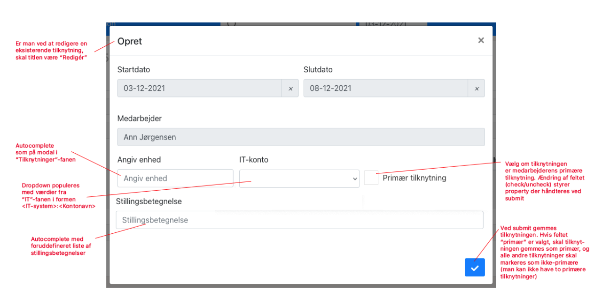

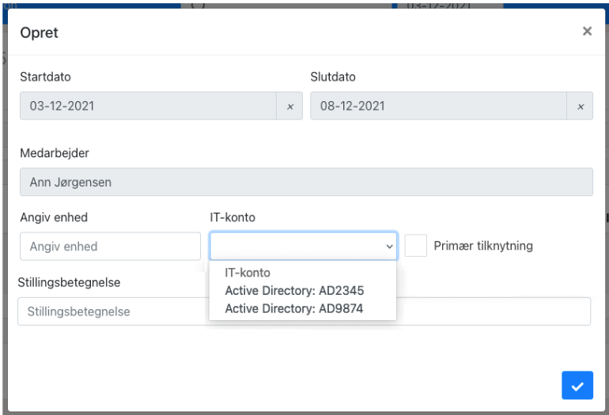

**Valideringer**

Følgende valideringer er gældende:

**_It-konti_** (i et bestemt system)

- En it-konto må kun være tilknyttet én person (et CPR-nummer).
- En given person må maksimalt have én primær it-konto pr. it-system

Fx kan én person have it-konti Y11 og Y22 til ét it-system og Y33 til et andet. Dvs. tre it-konti som hver især kan tilknyttes organisation en eller flere gange.

**_It-konti-tilknytning_**

- En person må maksimalt have én it-tilknytning til en given it-konto pr. organisationsenhed.

Fx: Y11 fra samme it-system må kun være tilknyttet samme organisationsenhed én gang.

Fx: Y11 og Y22 fra samme it-system kan være tilknyttet samme organisationsenhed.

- En person må maksimalt have én primær it-tilknytning for en given it-konto.

Fx: Y11 kan ikke være tilknyttet to forskellige organisationsenheder som primær på samme tid.

Fx: Y11 og Y22 fra samme it-system kan være knyttet til samme organisationsenhed som primær.

#### Fanebladet Orlov

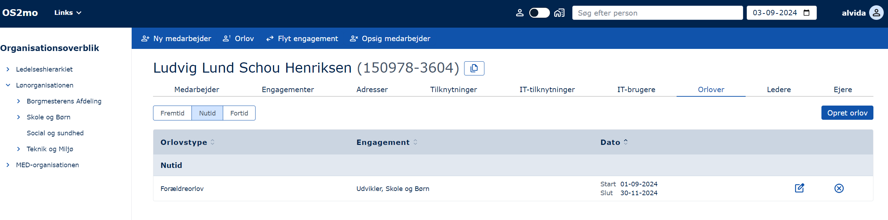

En ‘Orlov’ beskriver fritagelse for tjeneste i en periode.

Man kan eventuelt bruge informationen til at suspendere en konto i Active Directory midlertidigt. Informationen kan altså sendes videre til andre systemer.

Eksempel: Uddannelsesorlov, Sygeorlov, Barselsorlov.

## Hovedarbejdsgange

Arbejdsgangene kan tilgås fra forsiden eller under de enkelte faneblade.

For organisationsenheder er de:

1. Opret enhed
2. Omdøb enhed
3. Flyt enhed
4. Afslut enhed

For ansatte er de::

1. Ny medarbejder
2. Orlov
3. Flyt engagement
4. Flyt mange engagementer
5. Opsig medarbejder

Fælles for arbejdsgangene er, at en startdato skal angives (slutdatoen er optionel). Startdatoen kan være fortidig, nutidig eller fremtidig. Generelt er det sådan, at en organisationsenhed eller en medarbejder ikke må eksistere uden for hhv. den tilhørende overenheds eller enhedens gyldighedsperiode.

Oprettes en medarbejder med en fremtidig startdato, vil medarbejderen fremgå af ‘Fremtids’-tabben.

Oprettes en organisationsenhed med en fremtidig startdato, vil den kun fremgå af organisationstræet, hvis Datovælgeren indstilles til den fremtidige dato. Ellers vil den først dukke op i organisationstræet på pågældende dato.

Når man opretter en medarbejder, hentes vedkommende via indtastning af CPR-nummer fra CPR-registret (såfremt denne integration er tilvalgt).

Hvis man er interesseret i at arbejde med fiktive, men valide cpr-numre, skal man benytte guiden [Fiktive CPR numre](https://modst.dk/media/17386/fiktive-cpr-numre.pdf).
