## Introduktion

MO er bygget til at håndtere en eller flere organisationer, dens medarbejdere og andre tilknyttede personer (eksterne konsulenter, praktikanter, mv.). Organisationstyperne kan fx være lønørganisationen, den administrative organisation, MED-organisationen, økonomiorganisationen, projektorganisationen, mv.

Det smarte ved MO er, at samtlige organisationer og samtlige tilknyttede personer håndteres i ét system. Alle oplysningerne kan og bør sendes videre til andre systemer, således at disse grundlæggende oplysningerne altid er ens i alle systemer, der er forbundet til MO, herunder fx et organisationsdiagram, Active Directory, et patientjournalsystem, et Identity Management system (IdM), m.fl.

Nedenfor beskrives en række grundbegreber og \-logikker samt den funktionalitet, der er indlejret i brugergrænsefladen.

## Overordnede begreber og fælles funktionalitet

### Organisation og Organisationsenhed

En **organisation** kan være en juridisk enhed med rettigheder og ansvar. Det kan også være en mere uformel enhed, der oprettes ad hoc i en agil projektorganisation. Eksempler på organisationer er således myndigheder (fx et ministerium, en styrelse, en region, en kommune), NGO'er og private virksomheder, men også MED-udvalg, (midlertidige) teams, gymnasier, skoler, universiteter - der er ingen grænser.

En **organisationsenhed** er *en del* af en organisation og kan kun eksistere i forbindelse med denne. Eksempelvis kan et kontanthjælpskontor kun eksistere som en del af kommunen, og en it-afdeling eksisterer kun som en del af en virksomhed.

Eksempler på organisationsenheder er teams, afdelinger, sektioner, kontorer, udvalg, projektgrupper, styregrupper, daginstitutioner og lignende.

### Personer, Engagementer (ansættelser) og (It)-brugere

En **Person** i MO er en digital repræsentation af en fysisk person - en 'CPR'-person. Personer hentes typisk fra et lønsystem eller CPR-Registret, men kan også oprettes direkte i MO.

Et **Engagement** er en ansættelse. Et engagement er altid tilknyttet en person, og en person kan have flere ansættelser.

En **IT-bruger** er knyttet til et engagement, men ikke personen bag engagementet. En persons rettigheder og adgange i et system bør afspejle, hvad vedkommende har brug for i kraft af sin stilling – ikke hvem personen er. Skifter personen job internt, skal adgangene ændres automatisk med ansættelsen.

### Dobbelthistorik og Fortid, Nutid og Fremtid

[Dobbelthistorik](https://en.wikipedia.org/wiki/Bitemporal_Modeling), eller bitemporalitet, understøttes af MO og tillader, at to tidsakser (*registreringstid* og *virkningstid*) håndteres:

**Registreringstid** er tidspunktet for selve registreringen, fx oprettelsen af en enhed eller en medarbejder.

Denne tidsakse tilvejebringer typisk de data, der er behov for ifm. med sporbarhed: Hvem har ændret hvilke data hvornår?

**Virkningstid** er den periode, inden for hvilken en registrering er gyldig, fx at en enhed eksisterer fra 1\. januar 2020 til 31\. december 2024, eller at en medarbejder er ansat i en given periode.

Organisationsændringer kan altså laves på forhånd, og ansatte kan oprettes i systemet på bagkant; man kan se, hvornår en specifik medarbejder havde adgang til hvilke it-systemer, og det kan ligeledes spores, hvilken bruger der oprettede vedkommende i systemet.

Alt det betyder, at det i MO er muligt at have overblik over fortidige, nutidige og fremtidige oplysninger, planlægge dem på forhånd og inspicere dem retrospekt. Man kan tilmed se, hvem der har lavet ændringerne. Se også [auditloggen](https://rammearkitektur.docs.magenta.dk/os2mo/tech-docs/audit-log.html).

Oplysninger om virkningstider er tilgængelige i de tre "tids-tabs", Fremtid, Nutid og Fremtid, under hvert faneblad. Man kan altså se alle de ændringer, der er foretaget over tid i brugergrænsefladen. Nedenfor er der tale om en enheds navn før, nu og siden.

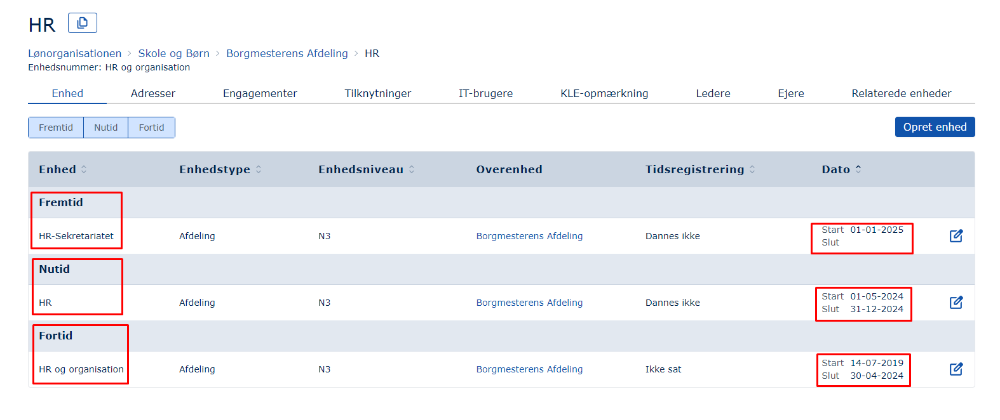

### Inspicér, Redigér, Afslut

**Inspicér**

Se [auditloggen](https://rammearkitektur.docs.magenta.dk/os2mo/tech-docs/audit-log.html).

**Redigér**

Det er muligt at ændre i en eksisterende oplysning. Det kan fx være, at et telefonnummer skal redigeres, eller en stillingsbetegnelse skal ændres. Hvis den nye stillingsbetegnelse skal være gældende fra i dag, vil den gamle stillingsbetegnelse rykke ned under Fortidstabben. På den måde er der synlig historik på alle de ændringer, man foretager.

I eksemplet nedenfor har Viggo et job som *Udvikler*, men det er planlagt, at han skal være *Udviklingskonsulent* pr. en fremtidig dato, her den 01-08-2025, hvorfor ændringen kan ses under Fremtidstabben. Når datoen oprinder, vil ændringen træde i kraft og blive flyttet ned under Nutidstabben, mens den registrering, der i dag findes under Nutidstabben, vil blive flyttet ned under Fortidstabben.

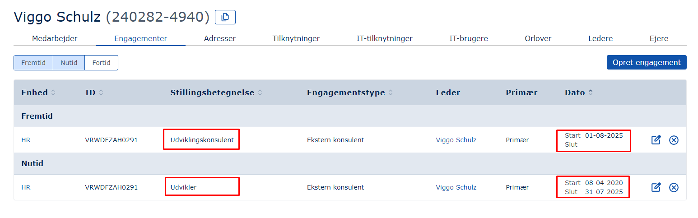

**Overskrivninger**

Såfremt startdatoen ikke ændres, vil det resultere i en *overskrivning* af den eksisterende registrering, og der vil ikke blive oprettet historik på oplysningen i brugergrænsefladen (det vil dog kunne spores i [auditloggen](https://rammearkitektur.docs.magenta.dk/os2mo/tech-docs/audit-log.html)), fordi det ikke bliver opfattet som en ændring, men en rettelse (fx ifm. fejlindtastning).

**Afslut**

Det er muligt fx at afslutte en ansættelse, sådan at en medarbejders engagement i organisationen bliver bragt til ophør på en specifik dato, og vedkommendes it-konti i andre systemer (fx Active Directory) bliver nedlagt. Når datoen for afslutningen af ansættelsen oprinder, vil medarbejderens engagement dermed flytte sig fra Nutidstabben til Fortidstabben og blive inaktivt, men fortsat figurere i brugergrænsefladen.

## MOs brugergrænseflade

MO består en eller flere organisationer, organisationshierarkierne, deres metadata, de indplacerede medarbejdere samt deres metadata. Hertil kommer en række moduler og arbejdsgange, der understøtter forvaltning af organisationen:

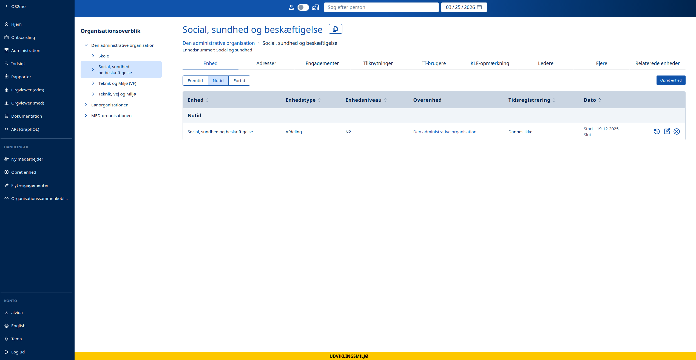

## MOduler

* [**Onboarding**](https://rammearkitektur.docs.magenta.dk/os2mo/features/insights.html), som lader dig straksoprette en bruger i MO.

* [**Administration**](https://rammearkitektur.docs.magenta.dk/os2mo/features/klassifikationer.html), som tillader dig at administrere IT-systemer og -roller samt MOs metadata, fx nye stillingsbetegnelser eller lederroller.

* [**Indsigt**](https://rammearkitektur.docs.magenta.dk/os2mo/features/insights.html), som giver muligheden for at man selv kan sammenstille MOs data og gemme dem i en csv-fil.

* [**Rapporter**](https://rammearkitektur.docs.magenta.dk/os2mo/features/reports.html), som genererer og hver morgen udstiller friske rapporter indeholdende forskellige datasæt fra MO.

* [**Organisationsdiagrammerne**](https://rammearkitektur.docs.magenta.dk/os2mo/features/org-chart.html), som udstiller organisationen på intranettet eller internettet.

* [**Dokumentation**](https://rammearkitektur.docs.magenta.dk/os2mo/index.html), som linker til denne dokumentation.

* [**API (GraphQL)**](https://rammearkitektur.docs.magenta.dk/os2mo/tech-docs/graphql/intro.html), som åbner MOs API ved ét klik.

## MOS arbejdsgange

* **Ny medarbejder**, der giver muligheden for at oprette en ny medarbejder.

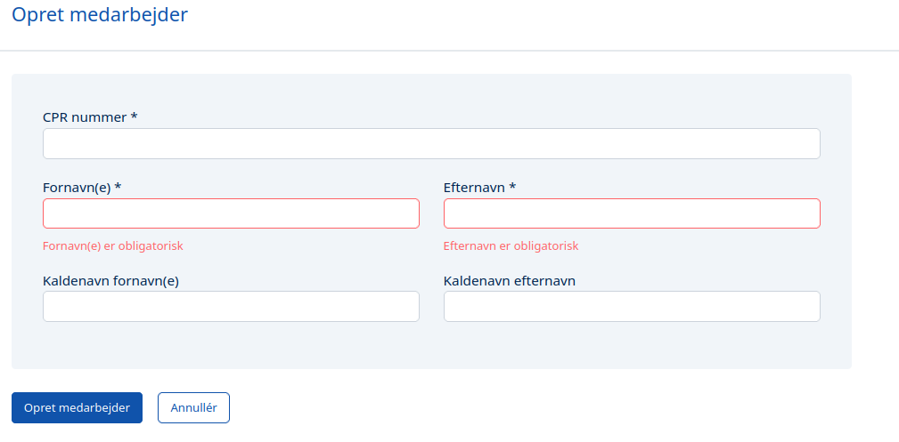

* **Opret enhed**, der giver muligheden for at oprette en ny enhed.

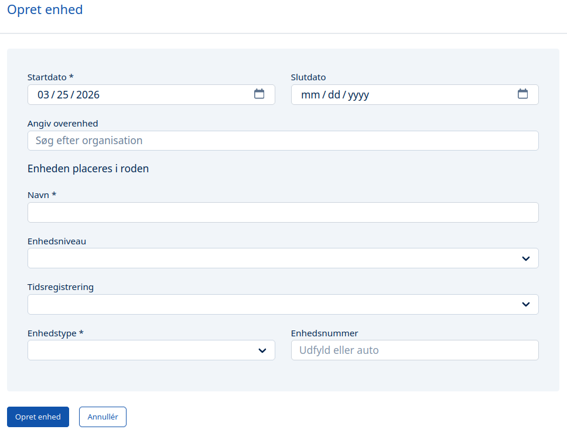

* **Flyt engagementer**, der giver muligheden for at flytte flere medarbejdere fra en enhed til en anden.

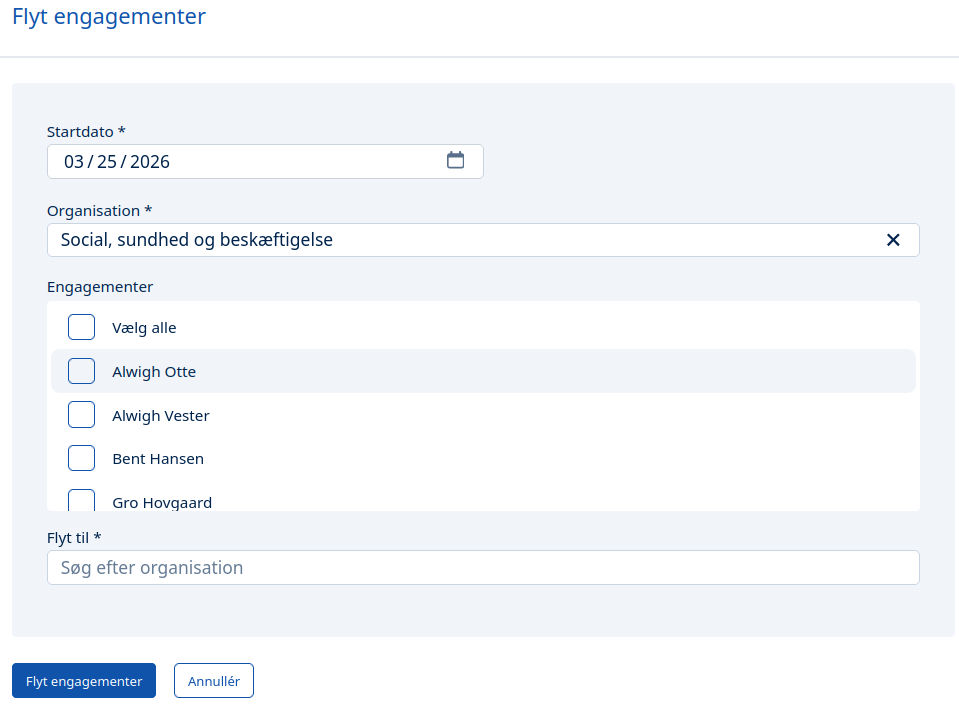

* [**Organisationssammenkobling**](https://rammearkitektur.docs.magenta.dk/os2mo/features/org-sammenkobling.html). Det er muligt at skabe relationer mellem organisationsenheder vha. modulet *Organisationssammenkobling*, hvilket tillader en række automatikker mellem enheder der tilsvarer hinanden i to forskellige Organisationer, fx lønorganisationen og den administrative organisation.

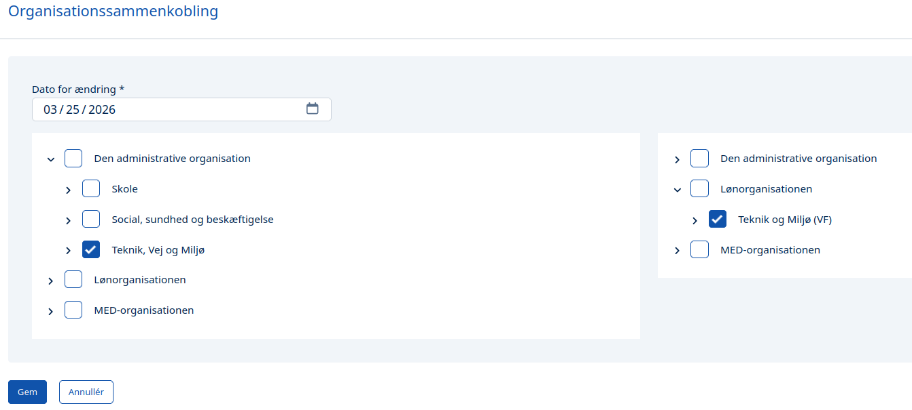

## Søgefunktionen

Søgefunktionen fungerer i kontekst med enten Medarbejderdelen eller Organisationsdelen:

**Hvad kan man søge på?**

**Medarbejderes:**

- UUID
- Medarbejdernavn
- Kaldenavn
- CPR-nummer (uden bindestreg)
- IT-bruger

**Organisationsenheders:**

- UUID
- Enhedsnavn
- Enhedsnummer \- BVN (brugervendt nøgle)
- IT-bruger

**Hvad kommer frem i søgeresultat?**

**Medarbejder**

- Navn
- Organisationssti

**Organisation**

- Navn
- Organisatorisk overenhed
- Organisatiorisk rodenhed

### Organisationshierarki med mulighed for flere parallelle organisationer

I venstre side af skærmen findes et organisationshierarki, der giver overblik over organisationen og mulighed for at navigere i den:

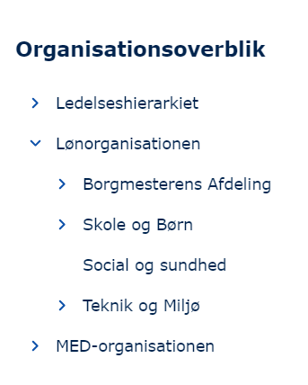

Bemærk, at det er muligt at have flere organisationer indlæst, fx den administrative organisation, lønorganisationen, MED/AMR-organisationen.

### Detaljeside

Når en organisationsenhed vælges, vil information om den være fordelt på en række faneblade.

#### Fanebladet Enhed

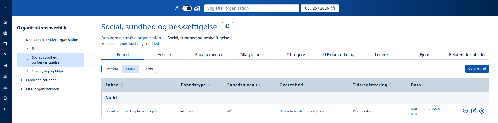

**Enhedstype** kan fx bruges til at skelne mellem de formål, enhederne har. Enhedstype bør bruges beskrivende og til at identificere organisationsenheder af en bestemt enhedstype, fx gennem Indsigts-modulet. Eksempel: Afdeling, underafdeling, sektion, enhed, direktørområde, center.

**Enhedsniveau** benyttes til at angive organisationens hierarki.

**Overenhed** fortæller, hvilken enhed der ligger umiddelbart hierarkisk over den valgte enhed.

**Tidsregistrering** benyttes i nogle organisationer til at identificere, hvilken type tidsregistrering, enheden benytter sig af.

**Start- og slutdato** angiver hhv. hvornår enheden er oprettet og nedlagt, samt hvornår sidste ændring på enheden er foretaget.

#### Fanebladet Adresser

Fanebladet **Adresser** består af en liste af forskellige kontaktformer og kan være alt fra telefonnumre over EAN-numre til web-adresser.

Det er muligt at behæfte en **Synlighed** til alle Adressetyper. Synligheden ændrer ikke på, om adressen kan ses i MO, men indikerer overfor brugeren, om adressen må videregives. Synlighed anvendes i øvrigt af MOs integrationer til at afgøre, i hvilke sammenhænge en adresse må udstilles i (hjemmesider, rapporter, organisationsdiagram, mv). Det kan fx dreje sig om, at man ikke ønsker at udstille et telefonnummer på fx internettet.

Fanebladet findes også under Medarbejdere i MO og indeholder samme type oplysninger blot for personer:

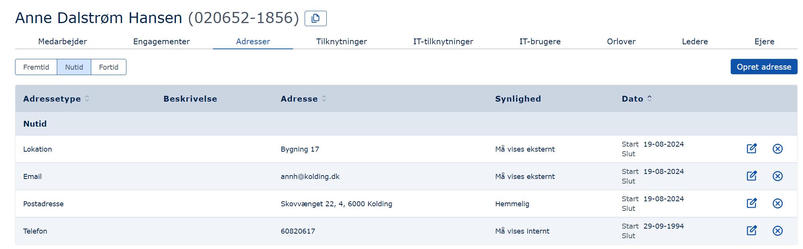

#### Fanebladet Engagementer

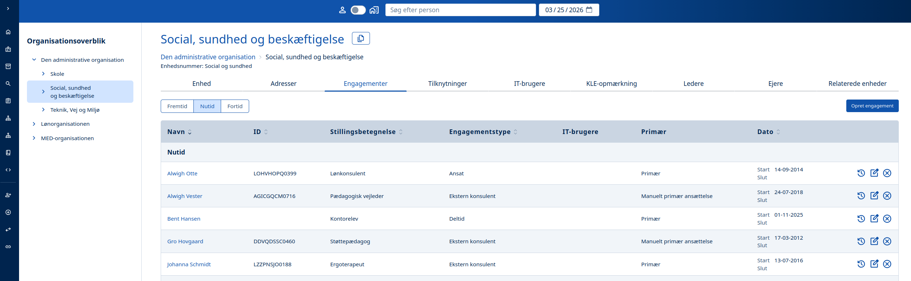

Et **Engagement** beskriver et ansættelsesforhold mellem en person og en organisation(senhed).

Fanebladet Engagementer viser de ansatte i enheden.

Fanebladet findes også under Medarbejdere i MO og indeholder samme type oplysninger blot for den enkelte medarbejder:

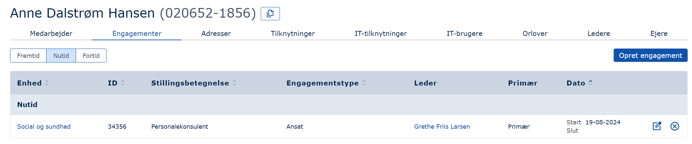

#### Fanebladet Tilknytninger

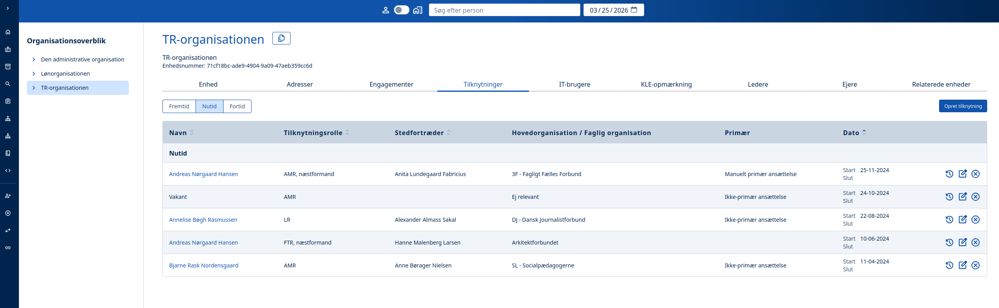

En **Tilknytning** definerer et forhold mellem en person og en organisationsenhed, men i modsætning til engagementet er der ikke tale om en ansættelse; der er derimod tale om en funktion eller en rolle, en person udfylder i forbindelse med en anden opgave.

Det kan fx være, at en medarbejder midlertidigt er knyttet til en anden enhed ifm. et midlertidigt projekt.

En Tilknytning kan også benyttes til at knytte medarbejdere til MED/AMR/TR-organisationen. [Læs mere om MED/AMR/TR-organisationen her](https://rammearkitektur.docs.magenta.dk/os2mo/features/med-organisation.html).

Fanebladet findes også under Medarbejdere i MO og indeholder samme type oplysninger blot for den enkelte medarbejder.

#### Fanebladet IT-brugere

Fanebladet er delt op i to under-faneblade:

#### IT-brugere

Dette underfaneblad tillader vedligehold af kontonavne til forskellige it-systemer og giver et overblik over, hvilke it-systemer organisationsenheden benytter. Under Medarbejderdelen vises medarbejdernes IT-konti, fx fra SAP og Active Directory:

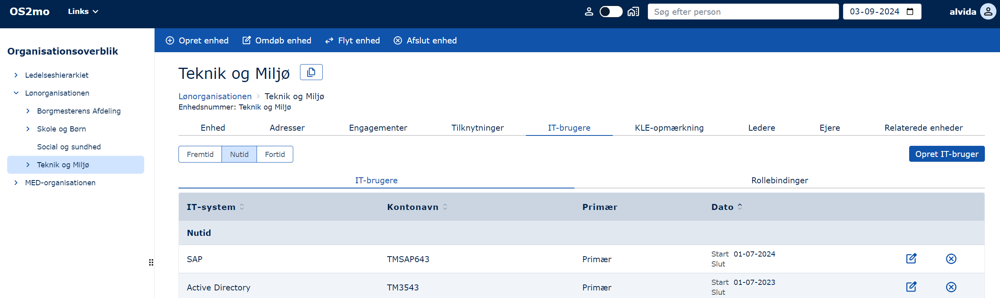

#### Rollebindinger

For hver konto, man har i et it-system, kan der høre forskellige roller.

I nedenstående eksempel har en ansat fået oprettet en it-konto i systemet NextCloud og fået tildelt rollen Admin. Hvis MO er integreret med NextCloud, bliver it-kontoen med tilhørende rolle automatisk oprettet i det system. Er MO og NextCloud ikke integreret, kan oprettelsen i MO udløse afsendelsen af en mail til en system-adminsitrator, som skal stå for den manuelle oprettelse af it-kontoen i NextCloud.

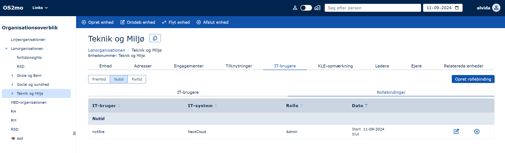

#### Fanebladet KLE-opmærkninger

Det er muligt at opmærke sine enheder med [KL's Emnesystematik (KLE)](http://www.kle-online.dk/soegning).

KL's Emnesystematik er oprindeligt tænkt som en opgavetaksomnomi, der skal give et overblik over, hvem der udfører hvilke opgaver.

Anvendelsen varierer, men hovedformålene er dataafgrænsning og/eller opgavestyring.

Opmærkningerne af organisationen kan sendes videre til andre systemer, der har behov for dem  (fx [FK Organisation](https://digitaliseringskataloget.dk/l%C3%B8sninger/organisation), [organisationsdiagrammet](https://rammearkitektur.docs.magenta.dk/os2mo/features/org-chart.html) og/eller IdM-systemer).

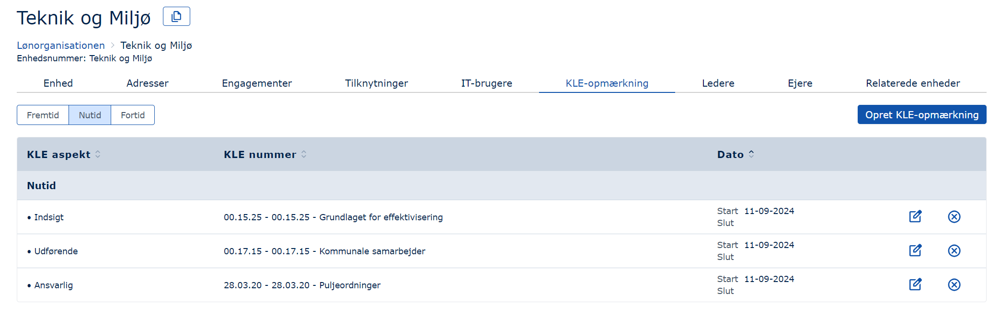

Fanebladet findes ikke i Medarbejderdelen, fordi kun organisationsenheder kan opmærkes pt.

MO får KLE-numrene fra FK Klassifikation, som er en integration, du kan læse mere om [her](https://rammearkitektur.docs.magenta.dk/os2mo/integrations/fkk.html).

#### Fanebladet Ledere

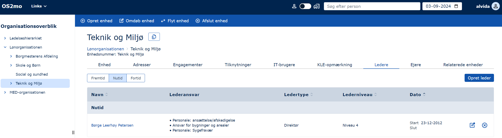

En leder er en ansat, som har bestemmende indflydelse på organisationen ved hjælp af specifikke beføjelser og ansvarsområder.

Ledere kan beskrives vha:

- **Lederansvar** beskriver de ansvarstyper, en leder kan have. Eksempel: MUS-ansvarlig, Personaleansvarlig. En leder kan have flere ansvarsområder.
- **Ledertype** indikerer ofte lederens funktion og hierarkiske placering eller tilknytning til et specifikt organisatorisk niveau. Eksempel: Direktør, Beredskabschef, Centerchef, Institutionsleder.
- **Lederniveau** er en hierarkisk beskrivelse. Eksempel: Niveau 1, 2, 3\.

For ledere gælder det, at de er markeret med en stjerne (\*), hvis de er nedarvede fra en overordnet organisationsenhed som følge af, at enheden ikke har en direkte leder.

Det er desuden muligt at gøre en lederfunktion vakant, hvis den midlertidigt ikke er besat:

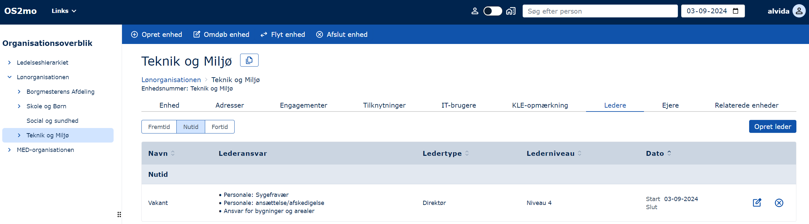

Såfremt en lederfunktion bliver vakant, er det muligt at modtage en [email-notifikation](https://rammearkitektur.docs.magenta.dk/os2mo/features/email-notifikationer.html) herom.

Fanebladet findes også under Medarbejdere i MO og indeholder samme type oplysninger blot for den enkelte ansatte:

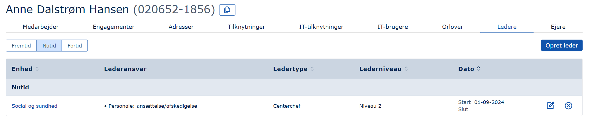

#### Fanebladet Ejere

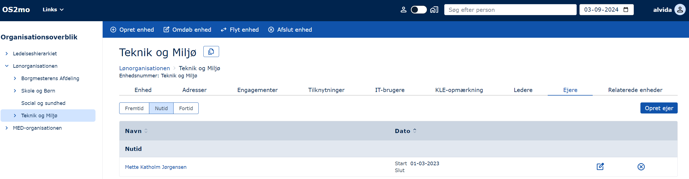

Konceptet 'Ejer' benyttes til at foretage rollebaseret adgangsstyring i MO. Det betyder, at det er muligt at give visse personer rettigheder til at redigere i en specifik del af MO (Ejere), mens andre (Administratorer) har rettigheder til at redigere overalt i MO. I eksemplet ovenfor har Mette ret til at redigere i afdelingen "Teknik og Miljø" og alle dens underenheder, men hvis hun prøver at rette andre steder, vil hun modtage en fejlbesked.

Denne rettighedsstyring er sat op via [Keycloak](https://www.keycloak.org/), og du kan [læse mere om den her](https://rammearkitektur.docs.magenta.dk/os2mo/tech-docs/iam/auth.html).

Fanebladet findes også under Medarbejdere i MO og indeholder samme oplysninger blot for den enkelte ansatte.

#### Fanebladet Relateret

Viser om en organisationsenhed har en relation til en anden. Relationen kan foregates enten under fanebladet ved at vælge "Opret relateret enhed", eller i selve Organisationssammenkoblingsmodulet:

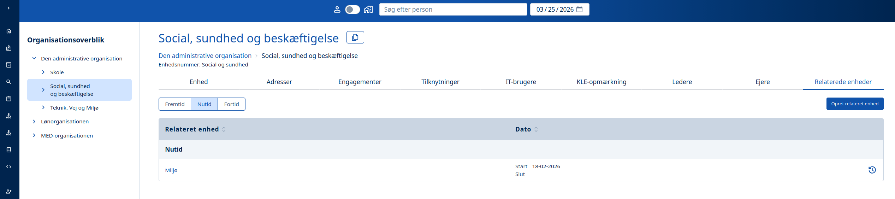

Sammenkoblingerne kan benyttes til forskellige formål, fx til at flytte engagementer fra en lønorganisationsenhed til dens pendant i den administrative organisation.

Bemærk, at sammenkoblingerne kan datostyres.

### Faneblade, der kun eksisterer i medarbejderdelen af MO

#### Fanebladet Medarbejder

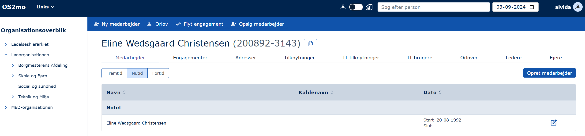

Under denne fane ses stamoplysninger på en person, nemlig navn, kaldenavn samt datoer.

* **Navnet** er altid personens CPR-navn.
* **Kaldenavnet** benyttes især, hvis man ikke er interesseret i at korrespondancer indeholder personfølsomme oplysninger. Det kan fx være fordi man arbejder med udsatte børn og unge. Hvis et kaldenavn er sat, vil en integration til et andet system kunne konfigureres til at videreformidle dette og ikke CPR-navnet.
* **Datoer**. Som udgangspunkt vil startdatoen være ens fødselsdato. Såfremt der ændres i en stamoplysning - fx at et kaldenavn angives - vil startdatoen ændres til at matche denne dato, og hvis man er interesseret i at se en persons fødselsdato, skal man klikke på Fortid:

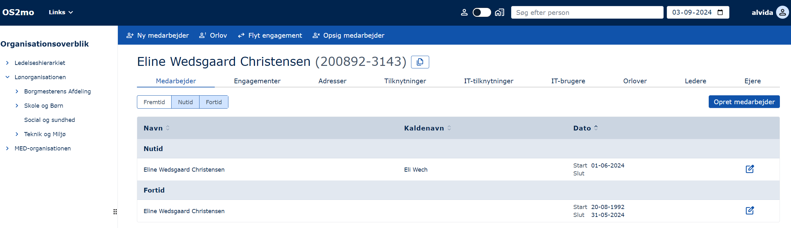

#### Fanebladet IT-Tilknytninger

Se [Indplacering af it-brugere](https://rammearkitektur.docs.magenta.dk/os2mo/features/indplacering-af-it-brugere.html).

#### Fanebladet Orlov

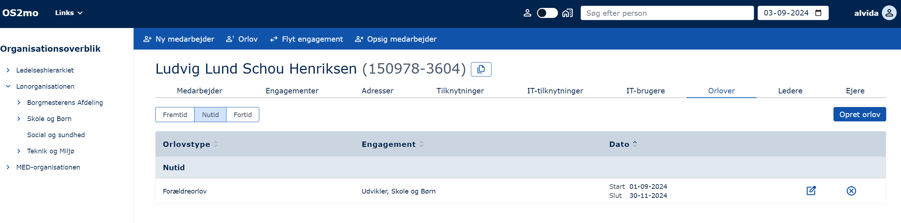

En ‘Orlov’ beskriver fritagelse for tjeneste i en periode.

Man kan eventuelt bruge informationen til at suspendere en konto i fx Active Directory midlertidigt. Informationen kan altså sendes videre til andre systemer.

Eksempel: Uddannelsesorlov, Sygeorlov, Barselsorlov.
