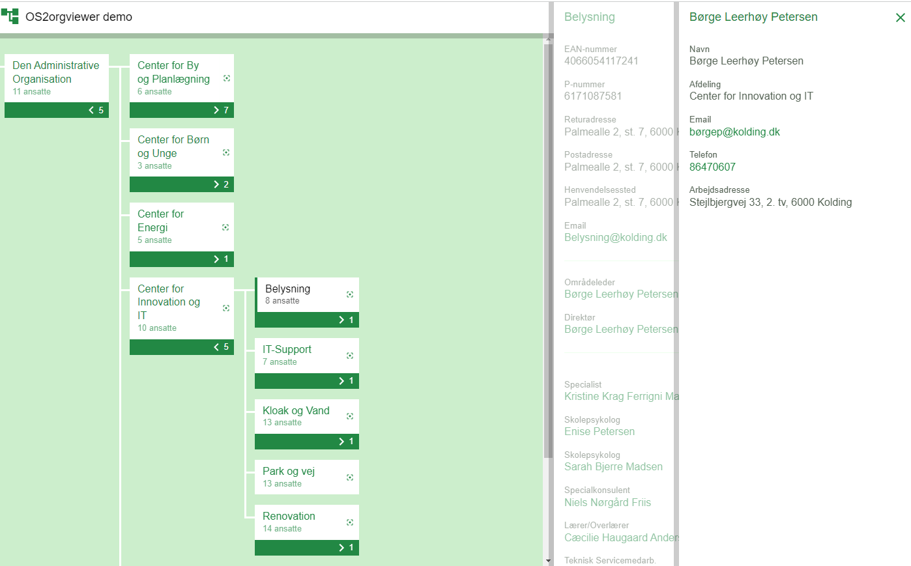

Dette er den fuldstændige dokumentation til OS2mo |
MedarbejderOrganisation. Dokumentation af andre relaterede systemer kan
findes her:

-   [LoRa (databasen)](https://mox.readthedocs.io/en/master/)
-   [Import- og
    exportværktøjer](https://os2mo-data-import-and-export.readthedocs.io/en/latest/)

OS2mo er en webapplikation til håndtering af et medarbejdere og
organisationshierarkier. Systemet sætter brugerne i stand til at navigere i eksempelvis organisationshierarkiet, indhente relevante
informationer om organisationsenhederne samt at redigere de
data der er tilknyttet de forskellige enheder, fx medarbejderne.

Visionen for OS2mo er at det skal være det it-system som indeholder en kommunes, en NGO's et privat firmas sandhed om de mennesker der er tilknyttet organisationen, herunder deres organisatoriske indplacering.

Det skal være i OS2mo at medarbejdere opstår og afsluttes; det skal være her organisatoriske omstruktureringer foretages.

Alle OS2mo's oplysninger skal afspejles i de it-systemer der har behov for dem sådan at de altid alle har den samme opfattelse af organisationen hvad enten det handler om medarbejdere, eksterne konsulenter, frivillige, organisatoriske ændringer, e-mails, mv.

Det er også muligt at udstille OS2mo's oplysninger i et organisationsdiagram som alle kan tilgå på intranettet eller internettet.

