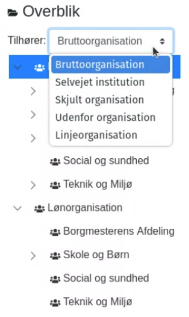
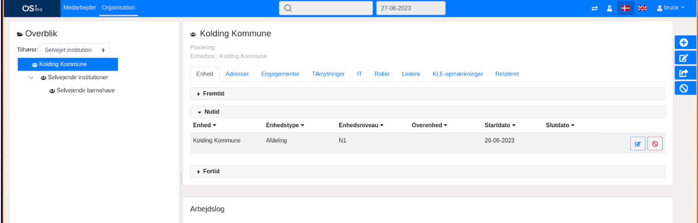
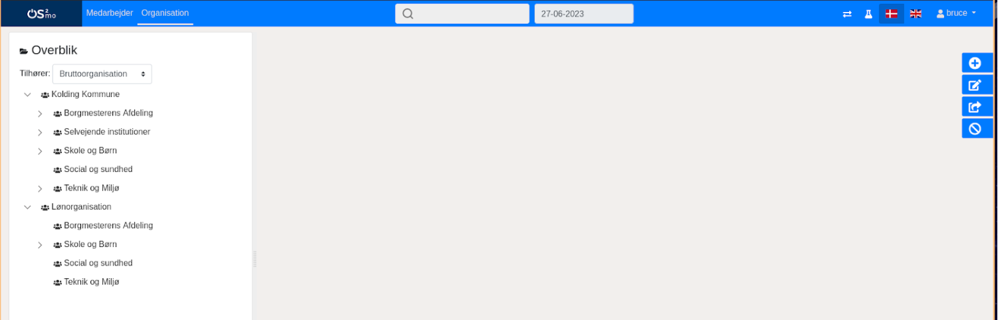

# Opmærkning af organisationsenheder

## Indledning

Formålet med at komponenten er ved import af data i MO automatisk at opmærke organisationsenhederne, så det bliver muligt at differentiere mellem forskellige organisationer i MO. Dermed bliver det også muligt at kunne bestemme, hvilken organisation der skal sendes videre til andre systemer, fx den administrative organisation til FK Organisation og Active Directory.

## Regler for opmærkning af organisationsenheder i MO

Opmærkning af en enhed sker automatisk, når der er relevante ændringer. Når enheden skal opmærkes i MO, gøres det ifølge disse regler:

**1. Linjeorganisation:** Hvis orgenheden har "NY"-niveau eller "Afdelings”-niveau i departmentlevel og har medarbejdere eller tilknytninger i sig, skal enheden være en del af linjeorganisationen. Dette gælder kun enheder under den administrative organisations rod-enhed ("XX Kommune"), hvis UUID vil blive sat i konfigurationen.

**2. Selvejende institutioner:** Hvis en enhed ikke er i linjeorganisationen og ikke hører under “XX Kommune”, men har en it-konto i it-systemet med den brugervendte nøgle, som er sat i konfigurationen, skal den markeres som "Selvejende institution".

**3. Skjult:** Hvis organisationsenheden hører under en enhed, der har sit UUID i listen "hidden" i konfigurationen, markeres enheden som skjult.

**4. Uden for organisation:** Hvis enheden ikke overholder nogen af de ovenstående regler, markeres den som "uden for organisationen" - altså som en del af bruttoorganisationen

## Brugergrænsefladen - organisationsvalg

Nedenfor ses en række eksempler på, hvordan det i MOs brugergrænseflade er muligt at vælge den organisation, man er interesseret i at se.

Umiddelbart over visningen af organisationshierarkiet findes en dropdown, hvor det er muligt at vælge, hvilken organisation der skal vises:

Vælges “Linjeorganisation”, vises den (også kaldet den administrative organisation):

Vælges “Selvejet institution”, vil selvejende enheder blive vist:

Vælges “Bruttoorganisation”, vil alle organisationsenheder i MO blive vist (ufiltreret):

## Eksport af den rette organisation til 3. parts systemer

Det er muligt ud fra de regler, der er beskrevet i afsnittet "Regler for opmærkning af organisationsenheder i MO", at sende specifikke organisationer til eksterne systemer.

FK Organisation og Active Directory vil således typisk modtage den administrative organisation, mens organisationsdiagrammet typisk udstiller den administrative organisation og MED-organisationen.

Hvis man er interesseret i fx at få selvejende institutioner sendt til FK Organisation også, er det ligeledes muligt takket være opmærkningen.
