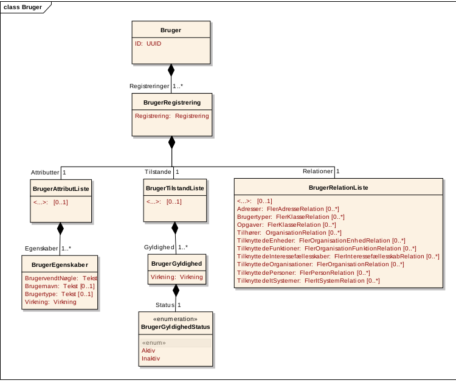

# MOX - infrastruktur for udveksling af offentlige data

MOX er en mekanisme, der vil tillade fagsystemer, der anvendes af det
offentlige at udveksle data uden at behøve at integrere direkte til
hinanden. I stedet behøver hvert fagsystem blot at integrere til en
*mox-agent*, der ved at sende en besked til en såkaldt *beskedfordeler*
kan sørge for, at interesserede fagsystemer kan bede om at få en
opdateret kopi af de pågældende data.

MOX er som koncept opfundet og beskrevet af Kommunernes Landsforening i
samarbejde med en lang række kommuner, og der er blandt andet en
gennemgang af det her:

<http://beta.rammearkitektur.dk/index.php/MOX_konceptet>

Dette notat vil omhandle det MOX-system, som Magenta har udviklet i
samarbejde Kommunernes Landsforening, Sager på Tværs og Frederiksberg
Kommune, og forudsætter, at læseren selv i fornødent omfang gør sig
bekendt med det overordende MOX-koncept.

## Overordnet arkitektur

MOX-systemet består grundlæggende af fem komponenter:

-   En MOX-agent, der kan modtage besked om ændring af data fra et
    fagsystem og sende ændringen videre til en beskedfordeler.
-   En beskedfordeler, der primært er et kø-interface, der for eksempel
    kan være (og i vores tilfælde er) baseret på AMQP.
-   En \"OIO-REST\"-agent, der lytter på en af beskedfordelerens køer og
    sender data-ændringerne videre til et serviceinterface, der
    vedligeholder de faktiske data.
-   Et service-interface, der implementerer en standard-komponent fra
    OIOXML-standarden. Dette service-interface har form af et
    REST-interface, der er implementeret i Python. I øjeblikket
    understøtter Magentas MOX-system OIOXML-standarderne Organisation,
    Klassifikation, Sag og Dokument.
-   En database, der opbevarer de faktiske data. Databasen vedligeholder
    dataenes integritet med hensyn til tidsmæssige bindinger, herunder
    en fuld log af alle ændringer. Dette indgår som en del af
    OIOXML-standarden, men forklares i større detalje herunder. En
    trigger sørger for at give abonnerende fagsystemer besked om alle
    ændringer i data. Denne database er implementet i PostgreSQL.

Som systemet er implementeret, har det følgende features/egenskaber:

### Autentificering

Denne foregår ved hjælp af SAML-tokens. Når MOX-agenten får besked om en
ændring af fagsystemets data, sørger den for, at der genereres en
SAML-token på den indloggede brugers vegne. Denne SAML-token
repræsenterer den indloggede brugers digitale signatur af de pågældende
ændringer. I REST-interfacet autentificeres brugerens identitet op mod
en SAML Identity Provider, og de pågældende ændringer logges med
brugerens brugerid (UUID).

### Autorisation

Efter validering af SAML token kalder REST-interfacet en selvstændig
rettighedsservice, der vil fortælle, om brugeren har ret til at udføre
den pågældende handling.

### Fuld implementation af OIOXML-standarderne

REST-interfacet giver (sammen med databasen, som det kører overfor) en
fuld implementation af version 1.1 af OIOXML-standarderne Klassifikation
og Organisation, Dokument version 1.1.1 og Sag version 1.2 - det vil
sige de nugældende standarder som defineret her:

<https://digitaliser.dk/resource/444163>

Hvis du gerne vil se en skematisk oversigt over, hvad en sådan service
mere konkret indeholder, kan du f.eks. se "Informations- og
meddelelsesmodeller for Organisation" for enden af dette link:

<https://www.digitaliser.dk/resource/991439/artefact/Informations-ogmeddelelsesmodellerforOrganisation%5bvs.1.1%5d.pdf?artefact=true&PID=1602187>

Når nu formatet netop hedder OIO *XML*, bør det bemærkes, at
Digitaliseringsstyrelsen har defineret en række XSD'er (XML-skemaer)
for de modeller, der beskrives i standarderne - men disse har vi i
samråd med kunden valgt ikke at understøtte. I stedet kommunikerer
REST-interfacet med en JSON-repræsentation af objekterne, der er lettere
at arejde med. Det vil imidlertid være meget let at konvertere mellem
dette JSON-format og et XML-format.

Hvis en kommune har brug for en service, der understøtter den gældende
version af en eller flere af disse fire standarder, indgår de altså som
en del af Magentas nuværende implementation af MOX.

### Repræsentation af OIOXML-objekter

Databasen implementerer OIOXML-objekter som standardformat og har
funktioner (stored procedures) der tillader oprettelse, import,
opdatering, passivering og sletning af objekter efter forskrifterne i
standarden.

Dette betyder blandt andet, at hvert objekt beskrives som en samling af
attributter, tilstande og relationer til andre objekter. Hver
OIOXML-standard består netop af en definition af en række objekter
(klasser) og deres relation til andre OIOXML-objekter.

*Som eksempel vises her objektmodellen for OIOXML-klassen Bruger*

Både databasen og REST-interfacet implementerer OIOXML-objekter på en
standardiseret måde, der gør det let at tilføje nye objekter - og dermed
at implementere nye standarder.

### Bitemporalitet

Et aspekt af OIOXML-standarden er *bitemporalitet*. Dette indebærer, at
hvert objekt kan være forsynet med to tidsaspekter:

-   Hver eneste version af objektet udgør en *registrering*. En
    registrering er altid gældende fra et start-tidspunkt og til et
    slut-tidspunkt, hvor slut-tidspunktet kan være "uendelig". Hver
    gang, der foretages en ændring af objektet, dannes en ny
    registrering, som er en fuld kopi af objektet med de pågældende
    ændringer indført. Den registrering har altid start- og slut-tid fra
    opdateringstidspunktet til uendelig. Ved samme lejlighed opdates
    slut-tidspunktet på den seneste registrering, ligeledes til
    opdateringstidspunktet.
-   Objektets attributter, tilstande og relationer er omfattet af en
    *virkning*. Denne virkning er essentielt et tidsinterval, der
    angiver, hvornår den pågældende værdi er gældende. Et Dokument kunne
    for eksempel have tilstanden "Ikke-Publiceret" frem til 1. januar
    2015 og "Publiceret" herefter. Det vil derfor have to
    *virkningsperioder* for tilstanden PubliceretStatus.

### Fleksibilitet og ensartethed

De p.t. fire understøttede OIO-standarder kommunikerer via et helt
standardiseret REST-interface. Hvert objekt \"bor\" på stien :

    https://<service-URL>/<standard>/<klasse>/<uuid>

-   altså for eksempel :

        https://mox.magenta-aps.dk/organisation/bruger/de305d54-75b4-431b-adb2-eb6b9e546014

Som det er standard i REST-interfaces, kan man oprette, opdatere og læse
objekter ved hjælp af HTTP-protokollens kommandoer PUT, PATCH, POST og
GET.

Kildekoden understøtter alle ud af boksen og ved en
standard-installation alle fire services, men det er muligt at lave en
installation, hvor de ikke alle er aktive - ligesom det vil være muligt
at lade flere forskellige tjenester køre på forskellige server og lade
dem interagere via MOX-agenter og beskedfordeler.
