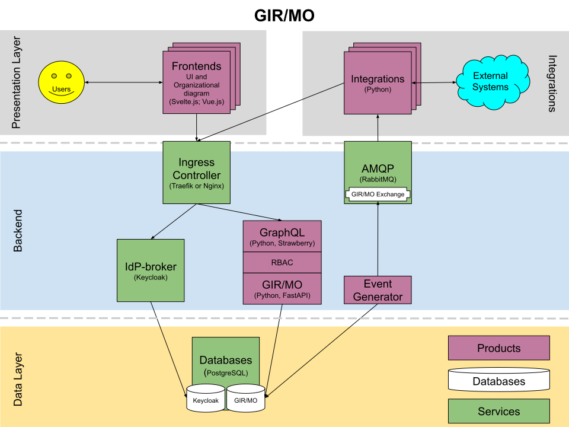

GIR/MO consists of the technology stack depicted above. Each element is briefly described below.

**Frontends**

- UI. The main UI, which is intended for administrators, is implemented in the Web App framework, Svelte.[^1]
- The organizational diagram is implemented in Vue-js.[^2]

**Integrations**
There are a plethora of existing integrations that import and/or export data. They are all written in Python,[^3] but can be written in any language that the integrator decides.
Examples of existing integrations are;

- an event-driven LDAP-integration to Active Directory
- an event-driven integration to Omada IdM

**The Ingress controller** is a piece of software that controls and directs HTTP(s) traffic to the services behind it.

**The IdP-broker** (Keycloak[^4]), which relays identities from e.g. ADFS, and allows GIR/MO to verify the identity of users via the OIDC protocol. It also implements the roles used in RBAC.

**GraphQL**[^5] is used for the public facing API of GIR/MO and is used for reading and writing data. Strawberry GraphQL is the library used to implement the interface.

**GIR/MO**[^6] is the middleware that communicates with the database and the frontends. It is written in Python and implemented using the FastAPI[^7] library.

**RabbitMQ**[^8] caters for an event-driven architecture and communicates with the integrations and the Event Generator.

**The Event Generator** is a small program that triggers events in RabbitMQ as a response to activities that occur in the system. It is implemented in Python using the bitemporality of GIR/MO.

**The PostgreSQL database**[^9] stores data in a standardized format (OIO[^10]).

[^1]: https://svelte.dev/
[^2]: https://vuejs.org/
[^3]: https://www.python.org/
[^4]: https://www.keycloak.org/
[^5]: https://graphql.org/
[^6]: https://www.magenta.dk/en/solutions/os-gir-en/
[^7]: https://fastapi.tiangolo.com/
[^8]: https://rabbitmq.com/
[^9]: https://www.postgresql.org/
[^10]: https://arkitektur.digst.dk/specifikationer/organisation/oio-specifikation-af-model-organisation
