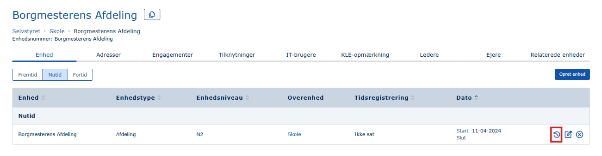
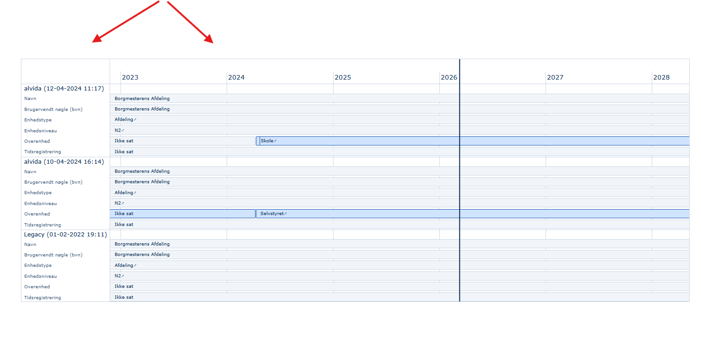
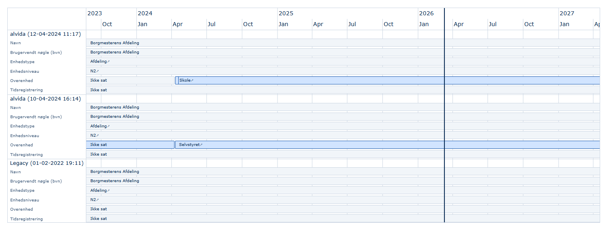
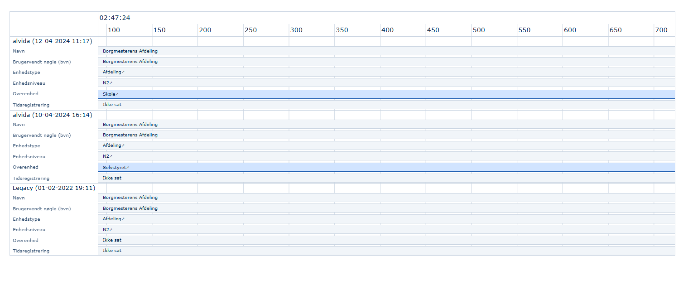
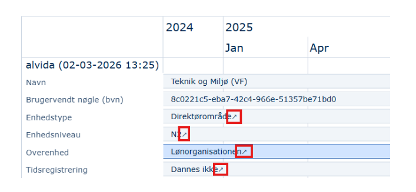

MO har nu en bitemporal auditlog, som er et værktøj, der viser data på to tidslinjer samtidigt: **Registreringstid** (hvornår en ændring blev registreret) og **Gyldighedstid** (i hvilken tidsperioden ændringen var/er gældende).

### Formål

Formålet med en bitemporal auditlog er at give et komplet og fejlfrit billede af både historikken (hvad hed en enhed hvornår) og registreringshistorikken (hvornår blev enhedens navn ændret).

Her er de primære formål:

- **Sikkerhed og overvågning:** Gør det muligt at opdage mistænkelig aktivitet, uautoriserede adgangsforsøg eller potentielle hackerangreb.
- **Ansvar:** Sikrer, at handlinger kan spores direkte tilbage til en specifik bruger eller systemproces.
- **Fejlfinding og systemgendannelse:** Hjælper med at analysere, hvad der gik galt ved systemnedbrud eller fejl, så man hurtigt kan rette fejlen, genoprette normal drift, og sikre at fejlen ikke gentager sig.
- **Overholdelse af lovgivning (Compliance):** Dokumenterer, at organisationen overholder juridiske krav og standarder, såsom GDPR og it-sikkerhed (adgange).
- **Dataintegritet:** Gør det muligt at verificere, at data ikke er blevet ændret uretmæssigt, og giver overblik over ændringshistorik.
- **Bevisførelse:** Fungerer som vigtig dokumentation i forbindelse med interne undersøgelser eller juridiske efterspil efter et sikkerhedsbrud.

### Eksempel

Adgang til auditloggen foregår via klik på 'uret' til højre for enhver registrering:

Bemærk, at samtlige rækker i MO kan inspiceres på denne måde - om det drejer sig om en enhed, et engagement, en tilknytning, en adresse, etc.

Når man klikker på uret, kommer man til et nyt billede, som viser historikken på det objekt, man har valgt (her en enhed).

Auditloggen er opdelt i to hovedområder:

- **Venstre (Systemtid/Registrering):** Viser navnet på den person, der har foretaget ændringen, samt det præcise tidspunkt for, hvornår ændringen blev gemt i databasen (f.eks. `alvida (10-04-2024 16:14)`).
- **Højre (Tidslinje/Gyldighedstid):** Viser en vandret tidslinje (2022, 2023, 2024 osv.). De blå bjælker indikerer, i hvilken periode de pågældende data er gyldige.

Når man skal finde ud af, hvilke ændringer, der er foretaget, skal man blot finde de mørkeblå markeringer: Ovenfor kan man se, at der er sket en ændring på Overenhed i registreringen `alvida (10-04-2024 16:14)`. Man sammenligner så den række med den tilsvarende række i den foregående registrering (nedenfor) `Legacy (01-02-2022 19:11)` og kan se, at overenhedens navn er ændret til Selvstyret. Kigger man på den nyeste registrering `alvida (12-04-2024 11:17)`, kan man se, at overenheden er ændret igen - denne gang til Skole.

### Funktionalitet

- **Scroll vandret.** Ved `shift+musescroll` kan man scrolle til siderne, så man kommer frem eller tilbage ad tidslinjen.
- **Zoom.** Ved `ctrl+musescroll` kan man zoome ind og ud ift., hvor granuleret et tidsbillede, man ønsker:

  

  Det er muligt at komme ned på tusindedele af sekunder:

  
- **Overblik over gældende ændringer:** Gældende ændringer er farvelagt, så man kan skelne dem nemt.
- **Kopiering af ændring.** UUID'et på hver række kan kopieres ved ét klik på ændringen, fx Navn i ovenstående eksempel.
- **Link til ændringer.** Såfremt en ændring er foretaget på et andet objekt (fx enhedens Overenhed) eller en anden klasse (fx enhedens Enhedsniveau), end man er i færd med at inspicere, kan man klikke på pilen i rækken, hvorpå man bliver sendt hen til det andet objekts / den anden klasses auditlog og kan forfølge sine undersøgelser der. Er der tale om en attribut på objektet, er der ikke noget link (fx Navn).

  

| Integration                 | UUID                                 |
|-----------------------------|--------------------------------------|
| AD2Mo Sync                  | ad21105c-baad-c0de-6164-326d6f73796e |
| ADGUID Sync                 | ad5711c0-baad-c0de-0000-616467756964 |
| APOS migration              | a1705000-baad-c0de-0000-000061706f73 |
| Calculate Primary           | ca1c0000-baad-c0de-6361-6c637072696d |
| Developer                   | de7e104e-baad-c0de-6465-76656c6f7065 |
| DIPEX                       | d1fec000-baad-c0de-0000-004449504558 |
| Engagement Updater          | 119da1e4-baad-c0de-656e-672075706461 |
| FKK                         | f1c1c000-baad-c0de-0000-000000464b4b |
| Job Function Configurator   | 70bf1ccf-baad-c0de-6a6f-6266756e6366 |
| LDAP import export          | 11101da9-baad-c0de-004d-4f206c646170 |
| Legacy                      | 42c432e8-9c4a-11e6-9f62-873cf34a735f |
| Manager engagement elevator | e1e7a104-baad-c0de-656c-657661746f72 |
| Manager Sync                | 5d05711c-baad-c0de-7364-206d616e6167 |
| Omada                       | 0111ada0-baad-c0de-0000-006f6d616461 |
| Orggatekeeper               | ca1e4ee9-baad-c0de-6761-74656b656570 |
| Orgviewer (ADM)             | 04c71e7a-baad-c0de-6f72-677669657761 |
| Orgviewer (Legacy)          | 03800000-baad-c0de-006f-726776696577 |
| Orgviewer (MED)             | 04c71e70-baad-c0de-6f72-677669657761 |
| OS2Sync                     | 0525711c-baad-c0de-006f-733273796e63 |
| Rollekatalog                | 2011e000-baad-c0de-726f-6c6c656b6174 |
| SDChangedAt                 | 5dc4a1ce-baad-c0de-7364-6368616e6765 |
| SDMox                       | 5d111070-baad-c0de-0000-0073646d6f78 |
| SDTool                      | 5d100100-baad-c0de-0000-7364746f6f6c |
| SDTool+                     | 5d700141-baad-c0de-0000-7364746f6f6c |
| SMTP                        | 51111900-baad-c0de-6d6f-20736d747000 |
| SQLExport                   | 052ec901-baad-c0de-7371-6c6578706f72 |
