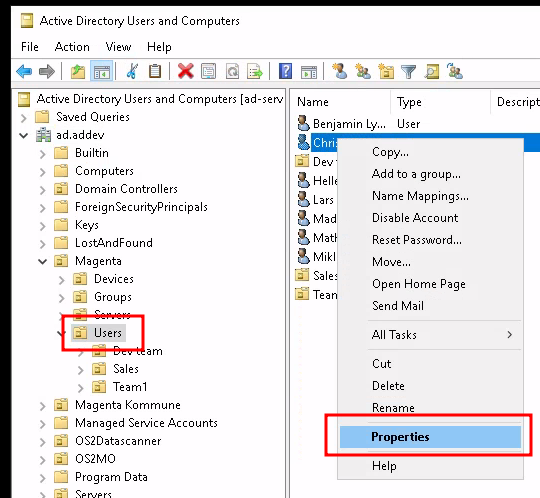
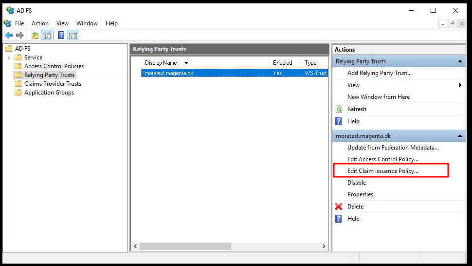
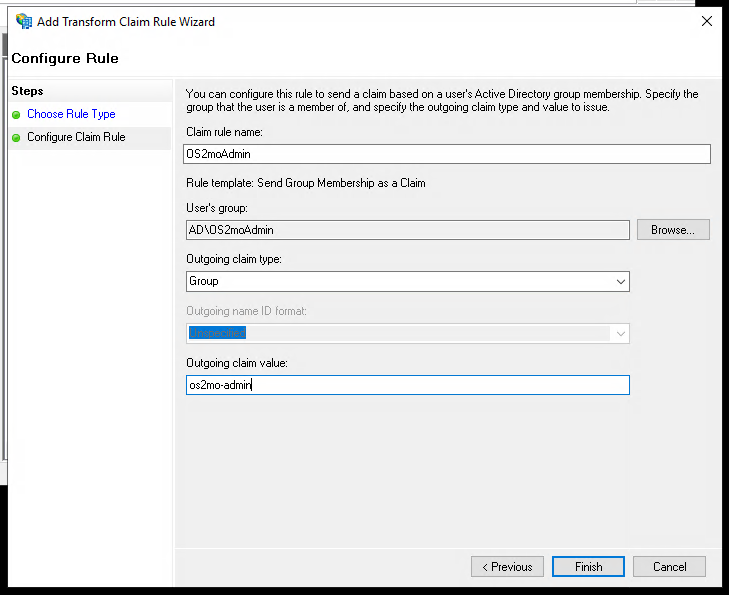
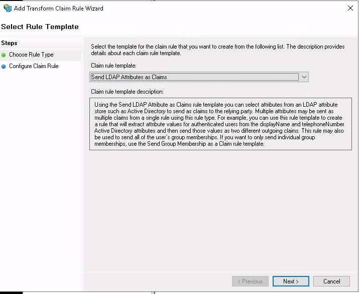

# ADFS RBAC setup for OS2mo

!!! note
    This guide requires [SAML SSO to have been set up on your servers](./adfs-setup.md).

    The guide also requires OS2mo and Keycloak to have been set up with RBAC enabled on your servers.

This guide will help you configure AD and ADFS with the necessary groups and attribute mappings for role-based access control (RBAC) in OS2mo. During installation, we will create the necessary groups in Active Directory, and map the membership of those groups as claims in ADFS when authenticating with OS2mo.

We also map the user GUID to OS2mo, so we are able to correlate the logged in user with an employee in OS2mo. This is necessary for the 'owner' role.

## Adding groups to AD

OS2mo currently supports two roles, each of which require membership of a group.

* `admin` - which gives read/write permissions to everything within OS2mo.
* `reader` - which gives read permissions to everything within OS2mo.
* `owner` - which gives read/write permissions to everything for which your user is the owner. It is necessary to give reader rights to owners as well, otherwise the owner role will not work properly.

Each of these roles should correspond to membership of a group in AD.

If you have already created these groups, feel free to skip to the next section.

If not, we will now create the groups:

Start by opening up the AD Users management application.

Select your organisation, and right-click on 'Groups' and select 'New/Group'.

We start by creating the admin-group.

Enter a fitting name for the group, select 'Universal' and 'Security' and click 'OK'.

Do the same for the owner-group.

To assign membership of these groups, select 'Users' in the tree on the left, and right-click on the user you want to edit, and select 'Properties'.

Select 'Member Of' and click on 'Add...'.

Enter the name of the group you want to assign membership of, and select "Ok".

## Mapping group membership to SAML claims

In order for the group membership to be available to OS2mo, we need to map this information to the claims sent to OS2mo during login.

Open up the ADFS management application, select "Relying Party Trusts", select the environment you would like to configure, and click on "Edit Claim Issuance Policy...".

Select "Add rule...".

Select "Send Group Membership as a Claim" and click "Next".

We will start by mapping the "admin" role.

Enter a fitting name, and enter the name of the associated admin-group.

Select "Group" as "Outgoing claim type".

As "Outgoing claim value" enter `os2mo-admin`. This is the name of the expected role in OS2mo.

!!! warning
    In order for OS2mo to function properly, the value of the outgoing claim **needs** to be:

    * `os2mo-admin` for the admin role.
    * `os2mo-reader` for the reader role.
    * `os2mo-owner` for the owner role.

Click "Finish".

Do the above steps for the "owner" role.

You should now have added two claim policies, one for each of the admin and owner role.

## Sending user object GUID

Users in OS2mo contain information about their AD GUID. In order for _all three_ roles ('admin', 'owner', 'reader') to function properly, it is important to send the AD GUID of the logged in user as an attribute.

Click "Add Rule..." in the "Edit Claim Issuance Policy" dialogue.

Select "Send LDAP Attributes as Claims".

Enter "objectGUID" as "Claim rule name" and "LDAP Attribute". Enter "object-guid" as "Outgoing Claim Type".

!!! note
    "object-guid" is not available in the dropdown, but must be typed manually.

Click "Finish".

You should now have the following claims configured:

RBAC should now be successfully configured for AD and ADFS! 🎈
