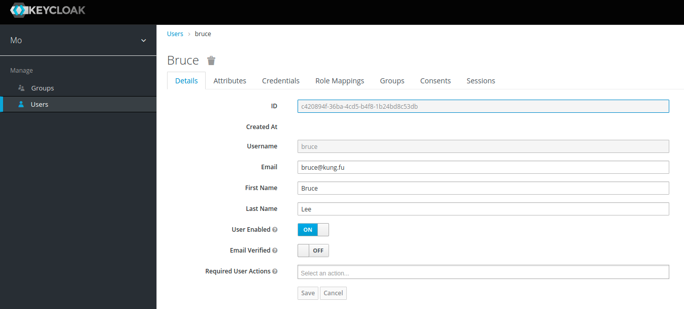
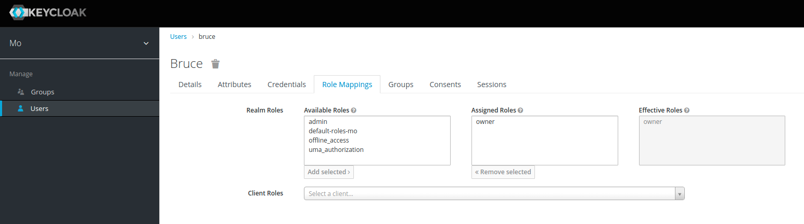
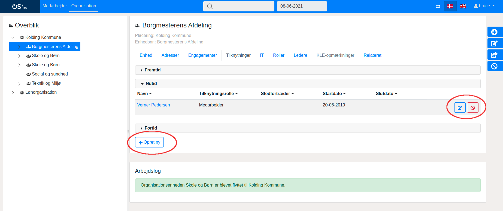
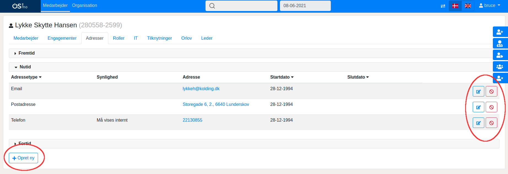

# RBAC Use Cases

This document describes the OS GIR | OS2mo RBAC use cases for both Keycloak usage and OS GIR | OS2mo usage.

## Keycloak

Keycloak will in the RBAC context have two responsibilities:

- Authentication
- Authorization

The _authentication_ mechanism will be enabled for all users of OS GIR | OS2mo and this mechanism does
not require any maintenance from Keycloak administrators, since the authentication flow will
be pre-configured by Magenta.

The _authorization_ mechanism, however, does require maintenance by one or more Keycloak
administrators within the organization. These Keycloak administrators will be granted access
to _user_ manipulations in the OS GIR | OS2mo realm - and hence be able to assign _roles_ to the users.

### Users

The users are the set of people having read and/or write access to OS GIR | OS2mo. User manipulations can
be performed, but in most cases this should not be necessary, since the user data (username,
email, first and last name,...) will be provided from elsewhere.

### Roles

We will in Keycloak operate with the followin roles:

- (No role)
- Admin
- Owner

Users who are not assigned a role will not be able to perform any write operations in OS GIR | OS2mo.

Users who are assigned the _Admin_ role will have full write access to all parts of OS GIR | OS2mo. The Admin
role is necessary in order to allow certain users to have write access to the root level of the
organization hierarchy, e.g. to create an organization unit at the top level of the organization
tree.

Users with the role _Owner_ will have write permissions only to the parts of OS GIR | OS2mo of which they are
owners. For example - imagine the following organizational hierarchy:

**Organization hierarchy in OS GIR | OS2mo**

- Organization 1
  - Unit 11
    - Unit 111
    - Unit 112
  - Unit 12
    - Unit 121
    - Unit 122
- Organization 2
  - Unit 21
    - Unit 211
    - Unit 212

and assume that:

1.  A user has been given the _Owner_ role in Keycloak.
2.  The user is the owner of Unit 121 and Unit 122.

### Use cases

A number of typical Keycloak use cases are described in the following section. We cannot
describe all possible use cases as this would be too comprehensive, but the use cases
described here are the most relevant ones.

#### Logging in to Keycloak

This use case describes the Keycloak login procedure which will be prior to all of the following
Keycloak use cases.

1.  Access to Keycloak is enabled via PAM (not within the Magenta scope).
2.  A OS GIR | OS2mo Keycloak administrator navigates to the Keycloak frontpage and logs in with the
    administrator username and password.

#### Assign a role to a user

1. The administrator selects “Users” in the left menu.
2. The administrator enters the username or name of the user that should be assigned the
   role in the search box and clicks the search button.
3. The administrator selects the relevant user from the list of users in the search results.
4. The administrator clicks the “Role Mappings” tab in the user manipulation area to the right:
   
5. The administrator selects the role that the user should be added to in the “Available Roles”
   window and clicks “Add selected”.

#### Unassign a role from a user

1. The administrator selects “Users” in the left menu.
2. The administrator enters the username or name of the user that should be unassigned the
   role in the search box and clicks the search button.
3. The administrator selects the relevant user from the list of users in the search results.
4. The administrator clicks the “Role Mappings” tab in the user manipulation area to the right.
5. The administrator selects the role that the user should be removed from in the “Assigned
   Roles” window and clicks “Remove selected”.

#### Manage users

In some cases it can be necessary to manage users manually, but typically this will not be
necessary since users are managed via other channels. However, in the scenarios where
manual user manipulations are required, the relevant use cases will follow what is described in
the Keycloak documentation regarding [user management](https://www.keycloak.org/docs/latest/server_admin/index.html#user-management).

## OS GIR | OS2mo

The access to OS GIR | OS2mo is controlled by Keycloak. As mentioned above, all users are authenticated
via Keycloak, and Keycloak also facilitates RBAC via the roles defined in Keycloak.

### Use cases

The following section describes the most important use cases with respect to write access
operations in OS GIR | OS2mo. The focus on write operations is due to the fact that all users have full read
access to all parts of the OS GIR | OS2mo organization hierarchy. As in the Keycloak case, it is not possible
to make an exhaustive list of use cases, but the most important and representative scenarios
will be covered below.

#### Log in to OS GIR | OS2mo

This login use case is common to all of the following use cases and takes place prior to the
following use cases described below.

1. A user navigates to the OS GIR | OS2mo frontend in a browser.
2. If not already authenticated in OS GIR | OS2mo, the user is redirected to Keycloak.
3. Keycloak redirects the user back to the OS GIR | OS2mo frontend with valid OpenID Connect tokens and
   the user is hereby logged in.

#### Create a new unit

1. The user clicks the blue “Create unit” button located to the far right.
2. The user selects the appropriate parent unit from the drop-down list of possible parent
   units.
3. The user fills out the form and provides relevant data about the new unit.
4. The user clicks the “Send” button.

#### Rename unit

1. The user clicks the blue “Rename unit” button located to the far right.
2. The user selects the appropriate unit from the drop-down list of possible units.
3. The user fills out the rename form.
4. The user clicks the “Send” button.

#### Move unit

1. The user clicks the blue “Move unit” button located to the far right.
2. The user fills out the form, i.e. selects the unit to be moved and the new parent unit.
3. The user clicks the “Send” button.

#### Edit units and employees

The description of these use cases will not be step by step as in the use cases described
above. Instead, a broader description of the common editorial features will be given.

When browsing around in the main window in the organization domain, details about the
currently selected unit are shown. A number of editing buttons appear (marked with red in the
image below):

If the user has write access to the relevant part of the OS GIR | OS2mo (e.g. in this example to the
organization unit show), the buttons will enable the user to perform the needed editing
operations. If the user does not have write permission to the entity upon which the editing
operation is attempted, a pop-up dialog will appear informing the user that he or she does not
have the required permissions to edit the entity.

When performing an action that navigates the user to the employee domain, i.e. by clicking on
a user under the “Employments” or “Affiliation” or by clicking the “Employee” tab directly in the
main header of the webpage, the user will be able to edit details about the employees:

As in the case of an organization unit, the user will only be allowed to edit details etc. on
employees of which he or she is the owner.
